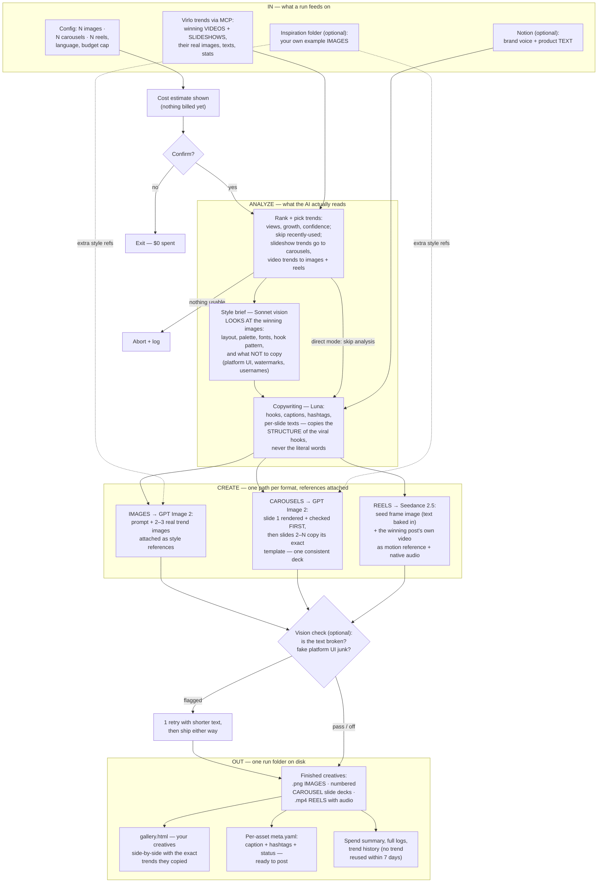

# HypeSocials — Lean Viral Content Engine (PRD)

## TL;DR — Plain English

HypeSocials is a tool that creates viral social media posts from real trends. You run it once, it fetches what's currently trending (from Virlo), copies the style and look of the best posts, writes captions, and generates images/carousels/short reels. Image and carousel batches run in approximately 3 minutes; batches including reels take approximately 8–10 minutes. Costs less than a dollar per post, and lands in a folder ready to publish.

Here's how it works:
- Pick a config file, choose formats (images/carousels/reels), set your budget
- Engine fetches active trends and their winning visuals
- Analyzes the style (colors, layout, text placement) from real viral posts
- Writes captions and generates images that match that style
- Short videos come with sound built in, and can even study the actual winning video for movement and pacing
- You can order specific post types (like an AI-audit CTA) via small brief files, and switch whole niches — restaurant UGC, AI agency, esoteric content — by picking a different niche config file
- Shows you everything in an interactive gallery to review before publishing; the next phase pushes approved posts into Postiz as drafts

No approval gates, no brand rules forced on you—you control what goes live.

## Problem & Motivation

The legacy HypeAgentSocials system was massively over-engineered: ~37,700 lines of code + ~29,400 lines of tests + ~36,600 lines of docs to produce just **3 images in 19 minutes at ~$1.33 per run**. Each image went through 5–11 sequential model calls, 93 polling loops, and a 3,658-line rendering fallback that produced zero final output. Everything was serialized despite collection finishing in 2 seconds.

HypeSocials target: **< ~3,000 lines of Python**, ~8 creatives in **≈3 minutes (images/carousels) or ≈8–10 minutes (with reels)** — fully concurrent, zero mandatory gates, and maximum visual fidelity to Virlo trends.

## Goals

- **G1:** Generate ~8 platform-specific creatives (images, carousels, reels) in ~3 minutes (images/carousels only) or ~8–10 minutes (when reels included).
- **G2** *(restated v1.6.1, operator decision)*: **Target ~3,000 lines of production Python; hard ceiling 4,500.** Includes the Virlo MCP wrapper (vs. the old ~37,700 — no Pillow fallback, no disabled harness). The v1.6.1 simplification round (niches-as-configs, no crop/pad, collapsed metadata, one spend table, no text-only machinery, trimmed Phase-2 flags) cut ~590 estimated lines from the v1.6 sizing of 4,000–5,200; if the build trends past 4,500, further cuts come from the remaining candidates in REVIEW-v1.6-recommendations.md (the operator chose to keep `both` mode, the provider seam, and both preview modes).
- **G3:** All LLM, image, and video jobs run concurrently; Kie.ai jobs are submitted concurrently in **at most two dependency waves** (chained artifacts only — no dedicated batch endpoint exists) and polled asynchronously.
- **G4:** Maximum visual fidelity to Virlo originals via reference-image inputs in both analyzed and direct modes.
- **G5:** All settings configurable: platforms, languages, formats, spend, Notion influence, inspiration sources, vision checking, generation mode — no code changes.
- **G6:** Zero mandatory gates; user reviews the gallery in-browser before deciding to publish.
- **G7:** Real MCP servers for Virlo and Notion; direct REST for model inference (OpenRouter, Kie.ai).
- **G8:** Live run logging (timestamps, API calls, spend, errors) and trend history to prevent repeats.
- **G9:** Two standalone preview modes: `--preview-sources` (show trends + eligibility verdicts, zero model spend) and `--preview-analysis` (show style briefs and copy, LLM cost only).
- **G10:** First-class source selection (`sources.active` in config, menu picker) with named future adapters (Google Trends, Hacker News).

## Non-Goals

- **No publishing in MVP:** Postiz ships in Phase 2 — but Phase 2 is a committed, fully specified milestone (60-publishing-postiz.md), implemented immediately after MVP, not a vague deferral.
- **No compliance or claim gates:** No claim ledger, banned-word lists, or GDPR stacks.
- **No brand grounding by default:** Pure trend mimicry unless Notion influence is explicitly enabled.
- **No ffmpeg or multi-scene video:** Reels are single Seedance 2.5 clips (with native in-model audio; no local audio/video processing ever).
- **No built-in scheduler:** Windows Task Scheduler + `--yes` flag for unattended runs.
- **No test harness or multi-model scoring:** No disabled QA ladders or fallback rendering paths.
- **No database:** All state is files (trend_history.json, run logs, per-asset metadata).
- **No rating or analytics widgets in the gallery:** No dark-mode toggle (prefers-color-scheme only).
- **No local style-template systems:** Styles derived on-the-fly from Virlo analysis.
- **No provider-abstraction layer:** Swapping Kie models is config-driven; a new provider is a deliberate code change.

## Users & Personas

**Primary (MVP):** One operator—a HypeDigitaly marketer or founder—launches `run.bat`, selects config and parameters from an interactive menu, and reviews the gallery. Manual weekly or daily runs.

**Secondary (Phase 2+):** Unattended scheduled runs via Windows Task Scheduler and `--yes` flag, chained into weekly marketing automation.

## The Pipeline at a Glance

*Diagram caveats:* the single "Vision check" node is a simplification — for chained artifacts the check runs **inside** Create (a carousel's anchor slide 1 is checked before slides 2–N are submitted, as the CAROUSELS node states; a reel's seed frame is checked before its URL is chained into Seedance — 10-pipeline FR-105); finished **video clips are never vision-checked** (no ffmpeg, D10) — only their seed frames are. All render jobs submit concurrently to Kie.ai in at most two dependency waves; the diagram draws formats as parallel paths, not sequential ones.

**Walkthrough:**

1. **Launch:** Menu/CLI, pick config, format mix, budget, generation mode, Notion influence.
2. **Collect:** Virlo MCP fetches trends + top videos/slideshows; reference images downloaded concurrently. Optional Inspiration folder indexing. Optional Notion MCP pull (if influence ≠ off).
3. **Select:** Rank by viral-strength score; skip trends in history window; assign top trends to requested creatives.
4. **Analyze** (if mode ≠ direct): Sonnet 5 analyzes top reference images + metadata → style brief.
5. **Write:** Luna generates captions, hashtags, hooks, on-image/slide/overlay text per trend.
6. **Generate:** Prompts (style brief + copy + reference images) submitted to Kie.ai concurrently in at most two dependency waves; reference-bearing image jobs ride Kie's `gpt-image-2-image-to-image` route (`input_urls`, ≤16 — OQ-17 closed). Carousel slide 1 generated first; slides 2–N anchored to slide 1 as reference. Reels: the hook seed frame's Kie-hosted URL is generated first; concurrently (starting alongside Analyze) the trend's winning post video is downloaded via yt-dlp (qualifies only if ≤28 s, per `reel_reference_max_s` — OQ-6 closed at the full ≤30 s tier), uploaded via Kie's file-upload API to obtain a public URL, and passed as a Seedance 2.5 reference video for motion/style mimicry (D23); both feed into animation with native synchronized audio (D22).
7. **Check** (optional): Vision check via Sonnet 5 ("is text broken?") with ≤1 retry.
8. **Package:** Per-asset folders, gallery.html, run log, trend history updated.

**Preview modes** (standalone, no generation):
- `--preview-sources`: Run Collect + Select's filters and label each trend as eligible/excluded/unusable; perform no yt-dlp or Kie activity; never touch the latest-pointer. Display trends, stats, hooks, reference thumbnails (zero model spend; Virlo metering per OQ-19).
- `--preview-analysis`: Also run Sonnet 5 analysis + Luna copy, display style briefs and captions (LLM cost only).

## Design Decisions

**D2 — Dual mimicry modes, A/B testable** (refined): `analyzed | direct | both`. Analyzed writes a style brief first from reference images; direct skips analysis. **Reference images always flow to the image model in both modes (when references exist — 10-pipeline FR-18 marks the reference-free exceptions)**—that is the visual-fidelity backbone, carried by Kie's `gpt-image-2-image-to-image` route (OQ-17 closed). Both-mode generates each creative both ways, shares one copy call, duplicates creatives for comparison.

**D3 — Zero gates; one optional vision check** (refined): No claim gates, no compliance blocks. Optional `vision_check: true` runs a single Sonnet 5 vision pass per image (one multi-image call per carousel) asking two objective questions — "is the on-image text garbled?" and "is there fake platform UI/watermarks?" — with ≤1 retry, then ships whatever exists (10-pipeline FR-105).

**D10 — Reels = one Seedance 2.5 clip** (refined): 9:16 (passed explicitly), 720p, duration **4–30 s** (verified range; default 5, clamped at pre-flight). Hook/overlay text generated by GPT Image 2 as a seed frame (text baked in, better fidelity), then Seedance 2.5 animates image-to-video keeping text static and legible. `reel_overlay_text: seed_frame | in_model | none` (default seed_frame).

**D16 — Every PRD file opens with TL;DR:** Plain English section immediately after H1, readable in < 1 minute, no jargon, no requirement IDs.

**D24 — Prompt templates in an editable `prompts/` folder:** every model-facing prompt scaffold (style brief, copywriter, image/carousel/reel scaffolds, vision check) is a plain-text template file with named placeholders, hot-loaded per run, tunable in Notepad. Missing file → built-in default + warning; template name+hash logged per run. Deterministic assembly fills placeholders; unresolved placeholder = that creative fails pre-submission, nothing malformed is ever sent.

**D26 — Campaign briefs (post-type overrides):** a `briefs/` folder of named brief files — e.g. `ai-audit-cta` — each defining copy directives, visual directives, optional own reference images, format(s), and an influence mode: `override` (brief replaces trend inputs entirely) or `blend` (trend look stays dominant, brief steers the message). Requested via menu or `--brief <name>:<count>`; brief creatives are ordinary plan entries (estimate, budget, gallery badge).

**D27 — Niches are configs (simplified v1.6.1):** a niche (restaurant UGC, AI agency, psychedelic esoteric…) is one ordinary config file carrying a `niche:` descriptor (audience, vibe, visual world — injected into analysis and copy prompts) plus three path keys pointing at its Inspiration folder, its briefs folder, and optional prompt-template overrides. Switching niche = picking that config. Keeping the assets together under `niches/<name>/` is a convention the paths point into, not engine machinery.

**D28 — withdrawn (v1.6.1, operator decision):** the declared media-richness contract and text-grounded mode were machinery for adapters that don't exist. A future text-only adapter marks its items `text_only` and inherits the existing item-level handling (10-pipeline FR-6/FR-90/FR-18).

**D29 — Postiz is committed Phase 2, spec'd now:** `--publish` pushes a run's assets to Postiz as drafts (media upload, per-platform captions, channel map, optional schedule slots); approval happens in the Postiz UI; auto-publish is a config flag, default off. Full spec: 60-publishing-postiz.md.

**D30 — Secrets hygiene is absolute:** keys live only in `.env`/env vars, are never interpolated into any LLM prompt or template, never sent to any model, and are redacted from all logs; they flow only into HTTP auth headers and per-server MCP env dicts.

**D31 — Budget governance at three enforcement points (2026-08-08; refined v1.6):** Pre-flight estimate checked against cap at launch (interactive runs refuse if over; `--yes` runs auto-trim). At submission time, the entire batch — both waves — is projected **at expected cost** against the cap (the worst-case-with-retries figure is displayed, not gated on); wave-2 work is pre-committed and always submits. The discretionary tail (vision-check retries, moderation retries, LLM re-attempts — **not** seed frames, which are wave-1 work) is governed by atomic per-submission budget reservation, reconciled to actual costs at terminal status, preventing concurrent retries from double-charging. Multi-wave trims are deterministic reverse-plan-order with A/B pairs and carousels treated as atomic units. **Rationale:** The single-check model had governance gaps for multi-wave submissions and race conditions on concurrent retries; v1.6 additionally stopped the worst-case allowance from deleting real creatives to fund retries that mostly never happen.

**D32 — Local reference images reach Kie via file-upload API (2026-08-08; endpoints confirmed v1.6):** Reference images from Inspiration, briefs, and niche pools are uploaded via Kie's file-upload endpoints (host `kieai.redpandaai.co`; uploads auto-delete after ~24 h — same-run-only URLs) to obtain public URLs, which are then passed to the image-generation and video-generation APIs. **Rationale:** Render APIs accept public URLs only; without this, three flagship features (reference images in prompted generation, carousel anchor chaining, and reel motion references) were unbuildable.

**D33 — Everything renders natively at its target ratio; local crop/pad deleted (2026-08-08; extended v1.6.1):** Reel seed frames and carousel anchor slides render natively at their exact target aspect ratio (seed frame 9:16, anchor at carousel ratio) and are never locally cropped — and as of v1.6.1 **no asset is**: Kie's verified ratio menu covers every default platform ratio directly, so the terminal crop/pad path was deleted entirely (10-pipeline FR-98). Chaining passes the Kie-hosted result URL onward, so the hosted image must be the finished reference; reels are 9:16 on every platform. **Rationale:** Passing a pre-cropped image would degrade subsequent references; and a near-never-exercised local geometry path wasn't worth its code or its imaging-library use.

**D34 — Config-swappable model IDs + render-provider seam + model profiles (2026-08-09):** Every model ID is a config string (OpenRouter endpoint: model id on `/chat/completions`; Kie: model route on `createTask`). The PRD defines a minimal render-provider interface (submit → poll → result URLs → upload) with Kie as the only built implementation. Each render model carries a small profile: param mapping, reference limits, template set. Two profiles ship: `gpt-image-2`, `seedance-2-5`. Same-profile swaps (e.g. seedance-2-5 → seedance-2-fast) are a config edit; new family (Kling, Veo, etc.) requires a profile + template-set recipe per one-page documented procedure (20-integrations FR-270–273). Unknown profile fails at pre-flight. **Rationale:** Model switching should be configuration, not rewrite. Building adapters for providers lacking required models is speculative complexity; Higgsfield was evaluated (2026-08-09: no Seedance 2.5 — waitlist only; account-auth MCP unfit for headless; subscription pricing) and is parked as a named future adapter (20-integrations notes).

**D35 — Transcript-tactics disposition (2026-08-09):** Product-photo-to-ad ships as a worked campaign-brief example (D26 machinery; zero new engine features — 30-configuration example). Extension chaining (>30 s multi-shot videos) and audio-reference music videos are parked as named future capabilities behind the provider seam; no current API exposes them.

**D25 — Model-specific prompt playbooks (50-promptcraft.md, FR-194):** Researched, source-graded prompting rules are codified per model in detailed director formats and section scaffolds. GPT Image 2 playbook covers fixed section order, text as a locked asset, style-DNA scaffold for carousel consistency. Seedance 2.5 playbook specifies the authoritative director section list and guardrails. Templates encode the playbooks so every run benefits automatically. See 50-promptcraft.md for the canonical specifications.

**D17 — Carousel anchor chaining, default ON:** Slide 1 generated first; slides 2–N generated concurrently with slide 1 as PRIMARY reference ("reproduce template, palette, typography; change only text and focal element"). Config toggle `carousel_anchor: true` (default). Falls back to independent generation if slide 1 fails.

**D18 — Reel text via seed frame, default:** `reel_overlay_text: seed_frame | in_model | none` (default seed_frame). GPT Image 2 generates the hook image WITH text baked in; its Kie-hosted result URL is passed directly into Seedance 2.5's reference images (no upload step) with instruction to keep on-frame text static and legible.

**D22 — Reel audio in-model, default ON:** Seedance 2.5 generates synchronized AI audio natively. `reel_audio: true` (default) maps to the provider's `generate_audio`; off ships silent clips for platform-native sound overlay. No ffmpeg, no audio pipeline — one API boolean.

**D23 — Viral-video motion references ship in MVP:** `reel_video_reference: true` (default). The trend's winning post video is downloaded via yt-dlp (duration from metadata, no ffmpeg), qualifies only if ≤ `reel_reference_max_s` (default 28 s — OQ-6 closed at the full ≤30 s tier), is uploaded via Kie's file-upload API (endpoints confirmed, OQ-5 closed) and passed as a Seedance reference video for maximum motion/style mimicry; the chain starts concurrently with Analyze so it never extends the reel's critical path. Any failure in the chain degrades the reel to seed-frame-only, logged — never blocks. Downloading platform videos is a ToS gray zone the operator accepts by leaving the toggle on.

**D19 — Preview modes replace --dry-run:** Two standalone modes: `--preview-sources` (collect + Select's filters with eligibility verdicts, zero model spend) and `--preview-analysis` (+ analysis + copy, LLM cost). No separate --dry-run flag.

**D20 — Source selection is first-class:** Config key `sources.active: [virlo]` (default) plus menu picker. Google Trends and Hacker News appear as named future adapters (visible, not-yet-implemented). Local Inspiration is an additive influence source per D13.

**D21 — Virlo MCP wrapper ships as Python** *(premise updated v1.6)*: MVP ships a thin Python MCP server (`python -m hypesocials.virlo_mcp`, official Python MCP SDK, stdio) wrapping Virlo REST API (api.virlo.ai, Bearer auth; all five endpoints verified against Virlo's OpenAPI spec). An **official Virlo MCP server now exists** (`dev.virlo.ai/api/mcp/mcp`, 49 tools, headless Bearer auth) — the wrapper is kept as a deliberate choice (5-tool reviewable surface, insulation from Virlo's API churn) with the official server as the config-level swap path (20-integrations §1a/§3). Notion uses self-hosted token-based Notion MCP (stdio, NOTION_TOKEN env; hosted PAT mode is the named fallback if that package sunsets). No Node toolchain for first-party servers.

**D4 — Conventions are guidance, never gates:** platform caption length, tone, and hashtag conventions are prompt guidance only; nothing validates, truncates, or rejects output for violating them (10-pipeline FR-15, 30-configuration FR-52).

**D6 — Platforms and languages are fixed sets:** LinkedIn, Instagram, TikTok as the platform set; EN and CS as the language set, one language per platform per run; Czech is a first-class citizen (UTF-8 everywhere, 30-configuration FR-256).

**D15 — Amendments trigger full regeneration:** any PRD amendment regenerates 00-overview (diagram + decision log), rebuilds PRD.html, and re-verifies sibling-file agreement — the cycle in the Amendment Protocol below is this decision.

[Existing D1, D5, D7–D9, D11–D14 recorded in full in their owning files; see 10-pipeline.md, 20-integrations.md, 30-configuration-and-run.md, 40-outputs-and-logging.md.]

## Success Metrics

- **Speed:** Images/carousels-only batch < ~3 min; batches with reels < ~8–10 min (gallery written incrementally—images reviewable while reels finish).
- **Completion:** ≥95% of runs complete without fatal errors (fatal defined as exit code 3; see 10-pipeline exit-code table); measurement taken over a rolling window of the **last 20 run folders**. ≥95% of planned creatives produce output or logged skip reason.
- **Cost:** Per-format cost targets under named default config (images ~$0.03–0.05 ea., carousels ~$0.08–0.12 ea., reels ~$0.40–0.60 ea., plus shared LLM cost ~$0.01–0.02 per run). State assumptions per run. Note: reel pricing likely exceeds old $0.30 blanket figure—use per-format numbers.
- **Fidelity:** Measured as a 3-point operator rating (1 = poor, 2 = acceptable, 3 = strong visual fidelity to source), **one rating per run** — the batch as a whole — recorded as one optional line in run.log's spend summary at the end of interactive runs (absent under `--yes` flag; 40-outputs FR-232). Target: **≥80% of rated runs score 2 or higher.** Judged in gallery against source references displayed alongside (run-level `refs/` folder + per-asset source display).
- **A/B:** Both-mode A/B concluded by operator eyeball + logged cost/time deltas per pair. No gallery rating widget. The concluded verdict is recorded as a one-line comment next to `generation_mode` in the operator's config — no machinery, just a stated home for the answer.

## Open Questions

This list is the **complete PRD-wide OQ registry** — every OQ number lives here (with a pointer when the detail is owned elsewhere), so numbering gaps never look like lost content.

- **OQ-1 — CLOSED (2026-08-08) [build]:** Luna's OpenRouter ID is confirmed: `openai/gpt-5.6-luna` ($0.10/$0.60 per Mtok, verified 2026-08-09). It is a reasoning model — reasoning tokens bill at the output rate; the copy role gets a reasoning-effort knob (default low) and the estimator counts a reasoning allowance.
- **OQ-2 — MUST-CONFIRM: Unit pricing [operator]:** Model confirmed as **Seedance 2.5**, Kie ID `bytedance/seedance-2-5` (createTask/recordInfo job model, 480p/720p, 9:16, 4–30 s, mp4, in-model audio). **Pricing remains unpublished (re-verified 2026-08-09) — reels cannot be planned until `price_per_unit.reel_second` is set in config.** Fallback: answerable with ONE measured 5 s test render before build; reels ship with `price: null` until confirmed. **Operator green-lit the day-one test spend (~$1–2: image reference spike + 5 s Seedance render) on 2026-08-09 — only the execution remains.**
- **OQ-3 — CLOSED (D21) [build]:** Whether to ship a first-party Virlo MCP wrapper — yes, as Python (20-integrations §3). Premise updated v1.6: an official Virlo MCP server now exists; the wrapper stands as a choice, the official server is the swap path.
- **OQ-4 — CLOSED (2026-08-08; amended v1.6) [build]:** No dedicated batch endpoint (batch = concurrent createTask calls); polling semantics confirmed — **five states** (`waiting|queuing|generating|success|fail`; all non-terminal states treated as pending), `resultJson.resultUrls`; `callBackUrl` exists but is unusable on a local workstation, so polling stays. **No generation seeds are exposed** — renders are not reproducible, and asset metadata states so.
- **OQ-5 — CLOSED (2026-08-09) [build]:** Kie's file-upload API confirmed — three endpoints on host `kieai.redpandaai.co` (stream, from-URL, base64); uploads auto-delete after ~24 h (same-run-only URLs); generated outputs retained ~14 days. Residual: one-line mkv-format spot-check at build.
- **OQ-6 — CLOSED (2026-08-09) [build]:** Kie's `bytedance/seedance-2-5` route serves the **full 2.5 tier**: 30 reference images, 10 reference videos totalling ≤30 s, 10 reference audio clips. `reel_reference_max_s` defaults to 28.
- **OQ-7 — CLOSED (2026-08-09) [build]:** Kie exposes **no** GPT Image 2 quality tiers (config key inert, logged note) and **no** Thinking-Mode multi-image batch (experiment dropped; anchor chaining is the only carousel path).
- **OQ-8 … OQ-16 — Phase 2 Postiz items**, defined and tracked in `60-publishing-postiz.md` §10 (OQ-10, hosted-plan API gating, is the must-confirm pre-check before the Phase 2 build; largely answered 2026-08-09 — all paid plans include Public API, **and the operator confirmed they are on a hosted paid plan** — with only the empirical key test remaining; OQ-16's issue #717 is closed upstream). **Operator stance (2026-08-09): Phase 1 review happens directly from the `output/` folder on disk; Postiz will carry TikTok and all other platforms when Phase 2 lands, so the TikTok direct-post-vs-inbox question (OQ-15) is deferred to Phase 2, not a Phase 1 concern.**
- **OQ-17 — CLOSED (2026-08-09) [build]:** Kie's `gpt-image-2-text-to-image` route accepts **no** reference inputs; the sibling **`gpt-image-2-image-to-image`** route does (`input_urls`, max 16 URLs). The mimicry backbone (D2/FR-18) is carried by the image-to-image route; the profile routes by reference presence (20-integrations §8c, FR-241). Residual day-one spike: one cheap render confirming references are honored qualitatively.
- **OQ-18 [operator + build]:** Re-evaluate Higgsfield as a second render provider when **all three** hold: (a) public REST API or API-key MCP with a published model-path catalog covering Seedance 2.5 (today: waitlist, OAuth-only MCP); (b) published per-unit or pay-per-use pricing (today: expiring subscription credits at ~5–6× Kie's render cost); (c) a concrete need for its unique capabilities (Soul character consistency, Cinema Studio, Sora/Veo/Kling access). Full comparison: 20-integrations §12a.
- **OQ-19 — NEW (v1.6) [operator]:** Virlo API per-call pricing. **The deposit half is answered: operator confirmed (2026-08-09) the Virlo account is funded and ready.** Per-call metering remains undocumented; until known, every "preview is $0" claim reads as "zero LLM/render spend". Answerable by one look at the Virlo billing dashboard after a test run.
- **OQ-20 — NEW (v1.6) [build]:** Kie-hosted **result** URL lifetime (outputs stated ~14 days; uploads ~24 h). Bounds how long a wave-1 → wave-2 gap can safely be and confirms that re-renders or Phase 2 publishes days later must download-then-reupload rather than reuse URLs.
- **OQ-21 — NEW (v1.6) [build]:** Confirm Seedance 2.5 on Kie accepts **image and video references simultaneously** in one job (the default reel sends both the seed frame and a motion-reference video). Docs list both parameters; one live render settles composition.
- **OQ-22 — NEW (v1.6) [build]:** Confirm OpenRouter strict structured-output mode composes with Luna's reasoning output in practice (FR-41/FR-125). The tolerant-parse fallback covers a negative answer; one call settles it.

## Build-Time Verification Checklist

Updated v1.6 — items closed by desk research (2026-08-09) are struck through with their answer; what remains is genuinely empirical.

1. ~~**Virlo wrapper endpoints**~~ — **CLOSED**: all five paths (`/v1/trends/digest`, `/v1/agents`, `/v1/agents/{id}`, `…/videos`, `…/slideshows`) verified against Virlo's live OpenAPI spec (20-integrations §3).
2. ~~**Kie file-upload endpoint**~~ — **CLOSED** (OQ-5): three endpoints on `kieai.redpandaai.co`; ~24 h upload expiry. Residual: mkv spot-check. Owner: build.
3. ~~**Seedance reference tier**~~ — **CLOSED** (OQ-6): full tier, ≤30 s total reference video; `reel_reference_max_s: 28`.
4. ~~**GPT Image 2 quality tiers + Thinking-Mode batch**~~ — **CLOSED** (OQ-7): neither exists on Kie.
5. **GPT Image 2 reference honoring spike** — OQ-17's route question is CLOSED (`gpt-image-2-image-to-image`, `input_urls` ≤16); run ONE cheap render on day one confirming references influence style/layout qualitatively (FR-241). Owner: build. **This is the first task of the build.**
6. **Seedance unit price** — Run one measured 5 s test render; record cost per unit (OQ-2). Also settles OQ-21 (image + video references in one job). Owner: build.
7. **Postiz hosted-plan API gating** — Largely closed (all paid plans include Public API; operator confirmed 2026-08-09 they are on a hosted paid plan); run the one-time empirical key test on that plan (OQ-10, 60-publishing). Owner: operator.
8. **Postiz draft full-payload defense** — Issue #717 is closed upstream; keep the full-payload POST and confirm once against the live instance (OQ-16, 60-publishing). Owner: build.
9. **Postiz self-hosted path prefix** — Only relevant if the self-hosted fallback is ever used: `/public/v1` vs `/api/public/v1` (OQ-8, 60-publishing). Owner: build. *(The old "Virlo/Notion MCP path prefix" wording was a bad pointer — stdio servers have no path prefixes.)*
10. **LinkedIn video caps** — Confirm current max video duration and aspect-ratio constraints via `integrationSchema` on a connected channel (OQ-13, 60-publishing). Owner: build.
11. **Instagram carousel ceiling as enforced by Postiz** — Confirm Postiz doesn't tighten Instagram's 2–10 range (OQ-14, 60-publishing). Owner: build.
12. **TikTok app audit status** — Check if `DIRECT_POST` is available or `UPLOAD` inbox mode is the practical default (OQ-15, 60-publishing). Deferred to Phase 2 by operator decision (2026-08-09): Phase 1 review is from the `output/` folder; Postiz will carry TikTok and all platforms in Phase 2. Owner: operator.
13. **Virlo `list_monitors` + billing deposit** — Confirm the tool works end-to-end; the deposit half is done — operator confirmed (2026-08-09) the Virlo account is funded. Note per-call metering if visible (OQ-19). Owner: build.
14. **Luna structured-output composition** — One strict-schema call through OpenRouter with reasoning enabled (OQ-22). Owner: build.
15. **Kie result-URL lifetime** — Confirm ~14-day output retention and that same-run chaining windows are safely inside it (OQ-20). Owner: build.

## Files in this PRD & FR-Range Registry

| File | Purpose |
|------|---------|
| **00-overview.md** | Executive summary, pipeline diagram, design decisions, success metrics. No FR blocks (goals/decisions only). |
| **10-pipeline.md** | Detailed run flow, decision logic, edge cases, failure modes. FR blocks: 1–29, 90–109, 141–149, 200–209. |
| **20-integrations.md** | MCP server configs (Virlo, Notion), OpenRouter, Kie.ai REST (including GPT Image 2 reference-image input surface), render-provider interface and model profiles (Kie built; Higgsfield parked), auth, error handling. FR blocks: 30–49, 110–129, 160–169, 240–249, 270–279. |
| **30-configuration-and-run.md** | Config schema, run.bat, menu, CLI flags, spend cap, trend history, model ID and profile selection. Product-photo-to-ad campaign-brief example. FR blocks: 50–69, 130–140, 170–177, 250–259, 280–289. |
| **40-outputs-and-logging.md** | Per-asset folder structure, gallery.html, run log, events file, caption.txt contract, state files, selection markers. FR blocks: 70–89, 150–159, 230–239. |
| **50-promptcraft.md** | Prompt-design spec: who writes the prompts, the editable prompts/ template folder, per-model prompt playbooks (GPT Image 2, Seedance 2.5), and per-profile template sets. FR blocks: 180–199, 260–269. |
| **60-publishing-postiz.md** | Phase 2 publishing spec: Postiz integration (MCP/REST per research), draft creation, channel mapping, schedule slots, publish records. FR blocks: 210–229. |
| **PRD.html** | Self-contained visual version with embedded Mermaid diagram. |

**FR-Range Rule:** New functional/non-functional requirements are assigned only within the FR blocks allocated to their owning file. Registry:
  - **10-pipeline:** FR-1–29, 90–109, 141–149, 200–209.
  - **20-integrations:** FR-30–49, 110–129, 160–169, 240–249, 270–279.
  - **30-configuration:** FR-50–69, 130–140, 170–177, 250–259, 280–289.
  - **40-outputs:** FR-70–89, 150–159, 230–239.
  - **50-promptcraft:** FR-180–199, 260–269.
  - **60-publishing:** FR-210–229.
  
Next fresh block: FR-290+ (for future amendments). This registry prevents collisions.

## Amendment Protocol

By design D15, any amendment triggers a full regeneration cycle:
1. Amend one or more Markdown files (00-overview through 60-publishing-postiz).
2. Regenerate 00-overview.md with updated diagram and decision log.
3. Rebuild PRD.html with latest Mermaid diagram and current content.
4. Republish PRD.html as a Claude artifact at stable URL.
5. Verify all sibling files agree with canonical pipeline and decision log.

This ensures the PRD remains coherent as requirements evolve.

### Amendment Log

- **v1.4 (2026-08-08)** — Expert-review hardening pass: approximately 40 gap/contradiction fixes across all files. Fixes include: pipeline walkthrough (yt-dlp moved to Generate stage), preview modes clarified, speed claims aligned to two-tier target (3 min vs 8–10 min), D25 deferred to 50-promptcraft, D31–D33 added (budget governance, reference-image upload, chained-artifact ratio preservation). FR-range registry established. Open Questions expanded with OQ-17 (highest priority), owner tags added, fallback strategies noted. Build-time verification checklist consolidated. Success metrics made observable (fidelity via 3-point operator rating, completion via exit-code window). No D1–D30 decisions changed; amendment is corrections and clarifications only.
- **v1.5 (2026-08-09)** — Model switching & provider seam: D34–D35 added. Model IDs are config-swappable (edit, not rewrite). Render-provider interface defined with Kie as sole built implementation; model profiles (gpt-image-2, seedance-2-5) ship; new providers via documented one-page recipe. Higgsfield evaluated and parked as named future adapter (OQ-18 tracks readiness criteria). Transcript tactics: product-photo-to-ad ships as campaign-brief example (D26 mechanics only); extension chaining and audio-reference music videos parked behind provider seam. FR-range registry updated: 20-integrations FR-270–279, 30-configuration FR-280–289, 50-promptcraft extends into 260-block per-profile sets. Next block: FR-290+.
- **v1.5.1 (2026-08-09)** — Operator defaults round: default `spend_cap_usd` raised to **$10**; first shipped niche pack = **`niches/hypedigitaly/`** (AI-agency marketing, default picker selection, Inspiration seeded from the repo's existing folder); first shipped brief = **`niches/hypedigitaly/briefs/ai-audit-cta/`** (HypeDigitaly AI-Audit CTA, `override` mode, image + carousel). Operator readiness confirmed: **all API keys on hand** (Virlo with monitors, Kie.ai, OpenRouter, Postiz paid cloud, Notion token) — the OQ-2 price-test render and the OQ-10 Postiz plan-gating test are unblocked and can run on day one of the build.
- **v1.6 (2026-08-09)** — Full four-track expert review (architecture, PRD completeness, mechanical consistency, live external fact-check) followed by a ~90-fix hardening pass. Headlines: **OQ-17 resolved with a route change** — reference-bearing image jobs move to Kie's `gpt-image-2-image-to-image` (`input_urls` ≤16); `models.image` default updated accordingly. **OQ-3/4/5/6/7 closed** from live docs (five poll states; upload endpoints + ~24 h expiry; full Seedance reference tier → `reel_reference_max_s: 28`; no quality tiers; no Thinking-Mode batch). Seedance duration corrected to 4–30 s; `nsfw_checker` made an explicit engine default (provider default is false). **Official MCP doc registry added** (20-integrations §1a: Notion local+hosted, Postiz, Virlo, Higgsfield, Kie=none, OpenRouter); D21 premise updated (official Virlo MCP exists; wrapper kept by choice); Notion hosted-PAT named as the sunset fallback; Higgsfield re-verified and kept parked (OQ-18 now three conditions). Architecture hardening: per-job permit rule (deadlock prevention), poll-failure-never-terminal, no-resubmit-on-timeout, expected-cost wave gate + reservation reconciled to actuals, intent-before-call ledger, stale-lock breaking, `output/latest.txt` pointer file, vision-check at native resolution, `max_tokens` defaults resized (copy 3000/analysis 2000), Virlo trend-normalization join spec, brief-only runs survive zero trends, `run.bat` pause only when interactive. Consistency: `run_deadline_min` 25 and `video_job_timeout_s` 300 everywhere; two-tier speed claims everywhere; seed frames removed from discretionary-spend lists; meta.yaml schema aligned (string `hook_pattern_used`, four-state vision enum, no seed field, degradation-reason enums); `SELECTED.marker`/`postiz_state` naming unified; D4/D6/D15 defined; complete OQ registry (OQ-3, 8–16 indexed; new OQ-19–22); exit codes realigned (missing key → 2; brief-only carve-out for 3); ranking weights stated (0.35/0.15/0.30/0.20, min-max); LLM price defaults shipped; trend-history pruning; append-only ledger semantics; fidelity metric per-run; NFR-212 defined. Default `formats.reel` set to 0 until the reel price is entered. D35 premise updated (Kie exposes `reference_audio_urls` and `return_last_frame` — capabilities parked by choice, not impossibility). Simplification candidates that would reverse operator-blessed decisions (cut `both` mode, drop provider seam, merge niche packs into flat configs, drop preview modes, collapse meta.yaml, drop crop/pad, trim Phase-2 flags) were **recommended, not applied** — recorded in the v1.6 review report delivered with this amendment.
- **v1.6.1 (2026-08-09)** — Operator decision round on the v1.6 recommendations (11 questions asked and answered). **Applied:** niches become ordinary config files with three path keys (`briefs_dir`, `prompts_dir`, `sources.inspiration_folders`) — niche-pack machinery, `--niche`, and the dual picker removed (D27 simplified, FR-56/FR-173/FR-174 rewritten, FR-250 tombstoned); local crop/pad deleted entirely (FR-98 rewritten, NFR-25 down to one imaging use, D33 extended); meta.yaml's ~10 degradation booleans collapsed into one `degradations: []` tag list (FR-73); one spend table (FR-84); budget trim reduced to one rule via plan ordering (FR-106); `image_quality_tier` key deleted (inert — OQ-7); text-only-source machinery removed (FR-148/149, FR-168/169, D28 withdrawn); Phase-2 `--assets`/`--force` flags and FR-215's auto-reconciliation cut (markers are the filter; delete `PUBLISHED.marker` to re-publish; lingering attempt-markers are reported for a manual glance). **Kept by explicit choice:** `both` A/B mode, the D34 provider seam + profiles, both preview modes, the vision-check-off default (Czech runs keep the hint only), and the 2×/7-day trend-reuse defaults. **G2 restated:** target ~3,000 lines, hard ceiling 4,500. Estimated ~590 lines cut.
- **v1.6.2 (2026-08-09)** — Operator readiness round (4 questions asked and answered). **Virlo deposit confirmed funded** (OQ-19's operator half closed; per-call metering still to observe on the billing dashboard after a test run). **Day-one test spend green-lit** (~$1–2: the GPT Image 2 reference-honoring spike + the 5 s Seedance price render — OQ-2/OQ-17/OQ-21 now execution-only, no approval pending). **Postiz hosted paid plan re-confirmed** (OQ-10 down to the one-time empirical key test). **TikTok publishing question deferred to Phase 2 by operator decision:** Phase 1 review happens directly from the `output/` folder on disk; when Postiz lands it carries TikTok and all other platforms, at which point OQ-15 (direct-post vs. inbox-draft audit status) gets checked. No requirements changed — this amendment records operator state only.
