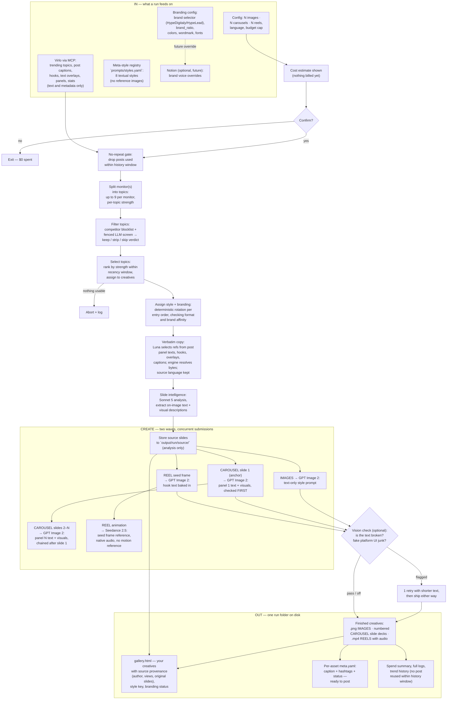

# HypeSocials — Lean Viral Content Engine (PRD)

**Amendment: v2.1.0 (2026-08-13)** — Slideshow fidelity: recent-window sourcing, on-image verbatim copy, text-only styles, panel-mapped carousels, post-level no-repeat, analysis-only slide intelligence, provenance gallery. Fixes: fetch 30-day window rank by views within pool; quote on-image panel texts/hooks first (no descriptions); styles are textual definitions only; source slide N → our slide N verbatim, position-preserving; repeat protection at post-ID level (never re-quote a post within history window); analyze each source slideshow's slides post-Confirm to extract text and visuals for render prompts; show original slides and extracted data in the gallery. See amendment log for full details.

## TL;DR — Plain English

HypeSocials creates viral social media posts directly from trending topics. You pick how many images, slide-decks and short videos you want, set your budget, and press Enter. About three minutes later — eight to ten if you asked for videos — you have a folder of finished posts.

Here's what happens in between:

- **Find what is trending.** The engine fetches real trending topics from Virlo, each topic with its top posts ranked by views.
- **Filter for brand safety.** The engine screens each topic for competitor mentions and removes them when they're incidental (a mention, an attribution, a sponsor). Topics mainly promoting a competitor product are skipped entirely. The sorted order never changes — top posts stay on top.
- **Pick the strongest ones.** It scores each topic on its posts' views, freshness and engagement, skips individual posts it has ever used within the history window (post-level never-repeat protection), and hands the strongest fresh posts to the creatives you asked for. Topics with slideshow-format posts go to carousels; image-heavy post topics go to images and videos.
- **Quote the originals verbatim.** An AI picks exact words from the topic's winning posts — panel texts, hooks, text overlays for on-image rendering first; captions for the caption field — and selects one that fits the style's text budget. What renders is a real quote from what went viral, in its original language. Descriptions never render.
- **Apply a visual style.** Every creative gets one of eight defined visual styles — photoreal ambient, editorial carousel, meme-caricature panels, and others. Each style carries its own palette, typography rules, layout guidance (textual definitions only — no reference images attached to styles). The style pick is deterministic per creative, so the same topic never looks the same way twice in a single run.
- **Add your brand (optional).** A configurable fraction of posts get your wordmark — either HypeDigitaly or HypeLead, never mixed — placed consistently and rendered as text, not a composite image.
- **Make the pictures.** All picture jobs are submitted concurrently to Kie.ai; text-only style definitions drive the look (no style reference images). For carousels sourced from slideshows, each source slide's panel text, hooks, and extracted visuals (text transcription + graphics description) become the corresponding output slide's directives — source panel 1 becomes output panel 1, verbatim, preserving position. Slide 1 renders first and becomes the template for slides 2–N, so the deck is consistent.
- **Make the video (if you asked).** A picture with the hook text baked in renders first, then the video model brings it to life, keeping that text static and readable. The video model also generates matching audio, so clips are not silent.
- **Optional spell-check.** If enabled, an AI looks at each picture — including a reel's seed frame — and answers: is the text broken or does it show fake platform UI? If yes, one retry with shorter text. Then it ships. For carousels, slide 1 is checked before the rest are made.
- **Analyze source slides (if sourced from slideshows).** After confirming your budget, the engine downloads each source slideshow, has an AI read every slide, and extracts both the on-image text verbatim AND a description of graphics (charts, icons, layouts, composition) for our render prompts. This analysis costs ~$0.01–0.03 per post and is charged to your budget; you see it in the estimate before you approve.
- **Show your work.** The gallery includes, for each carousel: the original source post (author, views, date, link, caption), each original source slide with extracted text, and our rendered slide aligned beside it. This provenance card lets you verify fidelity slide-by-slide.
- **Package.** Everything lands in a folder with a browsable gallery, a full log of what happened, and what it cost.

Key facts:

- **Money is checked first.** If the estimate exceeds your limit and you're at the keyboard, the run refuses and offers smaller numbers. If run unattended (scheduled or with the "just do it" flag), it drops posts from the end until the plan fits, with a log entry naming exactly which ones.
- **Nothing blocks the run.** If one post fails, that one is marked failed and everything else ships.
- **You can stop at any time.** Ctrl+C stops new orders, gives in-flight work a moment, then packages what it has. Ctrl+C twice quits immediately. Work already ordered is billed — the log lists it.
- **You can request specific post types** — like a HypeDigitaly AI-audit CTA — via small brief files that override or blend with trend styles.
- **You can preview for free.** One mode shows just the topics ($0); another adds filter verdicts, style choices and verbatim copy quotes ($0.01–0.03 for the text AI only).
- **No quality gates.** The engine makes it once and gives it to you. You decide what ships.

## Problem & Motivation

The legacy HypeAgentSocials system was massively over-engineered: ~37,700 lines of code + ~29,400 lines of tests + ~36,600 lines of docs to produce just **3 images in 19 minutes at ~$1.33 per run**. Each image went through 5–11 sequential model calls, 93 polling loops, and a 3,658-line rendering fallback that produced zero final output. Everything was serialized despite collection finishing in 2 seconds.

The new approach inverts the premise: **visual authority is a local registry of 8 textual style definitions** (palette, typography, layout rules, stored in the repo and edited like code), rotated deterministically per creative. **Trend topics supply the copy verbatim** — exact quotes from winning posts in their source language, selected and filtered by an AI, never retyped. Each source slideshow's slides are analyzed by an AI post-Confirm to extract on-image text and visual descriptions (graphics, charts, composition), enriching render prompts with content details. This reduces hallucination, removes the 260-line vision-analysis stage, and makes fidelity auditable: every word that appears is from a real post; every image style is named and versioned; every carousel slide position maps to a source slide's extracted text and visuals.

HypeSocials target: **~13,200 lines of Python**, ~8 creatives in **≈3 minutes (images/carousels) or ≈8–10 minutes (with reels)** — fully concurrent, zero mandatory gates, transparent step-by-step console showing which posts and styles were chosen.

## Goals

- **G1:** Generate ~8 platform-specific creatives (images, carousels, reels) in ~3 minutes (images/carousels only) or ~8–10 minutes (when reels included).
- **G2** *(restated v1.8.0, operator decision 2026-08-11 — line-growth measurement without ceiling; rule 5)*: **Measure and report production Python line growth at every wave barrier with per-task attribution.** The original budget was ~13,200 lines on a 13,500 ceiling; the ceiling is now withdrawn to prevent silent bloat but enforce visibility. Growth is reported as `"+217 (virlo.py +135, server.py +43, models.py +14, …)"` never as a bare total. Never absorb growth by trimming docstrings, comments or error messages (a regression). A file over ~500 lines is a splitting candidate and a deep-module review is owed, but on design grounds, not arithmetic. Includes the Virlo MCP wrapper and yt-dlp support (vs. the old ~37,700 — no Pillow fallback, no disabled harness). The v1.6.1 simplification round (niches-as-configs, no crop/pad, collapsed metadata, one spend table, no text-only machinery, trimmed Phase-2 flags) cut ~590 lines; if builds trend past 14,300, cuts come by operator decision from REVIEW-v1.6-recommendations.md (the operator chose to keep provider seam, both preview modes, and vision check).
- **G3:** All LLM, image, and video jobs run concurrently; Kie.ai jobs are submitted concurrently in **at most two dependency waves** (chained artifacts only — no dedicated batch endpoint) and polled asynchronously.
- **G4:** Visual fidelity achieved via textual meta-style registry (palette, typography, layout definitions) rotated per creative; style adherence measured per FR-150/232.
- **G5:** All settings configurable: platforms, languages, formats, spend, branding selector, vision checking, topic source — no code changes.
- **G6:** Zero mandatory gates; user reviews the gallery in-browser before deciding to publish.
- **G7:** Real MCP servers for Virlo and Notion; direct REST for model inference (OpenRouter, Kie.ai).
- **G8:** Live run logging (timestamps, API calls, spend, errors) and trend history to prevent post-level repeats (never re-quote the same post within the history window).
- **G9:** Two standalone preview modes: `--preview-sources` (show topics + filter verdicts, zero model spend) and `--preview-analysis` (show topics + verdicts + assigned styles + verbatim-copy selections, LLM cost only).
- **G10:** First-class source selection (`sources.active` in config, menu picker) with named future adapters (Google Trends, Hacker News).

## Non-Goals

- **No publishing in MVP:** Postiz ships in Phase 2 — but Phase 2 is a committed, fully specified milestone (60-publishing-postiz.md), implemented immediately after MVP, not a vague deferral.
- **No compliance or claim gates:** No claim ledger, banned-word lists, or GDPR stacks.
- **Brand grounding is optional, not required:** Config-driven brand selector (HypeDigitaly or HypeLead) determines if a fraction of posts are branded; default is 0.5 (half) but fully configurable.
- **No ffmpeg or multi-scene video:** Reels are single Seedance 2.5 clips (with native in-model audio; no local audio/video processing).
- **No built-in scheduler:** Windows Task Scheduler + `--yes` flag for unattended runs.
- **No test harness or multi-model scoring:** No disabled QA ladders or fallback rendering paths.
- **No database:** All state is files (trend_history.json, run logs, per-asset metadata).
- **No rating or analytics widgets in the gallery:** No dark-mode toggle (prefers-color-scheme only).
- **Deliberately absent (post-pivot):** No image-to-image style references (D46); no Virlo media in render payloads — analysis-only downloads allowed (D46 carve-out); no A/B mode; no motion-reference video for reels; no programmatic logo compositing (wordmark rendered as text via the image model).

## Users & Personas

**Primary (MVP):** One operator—a HypeDigitaly marketer or founder—launches `run.bat`, selects config and parameters from an interactive menu, and reviews the gallery. Manual weekly or daily runs.

**Secondary (Phase 2+):** Unattended scheduled runs via Windows Task Scheduler and `--yes` flag, chained into weekly marketing automation.

## The Pipeline at a Glance

*Diagram caveats:* the "Slide intelligence" node runs **after the Confirm gate** (paid LLM spend) but **before Create submissions** (results feed render prompts); for slideshows only (images/reels use brief or nothing). The "Vision check" node is a simplification — for chained artifacts the check runs **inside** Create (carousel's anchor slide 1 is checked before slides 2–N are submitted; reel's seed frame is checked before Seedance animation — 10-pipeline FR-105); finished **video clips are never vision-checked** (no ffmpeg, D10) — only their seed frames are. All render jobs submit concurrently to Kie.ai in at most two dependency waves. **Registry missing or unusable → exit 2 (FR-295)** — a run with no affine styles under the active brand refuses to start rather than silently degrading. **No-repeat gate** drops used posts (by post ID) before ranking; re-run `--preview-sources` shows which posts would be dropped as `dropped_used`.

**Walkthrough:**

1. **Launch:** Menu/CLI, pick config, format mix, budget, vision checking.
2. **Collect:** Virlo MCP fetches trending topics (text, captions, metadata only); no images downloaded. Optional Notion pull for brand voice (future override, dormant today).
3. **Split & Filter:** Topics extracted per monitor (up to 9 each), per-topic strength computed from their own posts. Competitor filter screens for brand safety: keeps safe topics, strips incidental mentions, skips competitor promos.
4. **Select & Assign:** Rank topics by strength; skip recent history; assign strongest to requested creatives. Deterministic style rotation picks affine styles (format + brand compatible) per creative. Deterministic brand rotation applies the wordmark to a `brand_ratio` fraction of creatives.
5. **Quote:** Luna selects exact words from the topic's top posts (panel texts, hooks, text overlays, captions) that fit the style's character budget and are free of @handles, URLs, emoji. Engine resolves to bytes verbatim. Source language is kept, no translation. Descriptions never render.
6. **Analyze (if sourced from slideshows):** After Confirm gate, Claude Sonnet 5 reads each assigned slideshow's source slides, extracting the on-image text verbatim and describing visuals (charts, icons, layout, composition). These extractions enrich each slide's render prompt. Source slides downloaded to `output/<run>/source/` for gallery provenance (analysis-only; never sent to Kie.ai).
7. **Generate:** Prompts (text-only style metadata + copy selections + visual briefs from analysis) submitted concurrently in two dependency waves. Image and carousel slide 1 generated first as primaries; carousel slides 2–N anchored to slide 1 and mapped to source panel positions; reel seed frame generated; reel animation fed seed frame URL (no motion-reference video post-pivot).
8. **Check** (optional): Vision check via Sonnet 5 ("is text broken?") on images, carousel anchor, reel seed frame, with ≤1 retry. Slides 2–N skip vision check (anchor already passed). Final reel clips never vision-checked.
8. **Package:** Per-asset folders, gallery.html, run log, trend history updated.

**Preview modes** (standalone, no generation):
- `--preview-sources`: Run Collect through Filter, show all topics and their verdicts (keep/strip/skip), zero LLM/Kie spend. Virlo API cost only per OQ-19.
- `--preview-analysis`: Also run Luna copy, show topics, verdicts, assigned styles, verbatim copy selections (LLM cost; Kie cost zero).

## Design Decisions

**D1–D22, D25–D30:** Recorded in their owning PRD files (10-pipeline through 60-publishing).

**D23 — WITHDRAWN (v2.0.0):** Viral-video motion references for reels are removed entirely post-pivot. No yt-dlp, no video download, no reference upload, no Seedance video-reference input. Reels render from seed frame only. Rationale: under text-only trends, motion references become speculative (the trend's topic text has zero correlation to its winning video's motion); the complexity and cost are deferred to a future A/B test with motion-reference-only reels measured against seed-frame-only (F25). Seedance remains capable and this decision is a choice, not a capability limit.

**D24 — Re-based (v2.0.0):** Prompt templates in an editable `prompts/` folder (including the new `styles.yaml` registry, treated as a template artifact per FR-184); every model-facing prompt scaffold is plain text with named placeholders, hot-loaded, tunable in Notepad. Missing registry → built-in default + warning was the old rule; **post-pivot, missing registry → exit 2 refusal (FR-295)** — the registry is the visual authority and a silent fallback tier would be silent drift. `styles.yaml` has no built-in tier. All other templates keep their fallback defaults.

**D31 — Re-based (v2.0.0):** Budget governance at three enforcement points. Pre-flight estimate checked against cap at launch (interactive runs refuse if over; `--yes` auto-trims). At submission, the entire batch is projected at expected cost against the cap (worst-case figure is displayed); wave-2 work is pre-committed and always submits. Discretionary tail (vision-check retries, LLM re-attempts) is governed by atomic per-submission reservation. Multi-wave trims are deterministic reverse-plan-order with carousels treated as atomic units. No A/B pairs exist post-pivot.

**D32 — Re-based (v2.0.0):** Local reference images (brief images when present) reach Kie via file-upload API (host `kieai.redpandaai.co`; uploads auto-delete ~24 h — same-run-only URLs). Memo tracks per-run uploads so each file is uploaded once.

**D36 — Re-based (v2.0.0):** Recency identity moves from the monitor to the individual post (FR-7 amended). A trend-history entry records not just the monitor but the posts actually used, so the engine can skip posts within 7 days while allowing new post sets from the same monitor (breaking the throughput bottleneck that locked `max_trend_reuses_per_run` to 2). Measured throughput: 30–39 unique post sets per monitor (old code rationed exactly 2). History entries gain an optional `posts` map; entries without it read as no-posts-used, so no migration and no silent recency-protection gap.

**D38 — Superseded (v2.0.0):** Brand accent is no longer welded to Notion (the path has never run). Brand colors, wordmark, fonts and profiles ship in the config's `branding:` section, edited like code. Notion is a future override slot only, today dormant.

**D40 — Superseded (v2.0.0):** Steering the render side without widening the allowlist boundary. `niche.visual_world` now reaches render prompts through a new visual-only placeholder `{{niche_visual_world}}`, allowlisted for image roles and ranked below references (biases palette/typography/motif where references leave a choice). Override-brief single images now have a subject via an allowlisted `{{render_prompt}}` slot (bug fixed: they had blank subject before). Inspiration `.txt` files are now read as copy exemplar material (copy call only).

**D41 — NEW (v2.0.0):** Meta-style registry replaces vision analysis as the visual authority. Eight textual style definitions (palette, typography, layout) are stored in `prompts/styles.yaml` (repo-root resolved; FR-174 seam), validated at pre-flight (FR-295 refusal on unusable), and rotated deterministically per creative on `entry.order` with brand/format affinity filters. No built-in fallback tier — the registry is the only visual contract. Downloading Virlo media FOR ANALYSIS/DISPLAY is allowed (slide intelligence extracts source slides); any Virlo byte or URL in a render payload is forbidden (code boundary: `render.upload_file`). Rationale: turns visual fidelity into an auditable version-controlled fact (style X has these colors and typography); removes 262 lines of vision analysis; moves style customization from "write a brief vision prompt" to "edit the YAML" (operator control, no model); analysis downloads inform render prompts without leaking Virlo media downstream.

**D42 — NEW (v2.0.0):** Copy is selection, not generation. Luna selects exact words from trending posts' source strings (panel texts, hooks, text overlays, captions), filtered by: (a) style's on-image character budget (emoji/@/URL/hashtag-free for rendering), (b) competitor blocklist (never shipped), (c) on-the-fly strip of incidental competitor mentions. The engine resolves selections to bytes verbatim (no retyping, no accent loss, no trimming). Source language is kept, never translated. Descriptions are context only (fenced into prompts, never rendered). Verbatim verifier asserts every rendered string is a substring of the chosen source post, minus logged strips. Degrade path (no candidate fits budget): caption-only creative, tagged `NO_ONIMAGE_TEXT`, shipped as delivered. Copy-call failure falls back to top post's caption verbatim, tagged `COPY_DEGRADED`, stays a code-1 loss. Rationale: eliminates hallucination (every word is from a real post); reduces cost (~210 lines removed from copywrite); makes output auditable (trace copy to source URL in metadata); operator accepted legal exposure from verbatim company mentions in captions (legal precedent: news aggregators are allowed).

**D43 — NEW (v2.0.0):** Branding block is fully configurable with a brand selector. Config keys: `branding.brand` (hypedigitaly | hypelead, filters style rotation), `branding.brand_ratio` (0..1, deterministic rotation on `entry.order`), `branding.mode` (overlay | background_tint | both), `branding.placement` (wordmark position hint), `branding.competitors` (fail-closed blocklist), `branding.profiles.{brand}.wordmark/colors/fonts/font_character/background_hint/never_always/never_style/product_nouns`. Wordmark injected through the TEXT block, never as a composite image (model renders it as text). `never_always` lines (color guards) inject always; `never_style` lines (medium guards) inject only on brand-affine styles. Brand-slot styles collapse branding block to nothing extra (style IS the brand). Ratio rotation: entry is branded iff `floor((order+1)·ratio) > floor(order·ratio)` — deterministic, supply-independent, never re-brands a surviving creative post-trim. Rationale: matches operator's two brand systems (parent + product); wordmark-as-text gets crisp rendering from the model; never-guards prevent photographic+serif in a teal brand; brand_slot handles brand-card styles that ARE the signature.

**D44 — NEW (v2.0.0):** Monitor → topics architecture. Virlo's per-monitor data is split into up to 9 topics per monitor (contract `_themes()` from Increment B, surviving here). Each topic has a view-ranked `SourcePost` list (post_id, url, author, caption, hooks, text_overlays, panel_texts, description, views). Per-topic strength is recomputed from that topic's own posts' views (min-maxed across the pool), replacing the old monitor-level strength and confidence. Reference groups are dead (topics own their source posts directly). History keying changes from `<monitor_id>` to `<monitor_id>::<topic_key>` (migration: first run sees empty window by design; old entries age out). Reuse index re-scoped: which `SourcePost` sibling quotes, not which reference group. Rationale: topics are the actual unit of viral strength; allows fresh posts from the same monitor within the history window (30–39 sets measured vs. old 2); the text-only source makes monitor-level grouping invisible anyway.

**D45 — NEW (v2.0.0, operator mandate 2026-08-12):** Console observability mandate. The console must show step by step how the flow progresses; how many outputs came from Virlo; **PROOF** that they are sorted by views within the recency window; which posts exactly; which data is being worked on; where each creative came from. Logs transparent and detailed; console straightforward. Delivered via: FR-296 (stage narration with in→out counts), FR-297 (topics table showing sort proof, per-post roster showing ref labels, provenance block with post identity and copy source), FR-298 (forensic events + `copy_source_refs`), FR-299 (render heartbeats + verbosity tiers), FR-300 (menu re-shape with runnability facts). Rationale: under text-only topics and post-level freshness, the engine's most important decisions (which topics, which posts, which styles) were happening silently; visibility builds trust in automated selection and enables operators to diagnose famine/quality issues without reading JSON.

**D46 — NEW (v2.1.0, operator mandate 2026-08-13):** Slideshow fidelity: recent-window sourcing, on-image verbatim copy, text-only styles, panel-mapped carousels, post-level no-repeat, analysis-only slide intelligence, provenance gallery. **Supersedes D2** (no style reference images attached); **supersedes the fetch clause of D37** (D37's "sorted by views" decision survives as "sorted by views within the recency window"; the "fetch all-time" clause dies); **amends D42** (descriptions never render, removed from the quotable set); **extends D41** with the analysis carve-out (downloading Virlo media FOR ANALYSIS/DISPLAY allowed; any Virlo byte/URL in a render payload forbidden — code boundary at `render.upload_file`). Rationale: the paid run against Virlo UI showed stale posts (all-time ranking), wrong text (hashtag captions instead of on-image panel texts), and cloned reference images. Fixes: fetch within a 30-day recent window, rank by views within that pool; quote panel texts/hooks first, then captions, never descriptions; styles are text-only definitions only (visual DNA for the renderer, not template images); source slideshows' slides are analyzed post-Confirm (Claude Sonnet 5) to extract on-image text verbatim and visual descriptions (graphics, composition, charts) for render prompts; each carousel's source slide N text becomes output slide N text position-preserving; post-level never-repeat (never re-quote the same post within the history window); gallery shows original slides and extracted data alongside our renders.

## Success Metrics

- **Speed:** Images/carousels-only batch < ~3 min; batches with reels < ~8–10 min (gallery written incrementally—images reviewable while reels finish).
- **Completion:** ≥95% of runs complete without fatal errors (fatal defined as exit code 3; see 10-pipeline exit-code table); measurement taken over a rolling window of the **last 20 run folders**. ≥95% of planned creatives produce output or logged skip reason.
- **Cost:** Per-format cost targets under named default config (images ~$0.03–0.05 ea., carousels ~$0.08–0.12 ea., plus shared LLM cost ~$0.01–0.02 per run). **Reels (no motion reference, post-pivot):** Seedance bills output seconds only at 720p ~$0.315/s (~$1.57 per 5 s reel, single render) or ~$2.85 worst case with reference buffer. State assumptions per run.
- **Fidelity:** Measured as style adherence to the assigned registry entry (colors, typography, layout, motion profile), panel fidelity (carousel panel texts match source slides), and topical accuracy (post selection matches the topic trend), **one assessment per run** — the batch as a whole — rated optionally by operator at gallery review (1 = poor, 2 = acceptable, 3 = strong). Target: ≥80% of rated runs score 2 or higher.

## Open Questions

This list is the **complete PRD-wide OQ registry** — every OQ number lives here so numbering gaps never look like lost content.

- **OQ-1 — CLOSED (2026-08-08):** Luna's OpenRouter ID confirmed: `openai/gpt-5.6-luna` ($0.10/$0.60 per Mtok). Reasoning-effort knob default low.
- **OQ-2 — MUST-CONFIRM: Reel unit pricing [operator decision]:** Model is Seedance 2.5 (bytedance/seedance-2-5). **Post-pivot pricing:** Kie bills output seconds only (no motion-reference video); 720p $0.315/s, 480p $0.140/s. Measured 5 s / 720p reel: $1.57. `price_per_unit.reel_second` in config states the worst-case-honest scalar the operator derives.
- **OQ-3 — CLOSED (D21):** Virlo MCP wrapper — yes, Python (20-integrations §3); official server exists as an alternative config-level swap.
- **OQ-4 — CLOSED (2026-08-08):** Kie poll states: five states (`waiting|queuing|generating|success|fail`), `resultJson.resultUrls`; no callback available for local workstations.
- **OQ-5 — CLOSED (2026-08-09):** Kie file-upload endpoints on `kieai.redpandaai.co`; ~24 h upload expiry.
- **OQ-6 — CLOSED (2026-08-09):** Seedance 2.5 full tier on Kie (30 images, ≤30 s video).
- **OQ-7 — CLOSED (2026-08-09):** Kie exposes no GPT Image 2 quality tiers or Thinking-Mode batch.
- **OQ-8 … OQ-16 — Phase 2 Postiz items**, tracked in 60-publishing-postiz.md §10.
- **OQ-17 — MOOT (v2.1.0):** Kie's `gpt-image-2-image-to-image` route accepts references; made irrelevant by D46 (text-only styling, no style references).
- **OQ-18 [operator + build]:** Higgsfield as second provider when all three: (a) published model catalog covering Seedance 2.5; (b) published per-unit pricing; (c) concrete unique capability need. Today: waitlist, OAuth-MCP only, ~5–6× cost.
- **OQ-19 — CLOSED (operator half, 2026-08-09):** Virlo metering — deposit funded; per-call billing dashboard observation pending. `--preview-sources` costs Virlo digest only; verdict label does not cost LLM.
- **OQ-20 — CLOSED (2026-08-09):** Kie result URL lifetime ~14 days (outputs); ~24 h (uploads). Same-run chaining safe; any later re-use requires download-then-reupload.
- **OQ-21 — CLOSED (2026-08-09):** Seedance accepts image + video references simultaneously in one job.
- **OQ-22 — CLOSED (2026-08-09):** OpenRouter structured output + Luna reasoning compose in practice.
- **OQ-23 — OPEN (v2.1.0):** Does text-only styling hold visual fidelity without reference images? — answered at the v2.1.0 live verification (W5 §5 item 3).

## Build-Time Verification Checklist

Updated v1.8.0; items closed by desk research are struck through. Empirical items remain.

1. ~~**Virlo wrapper endpoints**~~ — **CLOSED** (20-integrations §3).
2. ~~**Kie file-upload endpoint**~~ — **CLOSED** (OQ-5).
3. ~~**Seedance reference tier**~~ — **CLOSED** (OQ-6).
4. ~~**GPT Image 2 quality tiers + Thinking-Mode batch**~~ — **CLOSED** (OQ-7).
5. ~~**GPT Image 2 reference honoring**~~ — **CLOSED** (spikes/RESULTS.md §B; D46 removes style references).
6. ~~**Seedance unit price**~~ — **CLOSED** (OQ-2 post-pivot: $0.315/s @ 720p).

## Files in this PRD & FR-Range Registry

| File | Purpose |
|------|---------|
| **00-overview.md** | Executive summary, pipeline diagram, design decisions, success metrics. No FR blocks (goals/decisions only). |
| **10-pipeline.md** | Detailed run flow, decision logic, edge cases, failure modes. FR blocks: 1–29, 90–109, 141–149, 200–209, **290–291, 293, 302–304**. |
| **20-integrations.md** | MCP configs, OpenRouter, Kie.ai, render-provider interface. FR blocks: 30–49, 110–129, 160–169, 240–249, 270–279, **293 mirror (owner: 10-pipeline), 301, 305–306**. |
| **30-configuration-and-run.md** | Config schema, run.bat, menu, CLI flags. FR blocks: 50–69, 130–140, 170–177, 250–259, 280–289, **292, 299–300, 307**. |
| **40-outputs-and-logging.md** | Folder structure, gallery, run log, events, metadata. FR blocks: 70–89, 150–159, 230–239, **296–298, 309**. |
| **50-promptcraft.md** | Prompt design, templates, playbooks, registry. FR blocks: 180–199, 260–269, **294, 308**. |
| **60-publishing-postiz.md** | Phase 2 publishing. FR blocks: 210–229. |
| **PRD.html** | Self-contained visual version with embedded Mermaid diagram. |

**FR-Range Registry (post-amendment):**
  - **10-pipeline:** FR-1–29, 90–109, 141–149, 200–209, FR-290, FR-291, FR-293 (topic extraction contract, mirrored in 20-integrations), FR-302, FR-303, FR-304.
  - **20-integrations:** FR-30–49, 110–129, 160–169, 240–249, 270–279, FR-293 (mirrored in 10-pipeline), FR-301, FR-305, FR-306.
  - **30-configuration:** FR-50–69, 130–140, 170–177, 250–259, 280–289, FR-292, FR-299, FR-300, FR-307.
  - **40-outputs:** FR-70–89, 150–159, 230–239, FR-296, FR-297, FR-298, FR-309.
  - **50-promptcraft:** FR-180–199, 260–269, FR-294, FR-308. (FR-290/291 are owned by 10-pipeline; 50-promptcraft only consumes the registry they define.)
  - **60-publishing:** FR-210–229.

**Next fresh block: FR-310+** — for future amendments.

## Amendment Protocol

By design D15, any amendment triggers a full regeneration cycle:
1. Amend one or more Markdown files (00-overview through 60-publishing-postiz).
2. Regenerate 00-overview.md with updated diagram and decision log.
3. Rebuild PRD.html with latest Mermaid diagram and current content.
4. Republish PRD.html as a Claude artifact at stable URL.
5. Verify all sibling files agree with canonical pipeline and decision log.

This ensures the PRD remains coherent as requirements evolve.

### Amendment Log

- **v1.4 (2026-08-08)** — Expert-review hardening: ~40 gap/contradiction fixes. Fixes include pipeline walkthrough, preview modes clarified, speed claims aligned, D25 deferred, D31–D33 added, FR-range registry established, OQ expanded with owner tags, Build-time verification consolidated. No D1–D30 decisions changed.
- **v1.5 (2026-08-09)** — Model switching & provider seam: D34–D35 added. Model IDs config-swappable. Render-provider interface defined with Kie as sole built implementation; profiles ship; new providers via one-page recipe. Higgsfield evaluated/parked. Transcript tactics (product-photo-to-ad) ships as example. FR-range: 20-integrations FR-270–279, 30-configuration FR-280–289, 50-promptcraft extends into 260-block. Next: FR-290+.
- **v1.5.1 (2026-08-09)** — Operator defaults: spend cap $10; first niche `niches/hypedigitaly/`; first brief `ai-audit-cta` (override mode). All API keys on hand.
- **v1.6 (2026-08-09)** — Full four-track expert review + ~90-fix hardening. OQ-17 resolved (image-to-image route). OQ-3/4/5/6/7 closed. Official MCP registry added (D21 updated). Architecture hardening: per-job permit, poll failure never resubmits, expected-cost gate + reservation, vision-check at native, `max_tokens` resized, Virlo normalization, brief-only survives zero trends. Consistency: two-tier speed, seed frames removed from discretionary, meta.yaml schema aligned, exit codes realigned, ranking weights stated, LLM defaults shipped, fidelity metric per-run, NFR-212 defined. OQ-19–22 added. D35 premise updated. Default `formats.reel: 0` until price entered. Recommendations compiled (kept: `both`, provider seam, preview modes).
- **v1.6.1 (2026-08-09)** — Operator decisions on v1.6 recommendations. Applied: niches = config files with three path keys (D27 simplified); crop/pad deleted (D33 extended); meta.yaml `degradations: []` tag list (FR-73); one spend table; text-only removed (D28 withdrawn); Phase-2 flags cut. Kept: `both`, provider seam, preview modes.
- **v1.6.3–v1.6.8 (2026-08-09–10)** — Post-wave operator rounds: G2 raised iteratively (13,200 → 13,500 ceiling at W1, then W2/W3/W4/W5 raised past 13,500; finally withdrawn in v1.8.0). Reels initially off, then re-enabled with day-one spike (v1.6.6); timeout and retry-allowance refinements. M-barriers recorded (first live run, reel behavior verified). FR-129 temperature, 20 §3 tool-return, FR-73 tokens remain open. Platform validation (FR-69). Per-role placeholder enforcement. Incremental gallery write. D36 added (post-level recency). First-run usability round (v1.8.0): D36 fully implemented; FR-283 preflight (empty config refusal at $0); FR-284/285/286 wizard improvements (step purpose, per-step help, action choice with `--quick` and Virlo-id printer, 78-char line limit, honest money reporting). Brief-only `--preview-sources` exits 3 when nothing eligible. G2 ceiling withdrawn (measure-and-attribute rule 5). 370 tests.
- **v1.9.0 (2026-08-11)** — Increment A: D37 (Virlo fetch sorted `order_by=views&sort=desc` — 766× median improvement), tokens fix (analysis 12000/floor 6000), D37b (reference-window rotation per reuse). **Analysis unit (trend, reference_group) → per-assigned call count**. Estimate logic for real call count. **FR-155: Virlo funnel report** (run-wide rollup, unconditional after Select, machine-readable event). Virlo pagination corrected (page, not offset). D38 (brand accent decoupled from Notion), D39 (funnel). G2 withdrawn, measurement-only rule. Forecast +400 lines. (PRD.html republish deferred.)
- **v2.0.0 (2026-08-12)** — **Topic-first pivot** (MAJOR). New core: local meta-style registry (8 textual styles + own images, deterministic rotation, FR-290/291) replaces vision analysis; verbatim copy via reference selection (Luna selects, engine resolves, FR-294) replaces generation; competitor filter batched + fenced (FR-294); topics extracted per-monitor with per-topic strength (D44, FR-293); branding injection with brand selector and two profiles (D43, FR-292). Motion references removed (D23 withdrawn). A/B mode removed. Walkthrough, Goals (G4/G5/G9 re-based), Non-Goals re-shaped (brand optional, deliberately-absent clause added), Success Metrics re-based. D41–D45 added. Withdrawn FRs (v2.2 verified list): FR-3/9/10/11/12/16/22/33/92/93/128/134/142/160–163/199/247, NFR-160, plus partial FR-148/149. New FR-290–300 (290/291/294 in 10-pipeline, 292/295 in 30-configuration, 293 in 20-integrations, 296/297/298 in 40-outputs, 299/300 in 30-configuration/FR-299 also 30). history_key migration (first run sees empty window). Reel pricing no-reference only. yt-dlp AND Pillow removed from dependencies (W3.5). Glossary updated. PRD.html rebuilt current (clears v1.6.3–v1.9.0 backlog). Sessions 3–4 cancelled.
- **v2.1.0 (2026-08-13)** — **Slideshow fidelity** (MINOR). D46 added: fixes from paid run recon (stale posts, wrong text, cloned references). Fetch 30-day recent window, rank by views within pool (D37 fetch clause superseded; "sorted by views" restated as within window). Quote on-image panel texts/hooks first, captions for captions, no descriptions (D42 amended). Styles text-only (no style reference images — D2 superseded, D32 re-based). Source slideshows analyzed post-Confirm (Sonnet 5) for on-image text + visual descriptions per slide (D41 extended with carve-out: analysis-only downloads allowed, no Virlo byte/URL in render payload). Carousel: source panel N → output panel N verbatim, position-preserving (FR-304). Post-level never-repeat (drop used posts at fetch gate and pick-time; FR-307). Provenance gallery shows original slides + extracted data + our renders (FR-309). TL;DR ×3, Goals G4/G8, Walkthrough steps 5–8, Problem re-based, mermaid rebuilt (NHIST gate, INTEL step, STORE node, no style-upload edge), Non-Goals + carve-outs, FR-range table/registry updated (FR-301–309 with ownership, FR-293 discrepancy fixed), amendment log, OQ-17 moot/OQ-23 added, Build-checklist item 5 note, Success-Metrics fidelity criterion (FR-150). Next: FR-310+.

