# HypeSocials — Lean Viral Content Engine (PRD)

**Amendment: v2.9.0 (2026-08-21, D65, SESSION P)** — **Render-quality round:** deterministic panel_map contract guards before any render contract freezes (digit repair, row alignment, dedupe, identity scrub, truncation gate, coverage assertion, watermark-as-chrome; FR-362) plus an incomplete-deck packaging block and a caption-voice tag (FR-363); a global `colour_rendering` row prepended to style_dna and codex `quality`/`input_fidelity` render params with an alpha-halo guard (FR-364/365); the gauntlet's required marks re-derived from actually-cropped patches with a per-frame map and `platform_chrome` narrowed (FR-366); critic rebalance — softer on style geometry, harder on numerals/duplication/ordinals/wordless frames, `critic_reasoning_effort` high in brand configs (FR-367); empty-element purge in registry + template + a new craft code `empty_element` (FR-368); a `--style-test` diagnostic mode pinning one source post across one full deck per enabled style (FR-369); and exact-pixel screenshot paste — slide-intel detection, a reserved render plate, a local post-render Pillow composite (second sanctioned Pillow use, never uploaded), critic zone sanction, `plates/` backups and full receipts behind `run.screenshot_reuse` (FR-370). All work $0 under the D64 subscription backends. See D65 in the decision log. Builds on v2.8.0 (D64: subscription backends).

**Amendment: v2.8.0 (2026-08-21, D64, SESSION O)** — **Subscription backends:** OpenRouter and Kie.ai metered billing can be swapped for ChatGPT/Codex subscriptions (via `npx openai-oauth@latest` proxy on localhost:10531). Config keys: `models.llm_backend: openrouter | codex` (default openrouter; brand configs pin codex), `models.llm_base_url` (default loopback 127.0.0.1:10531/v1), `models.render_provider: kie | codex` (default kie; brand configs pin codex). Codex proxy launches at pre-flight if not running (start/probe via `hypesocials/codex_proxy.py`). Under codex: LLM calls via `/v1/responses` (vision + strict JSON verified), render images via `/v1/images/generations` and `/v1/images/edits`, uploads return `file://` URLs (local, no network spend). Video (reels) forbidden under codex (pre-flight refusal, exit 2). Model ids limited: gpt-5.6 family and gpt-image-2 only (operator rule: latest models only). Critics: `gpt-5.6-sol` (brief), `gpt-5.6-terra` (analysis), `gpt-5.6-luna` (copy); `critic_reasoning_effort: xhigh` for codex. Estimator: LLM/render lines show $0.00 origin "subscription" under codex (no API spend tracked); Virlo metering unchanged; spend cap still enforced. Claude Code autopilot: `.claude/skills/hypesocials-run/` skill + agents `hs-operator`, `hs-deck-critic`; `autopilot.bat` runs `claude -p "/hypesocials-run"`; `plans/tools/register_autopilot_task.ps1` registers Task Scheduler daily job; post-run Claude reviews all decks, writes `output/<run>/CLAUDE_REVIEW.md` + `logs/autopilot/AUTOPILOT_LOG.md` (advisory, no re-render). Rollback: git tag `pre-codex-pivot` (commit b6eac4d); `llm_backend: openrouter` + `render_provider: kie` restore metered path byte-for-byte. Scope: `hypesocials/codex_proxy.py`, `render/codex_images.py`, `.claude/skills/`, config keys, three brand configs updated, FR-356–361. See amendment log for full details. Builds on v2.7.0 (D63: output language).

**Amendment: v2.7.0 (2026-08-21, D63, SESSION N)** — **Output language pipeline:** topics in any language are accepted; bound carousel decks are translated to your configured language when the topic's source differs from it (four-rung language ladder from Virlo, vision analysis, or unknown); posts already in your language stay byte-identical; translation compresses only when needed by the auto mode (translate first, then budget test). Scope: Virlo wrapper language_detected field, slide-intel vision-read language, three-stage language ladder, translate-wanted gate logic, one LLM call per creative translating (never grouped), `copy_language_mode` config + CLI flag, brand configs pinned `target`, engine default `source`, pre-flight and console visibility. Cost: ≈ +$0.50–1.00 per 9-deck run at 2K (one translate call per foreign deck). See amendment log for full details. Builds on v2.6.0 (D62: cover best-of-3 + auto copy mode).

**Amendment: v2.6.0 (2026-08-21, D62, SESSION M)** — **Cover best-of-3 + auto copy mode:** carousel anchor stage submits N identical prompts concurrently (FR-351), vision analysis picks the winner (FR-352, 10th global template), `carousel_copy_mode: auto` compresses only over-budget rows (FR-353, shipped in brand configs), per-row compress provenance + cover thumbnails in outputs (FR-354). Scope: carousel.py cover candidate submission, cover_pick.py vision analysis, copy auto-mode, config `run.cover_candidates` key (1–3, default 1), brand configs pinned to `3` and `auto`, gallery candidate strip. Cost 3 candidates 9 decks 2K ≈ +$1.60/run, ≈ +1 min. Builds on v2.5.2 (D61: registry 19→26, concentration alarm). See amendment log for full details.

**Amendment: v2.5.2 (2026-08-20, D61, SESSION L)** — **Supply: seven carousel-derived styles + ASSIGN concentration line:** registry 19 → 26, enabled 12 → 17 (FR-341); match-profile exclusivity table narrowing `icon-ledger-carousel` and `circuit-atlas-dark` scope; ASSIGN concentration alarm warns when one style starves the pool (FR-355); every new style born FR-347/348/349/350 compliant. Scope: seven new styles in `prompts/styles.yaml`, five teal-accented entries added to brand configs' rotation pool, runner concentration logic. Builds on v2.5.1 (D60: palette/type/variant contracts, house spine, 2K per-platform resolution), v2.5.0 (D59: counter-rule slot, gated-zone DNA rule, empty-zone rule, counter-spec implementation), v2.4.1 (D58: compress pin withdrawn), v2.4.0 (D56–D57: registry 9→19 + LLM-matched assignment + teal spine). See amendment log for full details.

## TL;DR — Plain English

HypeSocials creates viral social media posts directly from trending topics. You pick how many images, slide-decks and short videos you want, set your budget, and press Enter. About three minutes later — eight to ten if you asked for videos — you have a folder of finished posts. Run costs ~$0.50–1.50 per post, or zero per post if you use your ChatGPT/Codex subscription instead of metered APIs.

After your posts render, an AI critic panel judges every frame for fidelity and quality, re-renders anything that doesn't pass, and blocks leakage defects (hallucinated text, identity leaks, forbidden marks). You review the gallery in your browser and hand-approve any you want to publish. Finally, Claude — our AI writing partner — reads every deck with its own eyes, writes a review, and files it for your records.

Here's what happens in between:

- **Find what is trending.** The engine fetches real trending topics from Virlo, each topic with its top posts ranked by views.
- **Filter for brand safety.** The engine screens each topic for competitor mentions and removes them when they're incidental (a mention, an attribution, a sponsor). Topics mainly promoting a competitor product are skipped entirely. The sorted order never changes — top posts stay on top.
- **Pick the strongest ones.** It scores each topic on its posts' views, freshness and engagement, skips individual posts it has ever used within the history window (post-level never-repeat protection), and hands the strongest fresh posts to the creatives you asked for. Topics with slideshow-format posts go to carousels; image-heavy post topics go to images and videos.
- **Quote the originals verbatim.** An AI picks exact words from the topic's winning posts — panel texts, hooks, text overlays for on-image rendering first; captions for the caption field — and selects one that fits the style's text budget. What renders is a real quote from what went viral, in its original language. Descriptions never render.
- **Apply a visual style.** Every creative gets one of 26 defined visual styles — photoreal ambient, editorial carousel, meme-caricature panels, listicle card decks, dark tech diagrams, social-quote cards, terminal mockups, big-number editorial, contrast verdict decks, photo-poster statements, and others (D56–D57 registry expansion, D61 supply: seven new). Each style carries its own palette, typography rules, layout guidance (textual definitions only — no reference images attached to styles). The style is assigned by deterministic rotation (pure function of order, always reproducible) or optional LLM-matched assessment (not reproducible, better fits).
- **Add your brand (optional).** A configurable fraction of posts get your wordmark — either HypeDigitaly or HypeLead, never mixed — placed consistently and rendered as text, not a composite image.
- **Make the pictures.** All picture jobs are submitted concurrently to Kie.ai; text-only style definitions drive the look (no style reference images). For carousels sourced from slideshows, each source slide's panel text, hooks, and extracted visuals (text transcription + graphics description) become the corresponding output slide's directives — source panel 1 becomes output panel 1, verbatim, preserving position. Slide 1 renders first and becomes the template for slides 2–N, so the deck is consistent. For carousel covers (anchor slides), the engine can generate N candidate anchors with the same style and prompt, have an AI pick the strongest one (best match to style palette/typography/layout, sharpest legibility, most stopping power), and ship that winner — you see all candidates in the gallery for inspection (D62).
- **Selective text compression (auto mode).** By default, carousel slide text quotes source panels exactly — density be damned. If you opt into "auto" mode, the engine compresses only those rows that overflow their text budget, leaving shorter text untouched; this keeps the fidelity of concise panels while shortening dense ones, in the source language (D62).
- **Make the video (if you asked).** A picture with the hook text baked in renders first, then the video model brings it to life, keeping that text static and readable. The video model also generates matching audio, so clips are not silent.
- **Quality check (Gauntlet).** After all pictures render, three independent AI critics review each frame: one checks that every text box matches what was planned (no invented text, no forbidden content, no leakage); one checks that all slides look consistent in style; one checks rendering quality (legibility, layout). If any frame fails, the engine re-renders just that frame with a targeted fix (shorter text, different layout, style adjustment) and checks again, up to three attempts. If a frame still fails its most critical checks (leakage of identity or competitor marks), the entire deck is marked BLOCKED and does not publish — you keep it for inspection but it does not go live. Degradable issues (minor quality flaws) still publish with a quality tag. This is how we catch invented text, scrambled tables, and identity leaks before they reach your audience.
- **Analyze source slides (if sourced from slideshows).** After confirming your budget, the engine downloads each source slideshow, has an AI read every slide, and extracts both the on-image text verbatim AND a description of graphics (charts, icons, layouts, composition) for our render prompts. This analysis costs ~$0.01–0.03 per post and is charged to your budget; you see it in the estimate before you approve.
- **Show your work.** The gallery includes, for each carousel: the original source post (author, views, date, link, caption), each original source slide with extracted text, and our rendered slide aligned beside it. This provenance card lets you verify fidelity slide-by-slide.
- **Package.** Everything lands in a folder with a browsable gallery, a full log of what happened, and what it cost.

Key facts:

- **Money is checked first.** If the estimate exceeds your limit and you're at the keyboard, the run refuses and offers smaller numbers. If run unattended (scheduled or with the "just do it" flag), it drops posts from the end until the plan fits, with a log entry naming exactly which ones.
- **Quality gates now automatic.** Every finished creative passes a three-critic Gauntlet quality check. Frames that fail get re-made up to three times. Anything that still fails critical tests (leakage, invention, identity exposure) is BLOCKED and never published — you keep it to inspect, but it stays in your outputs folder, never going live. Degradable issues ship with quality tags. This is your safety net against hallucinated content, scrambled tables, and identity leaks.
- **Partial delivery ships.** If one deck fails the Gauntlet permanently and can't be fixed (structural defect, too little time left in the run), that deck is BLOCKED and the rest ship. The log shows which ones and why.
- **You can stop at any time.** Ctrl+C stops new orders, gives in-flight work a moment, then packages what it has. Ctrl+C twice quits immediately. Work already ordered is billed — the log lists it.
- **You can request specific post types** — like a HypeDigitaly AI-audit CTA — via small brief files that override or blend with trend styles.
- **You can preview for free.** One mode shows just the topics ($0); another adds filter verdicts, style choices and verbatim copy quotes ($0.01–0.03 for the text AI only).

## Problem & Motivation

The legacy HypeAgentSocials system was massively over-engineered: ~37,700 lines of code + ~29,400 lines of tests + ~36,600 lines of docs to produce just **3 images in 19 minutes at ~$1.33 per run**. Each image went through 5–11 sequential model calls, 93 polling loops, and a 3,658-line rendering fallback that produced zero final output. Everything was serialized despite collection finishing in 2 seconds.

The new approach inverts the premise: **visual authority is a local registry of 8 textual style definitions** (palette, typography, layout rules, stored in the repo and edited like code), rotated deterministically per creative. **Trend topics supply the copy verbatim** — exact quotes from winning posts in their source language, selected and filtered by an AI, never retyped. Each source slideshow's slides are analyzed by an AI post-Confirm to extract on-image text and visual descriptions (graphics, charts, composition), enriching render prompts with content details. This reduces hallucination, removes the 260-line vision-analysis stage, and makes fidelity auditable: every word that appears is from a real post; every image style is named and versioned; every carousel slide position maps to a source slide's extracted text and visuals.

HypeSocials target: **~13,200 lines of Python**, ~8 creatives in **≈3 minutes (images/carousels) or ≈8–10 minutes (with reels)** — fully concurrent, zero mandatory gates, transparent step-by-step console showing which posts and styles were chosen.

## Goals

- **G1:** Generate ~8 platform-specific creatives (images, carousels, reels) in ~3 minutes (images/carousels only) or ~8–10 minutes (when reels included).
- **G2** *(restated v1.8.0, operator decision 2026-08-11 — line-growth measurement without ceiling; rule 5)*: **Measure and report production Python line growth at every wave barrier with per-task attribution.** The original budget was ~13,200 lines on a 13,500 ceiling; the ceiling is now withdrawn to prevent silent bloat but enforce visibility. Growth is reported as `"+217 (virlo.py +135, server.py +43, models.py +14, …)"` never as a bare total. Never absorb growth by trimming docstrings, comments or error messages (a regression). A file over ~500 lines is a splitting candidate and a deep-module review is owed, but on design grounds, not arithmetic. Includes the Virlo MCP wrapper and yt-dlp support (vs. the old ~37,700 — no Pillow fallback, no disabled harness). The v1.6.1 simplification round (niches-as-configs, no crop/pad, collapsed metadata, one spend table, no text-only machinery, trimmed Phase-2 flags) cut ~590 lines; if builds trend past 14,300, cuts come by operator decision from REVIEW-v1.6-recommendations.md (the operator chose to keep provider seam, both preview modes, and vision check).
- **G3:** All LLM, image, and video jobs run concurrently; Kie.ai jobs are submitted concurrently in **at most two dependency waves** (chained artifacts only — no dedicated batch endpoint) and polled asynchronously.
- **G4:** Visual fidelity achieved via textual meta-style registry (palette, typography, layout definitions) rotated per creative; style adherence measured per FR-150/232.
- **G5:** All settings configurable: platforms, languages, formats, spend, branding selector, vision checking, topic source — no code changes.
- **G6:** Automatic three-critic quality gate (Gauntlet) on all renders; user reviews the gallery in-browser to decide whether to publish BLOCKED decks (kept but marked) and verify quality-tagged creatives.
- **G7:** Real MCP servers for Virlo and Notion; direct REST for model inference (OpenRouter, Kie.ai).
- **G8:** Live run logging (timestamps, API calls, spend, errors) and trend history to prevent post-level repeats (never re-quote the same post within the history window).
- **G9:** Two standalone preview modes: `--preview-sources` (show topics + filter verdicts, zero model spend) and `--preview-analysis` (show topics + verdicts + assigned styles + verbatim-copy selections, LLM cost only).
- **G10:** First-class source selection (`sources.active` in config, menu picker) with named future adapters (Google Trends, Hacker News).

## Non-Goals

- **No publishing in MVP:** Postiz ships in Phase 2 — but Phase 2 is a committed, fully specified milestone (60-publishing-postiz.md), implemented immediately after MVP, not a vague deferral.
- **No compliance or claim gates:** No claim ledger, banned-word lists, or GDPR stacks.
- **Brand grounding is optional, not required:** Config-driven brand selector (HypeDigitaly or HypeLead) determines if a fraction of posts are branded; default is 0.5 (half) but fully configurable.
- **No ffmpeg or multi-scene video:** Reels are single Seedance 2.5 clips (with native in-model audio; no local audio/video processing).
- **No built-in scheduler:** Windows Task Scheduler + `--yes` flag for unattended runs.
- **No test harness or multi-model scoring:** No disabled QA ladders or fallback rendering paths.
- **No database:** All state is files (trend_history.json, run logs, per-asset metadata).
- **No rating or analytics widgets in the gallery:** No dark-mode toggle (prefers-color-scheme only).
- **Deliberately absent (post-pivot):** No image-to-image style references (D46); no Virlo media in render payloads — analysis-only downloads allowed (D46 carve-out); no A/B mode; no motion-reference video for reels; no programmatic logo compositing (wordmark rendered as text via the image model).

## Users & Personas

**Primary (MVP):** One operator—a HypeDigitaly marketer or founder—launches `run.bat`, selects config and parameters from an interactive menu, and reviews the gallery. Manual weekly or daily runs.

**Secondary (Phase 2+):** Unattended scheduled runs via Windows Task Scheduler and `--yes` flag, chained into weekly marketing automation.

## The Pipeline at a Glance

```mermaid
flowchart TD
    subgraph Inputs["IN — what a run feeds on"]
        V["Virlo via MCP:<br/>trending topics, post captions,<br/>hooks, text overlays, panels, stats<br/>(text and metadata only)"]
        STY["Meta-style registry<br/>`prompts/styles.yaml`:<br/>26 textual styles<br/>(no reference images; D56–D61)"]
        BR["Branding config:<br/>brand selector (HypeDigitaly/HypeLead),<br/>brand_ratio,<br/>colors, wordmark, fonts"]
        NO["Notion (optional, future):<br/>brand voice overrides"]
        CFG["Config: N images ·<br/>N carousels · N reels,<br/>language, budget cap"]
    end

    CFG --> EST["Cost estimate shown<br/>(nothing billed yet)"] --> GATE{"Confirm?"}
    GATE -- "no" --> X0["Exit — $0 spent"]
    GATE -- "yes" --> NHIST
    
    V --> NHIST["No-repeat gate:<br/>drop posts used<br/>within history window"]
    
    NHIST --> SPLIT["Split monitor(s)<br/>into topics:<br/>up to 9 per monitor,<br/>per-topic strength"]
    
    SPLIT --> FILT["Filter topics:<br/>competitor blocklist +<br/>fenced LLM screen →<br/>keep / strip / skip verdict"]
    
    FILT --> SEL["Select topics:<br/>rank by strength within<br/>recency window,<br/>assign to creatives"]
    SEL -- "nothing usable" --> XA["Abort + log"]

    SEL --> ASSIGN["Assign style + branding:<br/>rotation baseline (FR-291) or<br/>LLM matched (FR-334),<br/>checking format & brand affinity"]

    ASSIGN --> COPY["Copy (D54 mode toggle):<br/>verbatim = Luna selects refs from post<br/>panel texts, hooks, overlays, captions;<br/>engine resolves bytes verbatim; or<br/>compress = Luna compresses bound panels<br/>to style budget, humanized; engine scrubs<br/>+ trims; source language kept either way"]
    
    COPY --> GUARD["WAVE 0 — Contract guards (FR-362):<br/>digit repair, row-alignment, dedupe,<br/>identity scrub, truncation, coverage,<br/>incomplete-deck block (FR-363)"]
    
    GUARD --> INTEL["Slide intelligence:<br/>Sonnet 5 analysis,<br/>extract on-image text +<br/>visual descriptions"]
    INTEL --> STORE["Store source slides<br/>to `output/run/source/`<br/>(analysis only)"]

    subgraph Create["CREATE — two waves, concurrent submissions"]
        STORE --> IMG["IMAGES → GPT Image 2:<br/>text-only style prompt"]
        STORE --> CAR1["CAROUSEL slide 1 (anchor)<br/>→ GPT Image 2:<br/>panel 1 text + visuals, checked FIRST"]
        STORE --> SEED["REEL seed frame<br/>→ GPT Image 2:<br/>hook text baked in"]
        CAR1 --> CAR2["CAROUSEL slides 2–N<br/>→ GPT Image 2:<br/>panel N text + visuals,<br/>chained after slide 1"]
        SEED --> REEL["REEL animation<br/>→ Seedance 2.5:<br/>seed frame reference,<br/>native audio, no motion reference"]
    end

    BR -.->|future override| NO

    CAR1 --> PASTE["Screenshot exact paste (FR-370):<br/>reserved plate, composited source crop,<br/>carousel slides only, before critics judge"]
    CAR2 --> PASTE
    IMG --> GATE2
    SEED --> GATE2
    PASTE --> GATE2["GAUNTLET post-render gate:<br/>3 independent critics<br/>(brief, system, craft)<br/>≤ 3 re-render rounds"]
    REEL --> OUT

    GATE2 --> VERDICT{"All critics<br/>pass?"}
    VERDICT -- "yes" --> OUT
    VERDICT -- "no, fixable" --> REFIX["Re-render failing frames<br/>with targeted fixes"]
    REFIX --> VERDICT
    VERDICT -- "no, terminal" --> BLOCKED["BLOCKED:<br/>artifacts kept,<br/>excluded from use"]

    subgraph Outputs["OUT — one run folder on disk"]
        OUT["Finished creatives:<br/>.png IMAGES · numbered<br/>CAROUSEL slide decks ·<br/>.mp4 REELS with audio"]
        OUT --> GAL["gallery.html — your creatives<br/>with source provenance<br/>(author, views, original slides),<br/>style key, branding status"]
        OUT --> META["Per-asset meta.yaml:<br/>caption + hashtags + status —<br/>ready to post"]
        OUT --> SUM["Spend summary, full logs,<br/>trend history (no post<br/>reused within history window)"]
        STORE --> GAL
    end
```

*Diagram caveats:* the **"WAVE 0 — Contract guards"** node (D65, FR-362–363) runs **after Copy, before Slide intelligence**, validating panel_map rows deterministically: digit repair (OCR confusion), row-alignment check (misalignment), dedupe, identity scrub (handles/refs/watermarks), truncation gate, coverage assertion, incomplete-deck terminal refusal, caption-voice tagging. The "Slide intelligence" node runs **after the Confirm gate** (paid LLM spend) but **before Create submissions** (results feed render prompts); for slideshows only (images/reels use brief or nothing). The **"Screenshot exact paste"** node (D65, FR-370) runs **after render landing, before Gauntlet judges**, compositing reserved-plate source crops onto CAROUSEL slides only (when `screenshot_reuse` is enabled and the slide's source panel is `panel_kind: screenshot`), never uploading source bytes, re-pasted on re-renders. A reel enters the gate at its **seed frame only** — the finished clip is never judged (frame extraction would mean ffmpeg; NFR-25), so the animation edge bypasses the gate. The **"GAUNTLET post-render gate"** (D49–D53, D65 FR-322–330, FR-367) is a three-critic quality loop — `brief` (contract fidelity + leakage, with when-unsure-PASS for non-leakage), `system` (cross-frame consistency), `craft` (execution quality) — that judges rendered frames only, never prompts or references. Failing frames re-render with targeted fixes (canned remedies, never critic prose) up to `rounds_max` (default 3 per deck). Three tiers: **leakage codes** (identity_leak, forbidden_mark, platform_chrome, invented_text, translated) **always BLOCK**; contract codes respect `fail_action` config (block default | degrade); craft-only never blocks. **Non-converging decks** are BLOCKED: artifacts kept, excluded from trend-history use, exit 1. Unavailable critics (LLM fail + retry) are dropped for the deck; all-critics unavailable ⇒ skipped (ship as-is, tagged). All render jobs submit concurrently to Kie.ai in at most two dependency waves. **Registry missing or unusable → exit 2 (FR-295)** — a run with no affine styles under the active brand refuses to start rather than silently degrading. **No-repeat gate** drops used posts (by post ID) before ranking; re-run `--preview-sources` shows which posts would be dropped as `dropped_used`.

**Walkthrough:**

1. **Launch:** Menu/CLI, pick config, format mix, budget, vision checking.
2. **Collect:** Virlo MCP fetches trending topics (text, captions, metadata only); no images downloaded. Optional Notion pull for brand voice (future override, dormant today).
3. **Split & Filter:** Topics extracted per monitor (up to 9 each), per-topic strength computed from their own posts. Competitor filter screens for brand safety: keeps safe topics, strips incidental mentions, skips competitor promos.
4. **Select & Assign:** Rank topics by strength; skip recent history; assign strongest to requested creatives. Deterministic style rotation picks affine styles (format + brand compatible) per creative. Deterministic brand rotation applies the wordmark to a `brand_ratio` fraction of creatives.
5. **Quote:** Luna selects exact words from the topic's top posts (panel texts, hooks, text overlays, captions) that fit the style's character budget and are free of @handles, URLs, emoji. Engine resolves to bytes verbatim. Source language is kept, no translation. Descriptions never render.
6. **Analyze (if sourced from slideshows):** After Confirm gate, Claude Sonnet 5 reads each assigned slideshow's source slides, extracting the on-image text verbatim and describing visuals (charts, icons, layout, composition). These extractions enrich each slide's render prompt. Source slides downloaded to `output/<run>/source/` for gallery provenance (analysis-only; never sent to Kie.ai).
7. **Generate:** Prompts (text-only style metadata + copy selections + visual briefs from analysis) submitted concurrently in two dependency waves. Image and carousel slide 1 generated first as primaries; carousel slides 2–N anchored to slide 1 and mapped to source panel positions; reel seed frame generated; reel animation fed seed frame URL (no motion-reference video post-pivot).
8. **Quality gate (GAUNTLET):** Three independent AI critics (brief, system, craft) judge rendered frames against contract data only. Failing frames re-render with targeted fixes up to 3 rounds per deck. Leakage defects (inventor text, identity leaks, forbidden marks) always BLOCK and never publish. Contract defects degrade or block per configuration. Non-converging decks marked BLOCKED, excluded from use. Unavailable critics are dropped; all-critics unavailable ⇒ ship as-is tagged.
9. **Package:** Per-asset folders, gallery.html, run log, trend history updated. BLOCKED creatives are kept in outputs but excluded from trend history.

**Preview modes** (standalone, no generation):
- `--preview-sources`: Run Collect through Filter, show all topics and their verdicts (keep/strip/skip), zero LLM/Kie spend. Virlo API cost only per OQ-19.
- `--preview-analysis`: Also run Luna copy, show topics, verdicts, assigned styles, verbatim copy selections (LLM cost; Kie cost zero).

## Design Decisions

**D1–D22, D25–D30:** Recorded in their owning PRD files (10-pipeline through 60-publishing).

**D23 — WITHDRAWN (v2.0.0):** Viral-video motion references for reels are removed entirely post-pivot. No yt-dlp, no video download, no reference upload, no Seedance video-reference input. Reels render from seed frame only. Rationale: under text-only trends, motion references become speculative (the trend's topic text has zero correlation to its winning video's motion); the complexity and cost are deferred to a future A/B test with motion-reference-only reels measured against seed-frame-only (F25). Seedance remains capable and this decision is a choice, not a capability limit.

**D24 — Re-based (v2.0.0):** Prompt templates in an editable `prompts/` folder (including the new `styles.yaml` registry, treated as a template artifact per FR-184); every model-facing prompt scaffold is plain text with named placeholders, hot-loaded, tunable in Notepad. Missing registry → built-in default + warning was the old rule; **post-pivot, missing registry → exit 2 refusal (FR-295)** — the registry is the visual authority and a silent fallback tier would be silent drift. `styles.yaml` has no built-in tier. All other templates keep their fallback defaults.

**D31 — Re-based (v2.0.0):** Budget governance at three enforcement points. Pre-flight estimate checked against cap at launch (interactive runs refuse if over; `--yes` auto-trims). At submission, the entire batch is projected at expected cost against the cap (worst-case figure is displayed); wave-2 work is pre-committed and always submits. Discretionary tail (vision-check retries, LLM re-attempts) is governed by atomic per-submission reservation. Multi-wave trims are deterministic reverse-plan-order with carousels treated as atomic units. No A/B pairs exist post-pivot.

**D32 — Re-based (v2.0.0):** Local reference images (brief images when present) reach Kie via file-upload API (host `kieai.redpandaai.co`; uploads auto-delete ~24 h — same-run-only URLs). Memo tracks per-run uploads so each file is uploaded once.

**D36 — Re-based (v2.0.0):** Recency identity moves from the monitor to the individual post (FR-7 amended). A trend-history entry records not just the monitor but the posts actually used, so the engine can skip posts within 7 days while allowing new post sets from the same monitor (breaking the throughput bottleneck that locked `max_trend_reuses_per_run` to 2). Measured throughput: 30–39 unique post sets per monitor (old code rationed exactly 2). History entries gain an optional `posts` map; entries without it read as no-posts-used, so no migration and no silent recency-protection gap.

**D38 — Superseded (v2.0.0):** Brand accent is no longer welded to Notion (the path has never run). Brand colors, wordmark, fonts and profiles ship in the config's `branding:` section, edited like code. Notion is a future override slot only, today dormant.

**D40 — Superseded (v2.0.0):** Steering the render side without widening the allowlist boundary. `niche.visual_world` now reaches render prompts through a new visual-only placeholder `{{niche_visual_world}}`, allowlisted for image roles and ranked below references (biases palette/typography/motif where references leave a choice). Override-brief single images now have a subject via an allowlisted `{{render_prompt}}` slot (bug fixed: they had blank subject before). Inspiration `.txt` files are now read as copy exemplar material (copy call only).

**D41 — NEW (v2.0.0):** Meta-style registry replaces vision analysis as the visual authority. Eight textual style definitions (palette, typography, layout) are stored in `prompts/styles.yaml` (repo-root resolved; FR-174 seam), validated at pre-flight (FR-295 refusal on unusable), and rotated deterministically per creative on `entry.order` with brand/format affinity filters. No built-in fallback tier — the registry is the only visual contract. Downloading Virlo media FOR ANALYSIS/DISPLAY is allowed (slide intelligence extracts source slides); any Virlo byte or URL in a render payload is forbidden (code boundary: `render.upload_file`). Rationale: turns visual fidelity into an auditable version-controlled fact (style X has these colors and typography); removes 262 lines of vision analysis; moves style customization from "write a brief vision prompt" to "edit the YAML" (operator control, no model); analysis downloads inform render prompts without leaking Virlo media downstream.

**D42 — NEW (v2.0.0):** Copy is selection, not generation. Luna selects exact words from trending posts' source strings (panel texts, hooks, text overlays, captions), filtered by: (a) style's on-image character budget (emoji/@/URL/hashtag-free for rendering), (b) competitor blocklist (never shipped), (c) on-the-fly strip of incidental competitor mentions. The engine resolves selections to bytes verbatim (no retyping, no accent loss, no trimming). Source language is kept, never translated. Descriptions are context only (fenced into prompts, never rendered). Verbatim verifier asserts every rendered string is a substring of the chosen source post, minus logged strips. Degrade path (no candidate fits budget): caption-only creative, tagged `NO_ONIMAGE_TEXT`, shipped as delivered. Copy-call failure falls back to top post's caption verbatim, tagged `COPY_DEGRADED`, stays a code-1 loss. Rationale: eliminates hallucination (every word is from a real post); reduces cost (~210 lines removed from copywrite); makes output auditable (trace copy to source URL in metadata); operator accepted legal exposure from verbatim company mentions in captions (legal precedent: news aggregators are allowed).

**D43 — NEW (v2.0.0):** Branding block is fully configurable with a brand selector. Config keys: `branding.brand` (hypedigitaly | hypelead, filters style rotation), `branding.brand_ratio` (0..1, deterministic rotation on `entry.order`), `branding.mode` (overlay | background_tint | both), `branding.placement` (wordmark position hint), `branding.competitors` (fail-closed blocklist), `branding.profiles.{brand}.wordmark/colors/fonts/font_character/background_hint/never_always/never_style/product_nouns`. Wordmark injected through the TEXT block, never as a composite image (model renders it as text). `never_always` lines (color guards) inject always; `never_style` lines (medium guards) inject only on brand-affine styles. Brand-slot styles collapse branding block to nothing extra (style IS the brand). Ratio rotation: entry is branded iff `floor((order+1)·ratio) > floor(order·ratio)` — deterministic, supply-independent, never re-brands a surviving creative post-trim. Rationale: matches operator's two brand systems (parent + product); wordmark-as-text gets crisp rendering from the model; never-guards prevent photographic+serif in a teal brand; brand_slot handles brand-card styles that ARE the signature.

**D44 — NEW (v2.0.0):** Monitor → topics architecture. Virlo's per-monitor data is split into up to 9 topics per monitor (contract `_themes()` from Increment B, surviving here). Each topic has a view-ranked `SourcePost` list (post_id, url, author, caption, hooks, text_overlays, panel_texts, description, views). Per-topic strength is recomputed from that topic's own posts' views (min-maxed across the pool), replacing the old monitor-level strength and confidence. Reference groups are dead (topics own their source posts directly). History keying changes from `<monitor_id>` to `<monitor_id>::<topic_key>` (migration: first run sees empty window by design; old entries age out). Reuse index re-scoped: which `SourcePost` sibling quotes, not which reference group. Rationale: topics are the actual unit of viral strength; allows fresh posts from the same monitor within the history window (30–39 sets measured vs. old 2); the text-only source makes monitor-level grouping invisible anyway.

**D45 — NEW (v2.0.0, operator mandate 2026-08-12):** Console observability mandate. The console must show step by step how the flow progresses; how many outputs came from Virlo; **PROOF** that they are sorted by views within the recency window; which posts exactly; which data is being worked on; where each creative came from. Logs transparent and detailed; console straightforward. Delivered via: FR-296 (stage narration with in→out counts), FR-297 (topics table showing sort proof, per-post roster showing ref labels, provenance block with post identity and copy source), FR-298 (forensic events + `copy_source_refs`), FR-299 (render heartbeats + verbosity tiers), FR-300 (menu re-shape with runnability facts). Rationale: under text-only topics and post-level freshness, the engine's most important decisions (which topics, which posts, which styles) were happening silently; visibility builds trust in automated selection and enables operators to diagnose famine/quality issues without reading JSON.

**D46 — NEW (v2.1.0, operator mandate 2026-08-13):** Slideshow fidelity: recent-window sourcing, on-image verbatim copy, text-only styles, panel-mapped carousels, post-level no-repeat, analysis-only slide intelligence, provenance gallery. **Supersedes D2** (no style reference images attached); **supersedes the fetch clause of D37** (D37's "sorted by views" decision survives as "sorted by views within the recency window"; the "fetch all-time" clause dies); **amends D42** (descriptions never render, removed from the quotable set); **extends D41** with the analysis carve-out (downloading Virlo media FOR ANALYSIS/DISPLAY allowed; any Virlo byte/URL in a render payload forbidden — code boundary at `render.upload_file`). Rationale: the paid run against Virlo UI showed stale posts (all-time ranking), wrong text (hashtag captions instead of on-image panel texts), and cloned reference images. Fixes: fetch within a 30-day recent window, rank by views within that pool; quote panel texts/hooks first, then captions, never descriptions; styles are text-only definitions only (visual DNA for the renderer, not template images); source slideshows' slides are analyzed post-Confirm (Claude Sonnet 5) to extract on-image text verbatim and visual descriptions (graphics, composition, charts) for render prompts; each carousel's source slide N text becomes output slide N text position-preserving; post-level never-repeat (never re-quote the same post within the history window); gallery shows original slides and extracted data alongside our renders.

**D47 — NEW (v2.1.2, operator-approved D15 amendment cycle 2026-08-13):** Seven decisions from live-run audit (run 20260813_161444_r9pz) and operator review, implemented as FR-310 through FR-314. **D-A TOOL MARKS RENDER REAL:** Third-party logos named in on-image text or detected by vision analysis (Claude, Notion, Canva, etc.) render as recognizable marks in true brand colors, exempt from style palette discipline — enabling product references while excluding competitor promos and platform chrome (FR-310, affects FR-308). **D-B DECK SCENE CONTINUITY:** Carousel anchor slide establishes fixed scene, camera, background; subsequent slides' visual briefs describe content placed INTO that anchor's scene, never a new scene (FR-311, ties to FR-95). **D-C CREATOR-IDENTITY & CHROME-ECHO STRIP:** New third layer of verbatim-path filtering — any panel line matching source author handle, author display name, or platform chrome (watermarks, counters, Swipe cues) is stripped before copy selection (FR-312, placed with FR-102 verbatim-path stops). **D-D SOURCE-MIRRORED SLIDE COUNTER:** When source deck is numbered (e.g., "3/6"), render a locked counter slot in matching format/position on every output slide, re-based to output deck length, included in vision check's expected text (FR-313, render-template artifact). **D-E STYLE SELECTION:** Config key `styles.enabled` and CLI flag `--styles` restrict per-run rotation to named keys (empty = all); selector filters available pool, never modifies registry; unknown keys or empty pool per format/brand refuses pre-flight (FR-314, supersedes "styles are never config" tombstone — selector IS config-level control). **D-F DEFECT-AWARE RETRY:** Vision-check re-render names detected defects explicitly with invented strings quoted back ("render them nowhere"), repeating full style-DNA and exclusion clause verbatim; mapped panel text never trimmed on retry (FR-105 amendment). **D-G COLOR:** No palette rework; logos palette-exempt via D-A; operator curates color via D-E style selection. New FRs: 310, 311, 312, 313, 314 (ranges documented in FR-Range Registry below). Net: fidelity amplified (real tool references, locked counters, chained scenes); operator control expanded (style selector, defect naming); creator-identity hygiene completed (three-layer strip).

**D48 — NEW (v2.1.3, operator-approved D15 amendment cycle 2026-08-13):** Render-fidelity round from the operator's review of run 20260813_222101_g1xt plus its audit. **LOGO PIXEL FIDELITY:** name-only prompts hallucinate obscure marks (Higgsfield, Flodesk, Murf, Cursor), so the vision pass returns per-mark bounding boxes (`mark_boxes`, FR-306 amendment) and the pipeline crops the mark's actual pixels from the source slide and uploads the patch as a render reference — the ONLY sanctioned upload from the source store (D46 carve-out amended; full slides still never). Pillow returns as a dependency for cropping only. Marks named by TEXT are required elements with fixed placement (adjacent to the panel title, anchor's position wins) (FR-315). **ROUTE DEFECT FIXED:** the config override `models.image` collapsed the gpt-image-2 refs/no-refs split so anchor-chained slides were submitted to text-to-image; `models.image_edit` now owns the reference-bearing (image-to-image) route and no single key may collapse both (FR-241 amendment) — this weakness explains much of the observed anchor drift. **VISUAL-BRIEF CONTRACT:** briefs are foreground-content-only (no scenery/rooms, no colors/typography, no chrome/pagination, no creator names; wordless slides get content-free briefs) and pass the competitor/creator strip plus truncation at consumption (FR-316) — closes the source-color-override and invented-widget defects. **GUARANTEED DELIVERY:** `image_job_timeout_s` 300→600 and one automatic resubmit per timed-out/failed image job, on its own ledger, separate from the vision retry (FR-317; "timeouts never resubmit" retired for images, survives for video). **BRANDING OFF SWITCH:** `branding.enabled`, default false per operator — zero HypeLead/HypeDigitaly mentions until re-enabled; brand-slot styles leave the pool; competitor/creator safety stripping explicitly unaffected (FR-318). **SOCIAL/TECHNICAL SPLIT:** technical URLs and code/terminal content render byte-verbatim; @handles, social-platform/link-in-bio domains and creator identities keep dropping; mixed lines fail closed (FR-319). **DETECTION & REPORTING:** counter detection accepts unnumbered leading slides and constant positional offsets (FR-313 amendment); caption strip gains a fuzzy token layer at ≥0.85 similarity for prefix/truncation variants of author identifiers (FR-312 amendment); meta carries `slides_ordered` beside delivered count, the spend table prints `7/8` instead of a bare `yes`, and the post-retry vision verdict is logged as `vision_recheck` (FR-321). New FRs: 315, 316 (50-promptcraft), 317 (20-integrations), 318 (30-configuration), 319 (10-pipeline), 321 (40-outputs). FR-320 intentionally unallocated (counter detection folded into the FR-313 amendment).

**D49 — NEW (v2.2.0, operator-approved D15 amendment cycle 2026-08-14):** Gauntlet gate supersedes FR-105/D3/NFR-4 no-loop doctrine. Every finished creative passes a three-critic post-render gate: `brief` (contract fidelity + leakage), `system` (style/cross-frame consistency), `craft` (execution quality). Critics judge rendered frames only, never prompts or references, against contract data (expected lines, counters, signatures, required/forbidden marks, style DNA, layout zones, list_mode, platform). Each critic returns a strict-JSON defect-code enum per frame per zone with confidence; failing frames re-render only (passing frames carry over), up to `rounds_max` (default 3) per deck with per-deck budget `deck_budget_usd` (default $0.30). Round 0 (anchor-only pre-gate) = brief+craft check of slide 1 before 2–N submit. Terminal policy: leakage codes (identity_leak, forbidden_mark, platform_chrome, invented_text, translated) ALWAYS BLOCK; contract codes (other brief + all system) respect `fail_action` config (block default | degrade); craft-only never blocks (knob `craft_blocks` default false). Non-converging decks BLOCKED: artifacts kept, `GAUNTLET_REPORT.yaml` written, excluded from trend-history use, exit 1. Unavailable critics (LLM fail + retry): dropped for the deck, one retry per critic, all-critics unavailable ⇒ `skipped` (ship as-is, tagged), never BLOCKED. Budget/runway refusals are terminal (deck skipped, no second shot). Gauntlet re-renders are fresh submissions on their own ledger, never a second poll window. Rationale: the D48 audit showed invented text, mask corruption (list/table row scrambling), and leakage reaching pixels despite the old FR-105 gate; a no-loop culture invited one-shot fatalism; fresh-context critics + bounded re-render loops + canned-remedy fixes replace blind vision checks with auditable defect classification and operator-facing recovery.

**D50 — NEW (v2.2.0, operator-approved D15 amendment cycle 2026-08-14):** Verbatim-wins list_mode (reflow trigger, never a ceiling, never a drop). A mapped carousel panel longer than `list_mode.reflow_over_chars` or with more `list_mode.max_rows` lines is recognized as a LIST panel and renders in the list treatment declared by the style (e.g., label+value pairs in columns); the entire mapped text renders, never truncated (FR-304c). Reflow is a *layout change only* — the text itself is unchanged and never drops. `list_mode` is consumed only as layout guidance in render prompts (gated append to `{{layout_zones}}`), never in style budgets (`max_onimage_chars`), never in text-verdict (D50: `copywrite._panel_verdict` has no access to style budgets). Styles without `list_mode` key are legal (style never reflows); missing/malformed key is FR-295 refusal. Rationale: D48 audit identified a style budget whose low ceiling (240 chars) was silently dropping list items on save-form creatives; list data is content not style, and data loss is unacceptable; separation of layout guidance from text accounting enforces verbatim-first discipline. **D54 (2026-08-20) adds an operator-opted compress mode for bound carousel decks; D50's reflow-never-shorten rule continues to govern verbatim mode, which remains the default, and no drop path gains a budget input in either mode.**

**D51 — NEW (v2.2.0, operator-approved D15 amendment cycle 2026-08-14):** Spend-runway gate + deck-viability short-circuit. (1) Runway check: no submission when `remaining_s < timeout_for_kind + GRACE_S` (where kind = image/animation/analysis), unless `precommitted` per FR-106b (bookkeeping never splits a deck) — refusal is unbilled `NO_RUNWAY`, excluded from FR-317 resubmit eligibility, never consumes a contingency. (2) Viability skip: a slide permanently lost to a terminal render defect (after FR-317 resubmit) is a sunk cost; if ANY slide in a deck is unsalvageable, further work for the deck (all remaining slides and associated analysis/animation) is skipped pre-spend with cause `DECK_VIABILITY_LOSS`, tagged `short_circuit: true`, recorded in meta, excluded from trend-history use, never published. Excludes halted/no_runway/credits/disk losses (those keep today's partial-ship). Rationale: D51 gates prevent the most wasteful failure loops: runway checks stop jobs that will timeout before completing (a guaranteed loss); viability short-circuits skip expensive re-renders on decks that will never pass gauntlet fidelity gates, trading 1–2 slide losses for zero wasted re-render spend and faster graceful degradation on pathological topics.

**D52 — NEW (v2.2.0, operator-approved D15 amendment cycle 2026-08-14):** Seeded style rotation. Style assignment uses a deterministic rotation `pool[(order + step + run_seed) % len(pool)]` where `run_seed = stable_hash(run_id)`, gated by format + brand affinity. Config key `styles.rotation: seeded|fixed` (default seeded) selects the algorithm. Seeded mode: every run produces a different assignment order (decks 1–8 see styles in rotation order PLUS an offset unique to that run), so repeated runs against the same topic set show different styles. Fixed mode: legacy deterministic rotation per run (compatible with batch replay / regression-test setup). Rationale: run-level seeding breaks a pattern where every Monday's run looks similar (same topics, same style rotation → same look); seeded mode preserves determinism (the seed is part of run metadata) and repeatability (given run_id and topics, style assignments are reproducible) while breaking visual monotony across runs.

**D53 — NEW (v2.2.0, operator-approved D15 amendment cycle 2026-08-14):** D48 Pillow scope extended to crop validation (variance floor, content-rect detection on crop failure). FR-315 authorizes cropping tool-mark patches from source slides for upload as render references. Pillow reads are now (a) mark-box framing (D48), (b) crop validity check — a cropped patch is valid iff edges exist (≥1 px) and pixel variance above a floor (near-uniform ⇒ reject); (c) content-rect fallback only on validation failure — letterbox-detection remap attempts to shrink the crop box to a detected content rect, then re-validate. No other Pillow functions allowed: no compositing, no resizing, no thumbnail generation, no image-to-image preprocessing. Raw crop failures (after fallback) drop the mark (not uploaded); the absence is logged but does not fail the creative (FR-315b). Rationale: the D48 audit showed that name-only prompts (e.g., "Claude") can produce placeholder graphics (rounded-rect cards with fallback Courier text) instead of actual logos; requiring pixel variance ensures only recognizable patches upload as references, dodging hallucination without widening the Pillow surface beyond what the crop-validation gate demands.

**D54 — NEW (v2.3.0, operator-approved plan 2026-08-20):** Compress mode for bound carousel decks. A config/menu toggle (never automatic) gates operator-opted copy compression: in `compress` mode, the copy LLM is passed the bound post's actual panel texts verbatim (post-strip, post-vision-merge) and returns compressed text fitting the style's character budget, humanized (stripping comment/follow CTA bait, checking hashtags, no inventions). Compressed copy stays in the source post's language (mirroring the verbatim rule). Scope: **carousels only (bound, non-override, panel-mapped)** — images, reels, override briefs, and unbound decks are unchanged. **Default: verbatim** (D50 rules); operator applies compress via config key (`carousel_copy_mode: compress`) or menu step. Fallback: a failed compress call re-routes to the FR-304 verbatim mapped deck (tagged `copy_degraded`). One-walk invariant preserved: `_compressed_deck()` produces both `slide_texts` and `panel_map` from the same pre-stripped offer, so gauntlet `expected_blocks` contract integrity is maintained. Humanization: the distilled ~14-pattern on-image subset from **github.com/blader/humanizer** (MIT, SKILL.md) is vendored + distilled into the compress prompt; the reference file is read-only, never engine-loaded. No changes to verifier, gauntlet, or free-text machinery — compress is a third contract choice. ~~Shipped: three brand configs pin `carousel_copy_mode: compress`.~~ **Shipped pin WITHDRAWN by D58 (2026-08-20, same day): the three brand configs ship `verbatim`.** The compress *mechanism* below is untouched and still reachable per run via `--copy-mode compress`; only the shipped default changed.

**D55 — NEW (v2.3.0, operator-approved plan 2026-08-20):** Style doubling-down for the shipped brand configs. Operator selects four styles for shared use: `anime-noir-statement`, `letterpress-print-carousel`, `meme-caricature-panels`, `quiet-luxury-night-photoreal` (new, D55). `meme-caricature-panels` is `carousel_role: slides_only` — inert while run uses carousels only; operator keeps it inert for now (activates if image posts return in a future run). `hypelead-brand-card` deliberately excluded: `branding.enabled` is false in all three shipped configs, and brand-slot styles are filtered out anyway; branded entries sign through the TEXT block on any style (verified). Registry parses clean; effective carousel rotation = 3 styles.

**D56 — NEW (v2.4.0, operator-approved plan 2026-08-20):** Registry expansion: 9 → 19 styles. Four census-driven archetype styles address gaps identified in a 21-post bound-carousel census (measured 2026-08-20 from recent `output/<run>/source/` stores, 18/21 text-heavy, median 7 panels): `icon-ledger-carousel` (listicle infographics: 6 posts), `circuit-atlas-dark` (dark tech diagrams: 4 posts), `social-quote-card` (social-screenshot reposts: 2 posts), `terminal-mockup-deck` (tool-UI/code-card mockups: 3 posts). Additional style: `build-log-mono` (brutalist-editorial typographic system extracted from @courseprinter carousels). Five `*-teal` variants (`letterpress-print-carousel-teal`, `meme-caricature-panels-teal`, `quiet-luxury-night-photoreal-teal`, `photoreal-ambient-caption-teal`, `ugc-tabletop-statement-teal`) apply the HypeDigitaly/HypeLead teal spine (D57) to originals. All 19 entries receive `match_profile` fields (1-2 sentences: "what sources this style suits") for FR-334 matching.

**Source-post census:** 21 distinct posts from recent runs, all with vision pass approved:

| Archetype | Count | Prior Registry Coverage |
|---|---|---|
| Listicle card deck (icon-card rows, footer strip) | 6 | none |
| Dense infographic/diagram (light corporate or dark neon) | 4 | none |
| Tool-UI / app-mockup decks | 3 | partial (platform-showcase-card) |
| Terminal / code-card decks | 2 | partial (build-log-mono typographic, not code-UI) |
| Social-screenshot reposts (X, Reddit, GitHub) | 2 | none |
| Lifestyle/POV photo decks | 2 | photoreal pair (re-enabled by D57) |
| Big-type text card | 1 | letterpress / build-log-mono |
| Mixed sales-poster | 1 | — |

Recurring tool marks in sources: Claude/Anthropic (8), ChatGPT (5), GitHub (4), others (2 each). **Brand-safety ruling (social-quote-card + terminal-mockup-deck):** evoke the format, never imitate a platform; no real platform names, logos, chrome or engagement counters; gauntlet leakage hard-blocks on platform marks (FR-330 forbidden_mark codes). Rationale: census-driven selection grounds scope in data; teal unification (D57) requires expanded styles; matched assignment (FR-334) scales coherence across 19-entry pool.

**D57 — NEW (v2.4.0, operator-approved plan 2026-08-20):** Teal-spine unification: standing decision D-G ("colour is curated by choosing styles, never by editing a style") is PRESERVED. **D-G still holds:** operator curates color by selecting styles from the 12-key `styles.enabled` pool, not by editing any style's palette. New mechanism: five `*-teal` duplicate variants (D56) apply HypeDigitaly/HypeLead teal accent palette to originals; grounds, surfaces, and type stay native; accent placement stays under 5% in photographic styles (physical light casts, objects, no graphic overlays). New shipped `styles.enabled`: 12 keys across three brand configs (`anime-noir-statement`, `platform-showcase-card`, `letterpress-print-carousel-teal`, `meme-caricature-panels-teal`, `quiet-luxury-night-photoreal-teal`, `photoreal-ambient-caption-teal`, `ugc-tabletop-statement-teal`, `build-log-mono`, `icon-ledger-carousel`, `circuit-atlas-dark`, `social-quote-card`, `terminal-mockup-deck`). Unifies the feed's visual language around the teal family while respecting D-G's color-via-selection principle. Conformal: D-G remains the standing rule.

**D58 — NEW (v2.4.1, operator decision 2026-08-20):** D54's shipped compress pin is **withdrawn**. All three brand configs (`hypedigitaly`, `hypedigitaly-cs`, `hypedigitaly-fresh`) revert `run.carousel_copy_mode` from `compress` to `verbatim`, which is also the engine default — so the shipped selection and the engine default now agree, and a deck once again quotes its bound source panels whole. **Nothing about the compress mechanism is removed or deprecated:** FR-331/FR-332/FR-333 stand exactly as written, the `copy_compress_system.md` template stays shipped and tested, the menu step stays, and `--copy-mode compress` still turns it on for a single run. Rationale (operator): compression was introduced against a *four*-key minimal-density pool whose slide budgets could not hold a 1,000-char source panel; the operator prefers the source's own words and accepts the density cost. **Measured correction (same day, run `20260820_145809_4a0q` — the first verbatim run):** an earlier draft of this record claimed D56's archetypes had removed that pressure structurally. **They have not, and the claim was wrong.** D56 routes a dense panel to a better *layout* (list/row grammar rather than a one-statement frame) but not to a bigger *budget*: `icon-ledger-carousel`, `circuit-atlas-dark`, `terminal-mockup-deck` and `build-log-mono` all declare the same `max_onimage_chars.slide: 300` as the other dense entries — 300 is simply the registry ceiling, shared by 9 of 19 styles — and FR-304(a) forbids a style budget from dropping mapped text. That run therefore shipped 500–1,180 character panels onto 300-char frames, **8 of its 9 decks over budget**, and delivered 6 of 9. The three blocks were content-fidelity defects (`invented_text`, `counter_value`, `identity_leak`) and the *smallest*-text deck (26 chars max) blocked too, so density is **not** the proven cause of those losses — but neither is it solved, and the gauntlet's recurring `garbled` / `composition` / `missing_text` findings are the signature of an overfull frame. D58 stands as a preference with a known, visible cost; the fix if the decks read too dense is `--copy-mode compress`, or raising `max_onimage_chars.slide` on the dense archetypes, which is a separate decision nobody has taken. Scope: config values, their comment blocks, and the six PRD/doc sentences asserting the old pin. No code, no template, no test of the mechanism itself changes; the one test that pinned the shipped *values* (`test_fr333_...`) is re-based to assert `verbatim` and to assert the mechanism is still reachable.

**D59 — NEW (v2.5.0, SESSION J, 2026-08-20):** Contracts & render correctness. Paid run `20260820_145809_4a0q` shipped three render defects: (1) an invented page-number chip (`9 STEPS • NON-TECHNICAL • NO CODING`) because style DNA in `prompts/styles.yaml` describes the chip unconditionally while `carousel_slide.md:8` says STYLE_DNA reproduces exactly on every slide, yet the carousel renderer never receives `{{layout_zones}}` (only the critic does); (2) blank black/grey placeholder bars because `carousel_slide.md:159-162` licenses an empty text zone to render "as a non-text graphic element", inverting the empty-zone rule; (3) duplicated row text because `icon-ledger-carousel`'s two-part row rule never states the one-part case. Plus 7 styles reserve a "bottom 12% (4:5 crop)" band on a 1:1 frame. Four FRs + one amendment fix these. **FR-338** (`{{counter_rule}}` render slot in `gpt-image-2/carousel_slide.md` and its built-in twin, ONLY in `_ALLOWLIST`, never truncation order) with five-arm truth table: no style → `""`; style declares a `counter_slot` zone AND deck is counted → that zone's line rendered by the SAME formatter the critic's `{{layout_zones}}` uses; declared zone but uncounted → "no counter" absence line; no zone but counted → house-default line `counter <value>: small, body family, top-right inside the safe area; no chip, no badge`; neither → `""`. Override briefs get `""`. Template line: `COUNTER RULE (ignore if empty): {{counter_rule}}` followed by a sentence that this line outranks every chip/badge/page-number device STYLE_DNA describes. **FR-339** (gated-zone DNA rule): registry authoring contract — `typography`, `text_placement`, `visual_pacing` prose MUST NOT describe chips, badges, counters, page numbers, signatures or lockups; that spec lives ONLY in the `layout_zones` zone whose role gates it. Eight shipped counter-slot styles scrubbed (editorial-voxel-carousel, letterpress-print-carousel, platform-showcase-card, hypelead-brand-card, build-log-mono, icon-ledger-carousel, circuit-atlas-dark, social-quote-card, terminal-mockup-deck, letterpress-print-carousel-teal). **FR-340** (empty-zone rule): text zones with no string quoted are LEFT OUT of the frame — never filled with invented words, bars, rules or placeholders; repeating devices (rows, cards, chips) exist once per quoted line and not at all when none is quoted. Registry consequence: 7 "bottom 12% (4:5 crop)" reservations become "all text inside the central 80% of a 1:1 frame"; `icon-ledger-carousel` rows exist only where lines are quoted, one-part rows draw the title alone (no duplication), and two-part row rules must state the one-part case. **FR-313 amendment** (`prds/10-pipeline.md:253`): detection success/failure and extracted counter pattern now IMPLEMENTED — `CounterSpec` gains `rule: str` naming which of the four accept rules fired; `AssetRecord.counter: dict | None` shaped `{detected: bool, rule: str, pattern: str, sample: str}` written to `meta.yaml` for every bound carousel. Critic amendments ride with this FR: `style_consistency` gains "a chip, badge or signature that no frame's contract row calls for is never a reason to fail the frames that omit it", `style_layout` may not fail for a zone that reached no render channel, `gauntlet_fix.md`'s `counter_value | chip` remedy re-worded so it cannot read as "draw a chip" when no counter is quoted, plus new `style_consistency | chip` row refusing to propagate an unmandated chip. Scope: prompts (FR-338/340 in 50-promptcraft.md, FR-339 in 30-configuration.md, FR-313 amendment in 10-pipeline.md), critic templates (critic_brief/system, gauntlet_fix), registry scrub (8 styles), gauntlet contract (critic_brief/system), meta schema.

**D60 — NEW (v2.5.1, SESSION K, 2026-08-20):** Colour the model can hit, type contract, house spine, 2K. Paid run `20260820_145809_4a0q` exposed five hidden issues: (1) teal drift (mean RGB drift of the mid-teal strip 30, worst 69 measured on 7 decks, mid-teal `#00A59A` footer strip welded to bottom edge, one deck genuinely blotchy sd 40); (2) no palette validation at all (`styles.py` `validate()` never reads `palette`); (3) up to 4 type families per style while operator guidance says two; (4) counter top-left in three styles while house rule says top-right; (5) `icon-ledger-carousel` licensing teal at "under 1/5" (exceeds 1/8 house bound). Operator decisions: "fix the style designs, not the pixels" (Pillow correction rejected), 2K pinned in the three brand configs while engine default stays 1k (D58 shape), style designs verified against five new contracts before any style loads. **FR-342** (`platforms.<name>.image_resolution` = Literal `1k|2k`, default `1k`, one accessor `Config.image_resolution(platform)` feeds both estimator and five render sites, brand configs pin `2k` for teal accuracy, cost per slide $0.03→$0.05 + critic vision 1,398→3,278 tokens ≈ +$3–6/run). **FR-347** (palette contract: hex-based deterministic validation, saturated := S ≥0.45 AND 0.15≤V≤0.95, one accent hue per style under 30° family distance, every accent hex line has coverage clause ≤1/8, zero accents legal; warning mode first then errors = FR-295 exit-2). **FR-348** (type contract: two families max, one display + one body, mono utility carve-out only for three named styles; warning, heuristic). **FR-349** (variant scan: new, scans all DNA fields not just `render_prompt`, catches `" or "` leaks unless negation word present). **FR-350** (house spine: one accent ≤1/8 with coverage stated · ground at value extreme · counter top-right · safe area 80% 1:1 frame · two families; free: margins, scale, ground hex, motif, accent hue; swipe cue wordless). Session I ruling memorialized: `letterpress-print-carousel-teal` is teal on cream cover AND body (terracotta body ground retired). Plan 4a rule 1 (this session) on `icon-ledger-carousel`: full-width teal footer strip retired in favour of hairline + type (plan 4a rule 1). Scope: validators in `hypesocials/styles.py` (FR-347/348/349 warning-mode shipped, tests green for all 19 styles before errors flip on), registry prose over all 19 shipped styles (every one is carousel-affine) (palette re-work + type family audit + counter-zone position flip + safe-area sentence), config schema gains `image_resolution` key per-platform + three brand configs, budget estimator one accessor.

**D61 — NEW (v2.5.2, SESSION L, 2026-08-20):** Supply: seven carousel-derived styles + the concentration alarm. K completed style validators (FR-347/348/349/350); L authors seven new styles born compliant: `big-number-editorial` (numbered lists, one-per-panel), `contrast-verdict-deck` (before/after comparisons), `photo-poster-statement` (bold photography + headline), `mono-cutout-editorial` (personal brand, zero accents), `neon-glass-dark` (object-led SaaS), `paper-editorial-carousel` (hand-drawn editorial with vignettes), `aurora-white-deck` (corporate explainers with short rows). Registry grows 19 → 26; every entry is carousel-affine with no `-teal` twins. `styles.enabled` in the three brand configs grows 12 → 17, adding five teal-accented newcomers: `big-number-editorial`, `contrast-verdict-deck`, `photo-poster-statement`, `neon-glass-dark`, `aurora-white-deck`. `paper-editorial-carousel` (vermilion accent) and `mono-cutout-editorial` (zero accents) ship in the registry but stay off the brand configs' teal-spine selection (D57 ruling preserved). **FR-341** (registry 19→26 / enabled 12→17, match-profile exclusivity table with narrowed `icon-ledger-carousel` and `circuit-atlas-dark` scope). **FR-355** (ASSIGN concentration line: warn when one style takes >half of styled creatives or <3 distinct styles on plan of 5+; pure arithmetic, ≤78 chars, lands in `--preview-analysis`, logged to events.jsonl with `style_concentration` tag). Scope: seven new entries in `prompts/styles.yaml` (each ≤4,700 chars, all carousel-affine, all born FR-347/348/349/350 compliant), `styles.enabled` 12→17 in three brand configs, runner.py concentration line + events. Checkpoint after L: three carousels rendered (~$4–5).

**D62 — NEW (v2.6.0, SESSION M, 2026-08-21):** Cover best-of-3 + auto copy mode. M addresses anchor-quality variance and selected-compression flexibility. **FR-351** (carousel anchor best-of-3: concurrent candidate submission, wave-1 same-prompt parallel render, vision-based cover pick on contract adherence + legibility + stopping-power judges, fail-open to candidate-1, storage under `covers/` subfolder, provenance: candidates array, chosen id, reason string, degraded tag). **FR-352** (cover-pick playbook: 10th global template, `cover_pick_system.md`, analysis role metered vision, `{{cover_contract}}` fenced DATA, `{{cover_candidates}}` image attachments, JSON answer `{"chosen": id, "reason": str}` fallback candidate-1 on error/invalid). **FR-353** (`carousel_copy_mode: auto`, third option joining verbatim | compress, compress-only-over-budget selective rows via pure function `_rows_over_budget`, verbatim map first, over-budget rows compressed on one call, spliced back by position, rows at/under budget keep verbatim markers, no call when nothing over budget, fail-open verbatim + `copy_degraded`). **FR-354** (per-row compress + cover provenance: `copy_mode` gains `auto` value, gallery reads compression from rows not mode equality, mixed auto deck shows compress chip only on rows actually compressed, `cover_pick` field written on anchored carousels with `cover_candidates > 1`, gallery candidate-strip shows thumbnails + chosen mark + reason + degraded note, run counters count decks with any compressed row). Scope: carousel.py cover submission + pick logic, copy_compress tuned `_rows_over_budget`, runner vision-pick call, per-row metadata in `meta.yaml`, gallery display for covers + compress state, three brand configs `carousel_copy_mode: auto` pin. Cost estimate D61 run: +$1.60 for 3-candidate best-of-3 on 9 carousels at 2K. Checkpoint after M: cover anchor selection + selective row compression piloted.

**D63 — NEW (v2.7.0, SESSION N, 2026-08-21):** Output language pipeline. One checkpoint run (run `20260820_145809_4a0q`, defect 6, SESSION M closeout §2) rendered a German deck under an English account and shipped German text on English-language platforms — foreign-language topics are valid, they just need translation. Operator decisions: translate only non-target posts (posts already in platform language ship word-for-word); foreign topics are let in via config knob; translation is config + CLI only (no wizard step); engine default `source` (D58 shape: no silent price-hike); the three brand configs pin `target`; translation happens BEFORE the auto budget test. **FR-343** (translate pipeline: four-rung language ladder from Virlo/vision/unknown; translate_wanted gate fires when mode is target ∧ carousel is bound ∧ source language is known and different; one LLM call per creative never grouped; no-shortening guarantee via sanity ceiling only; already-target backstop ships source bytes byte-identical; length-drift audit < 0.5× or > 2.0× logs warning and ships; empty answer yields wordless slide; translate FIRST then `_rows_over_budget` on translated deck; fail-open to verbatim + `copy_degraded` + `copy_not_translated`; known bounded gaps — degrade paths ship source language, images/reels never translate). **FR-344** (translate playbook: eleventh global template / sixteenth shipped role, `copy_translate_system.md`, allowlisted `{{translate_panels}}` alone, rules never shorten, unprinted → `""`, already-target → byte-identical, caption translated + humanised, same bans, answer shape `CopyTranslated`, slide-intel question gains language sentence). **FR-345** (`run.copy_language_mode: source|target`, engine default `source`, brand configs `target`, CLI flag `--copy-language`, confirm-screen line, launch-summary line, pre-flight warning, bind-time fourth test under source mode, mode-gated topic filter). **FR-346** (outputs: `meta.yaml.copy_language` and `source_language`, per-row `translated` bool, gallery card-line and per-row chip, console COPY counts translated, provenance row, `copy_not_translated` loud like `copy_degraded`). Amendments: FR-294 (LLM filter LANG skip mode-gated — fires only under `source`), FR-100/101 (translation is third boundary where shipped string may be longer; FR-101 word-boundary trim on translated headline only), FR-313 (bare-numeral rule 2: position-equal numerals on ≥2 slides), FR-293 (Virlo language fields), FR-306 (vision deck-level language), FR-341 (handoff table narrowed). Scope: Virlo wrapper language, vision language sentence, copywrite translate gate/call/walk, models CopyTranslated, config + CLI, topic filter (source-mode gate), plan.py bind-time test, budget translate line, runner provision + COPY receipt + provenance, gallery/previews, four brand configs, styles.yaml handoff narrowed. Cost ≈ +$0.50–1.00 per 9-deck run at 2K (one translate call per foreign carousel).

**D64 — NEW (v2.8.0, SESSION O, 2026-08-21):** Subscription backends. Metered billing via OpenRouter + Kie.ai works for paid production runs, but subscription billing via ChatGPT Max (via `npx openai-oauth@latest` proxy on localhost:10531) cuts operational cost to zero API spend for high-volume operators. Operator decision: ship both paths as config-swappable backends; brand configs pin codex for subscription; engine default stays openrouter for metered (D58 shape: no silent repricing). **FR-356** (llm_backend config door: `openrouter | codex`, never in code). **FR-357** (Codex proxy lifecycle at pre-flight: probe `GET /v1/models`, start under kill-on-close job if needed, validate model ids). **FR-358** (Codex render seam: `/v1/images/generations` text-to-image + `/v1/images/edits` multipart refs, no Kie uploads, local `file://` paths, usage $0.00). **FR-359** (File upload via `file://`: no network, no 24-h expiry, D46 source carve-out unchanged). **FR-360** (Spend lines in estimate: LLM/render show $0.00 "subscription" under codex, Virlo unchanged, cap enforced). **FR-361** (Claude Code autopilot second-critic panel: `.claude/skills/hypesocials-run/` + agents; `autopilot.bat` runs `claude -p "/hypesocials-run"`; post-run Claude reviews all decks, writes `output/<run>/CLAUDE_REVIEW.md` + `logs/autopilot/AUTOPILOT_LOG.md` advisory; no API key required). Scope: new `hypesocials/codex_proxy.py`, new `render/codex_images.py`, config keys `llm_backend`, `llm_base_url` (default 127.0.0.1:10531/v1), `render_provider`, `reasoning_effort/critic_reasoning_effort` gain `xhigh`, three brand configs pin codex, `.claude/` skill + agents, `plans/tools/register_autopilot_task.ps1`. Cost: zero API spend under codex (ChatGPT Max subscription overhead), Virlo metering unchanged. Rollback: tag `pre-codex-pivot` (b6eac4d); flip `llm_backend: openrouter` + `render_provider: kie`.

**D65 — NEW (v2.9.0, SESSION P, 2026-08-21):** Render-quality round: contract guards, colour lock, critic rebalance, empty-element purge, --style-test mode, screenshot exact pixel paste. After the D64 Codex pivot, a full visual + fidelity audit identified five findings: (1) panel_map rows are corrupted in-transit (OCR digit confusion, row misalignment, stripped identity locked in) and go unvalidated; (2) critics are too harsh on style pedantry and miss real content failures; (3) gpt-image-2 colour drifts 30+ points across slides; (4) critics demand marks never cropped as patches; (5) every codex deck ships empty placeholder elements. Operator decisions: (A) validate panel_map at source before render — deterministic guards fix OCR, realignment, deduping, identity, truncation, missing slides, incomplete decks as terminal refusals; (B) soften critic style rules, harden content rules (numerals, duplication, ordinals, wordless-frame); (C) lock colour rendering globally, add Codex quality/fidelity params, alpha-halo check post-render; (D) strip positive greeking from styles, constrain to sanctioned mockups only; (E) deterministic style-test mode: 17 styles, one full deck each, pinned to one source post, gallery for operator selection; (F) exact-pixel screenshot paste: cropped real interface from source, composited post-render, before critics judge, never uploads, second sanctioned Pillow use. **FR-362** (panel-map contract guards: digit repair, row-alignment, dedupe, identity scrub, truncation gate, coverage assertion, watermark strip — pure functions, unit-tested). **FR-363** (incomplete-deck block + caption-voice guard: refuse terminal if slide count < ordered; tag first-person captions for operator review). **FR-364** (colour lock: global `colour_rendering` row prepended to style_dna + Codex `quality: high` + `input_fidelity: high` params + render-prompt icon/face/negative-colour constraints). **FR-365** (alpha-halo guard: post-render Pillow check for non-opaque frame edges, one FR-317-style resubmit, flatten on second failure, tag `alpha_flattened`). **FR-366** (marks derivation fix: bidirectional author test, extended chrome words, required marks = actually-cropped patches only, per-frame marks map from slide_intel, `platform_chrome` narrowed). **FR-367** (critic rebalance: when-unsure-PASS for brief non-leakage, numeral fidelity, duplication, ordinal ladder, wordless-frame, truncation, style-pedantry damping, `critic_reasoning_effort: xhigh → high` in brand configs). **FR-368** (empty-element purge: registry greeking strip, template constraint, new craft defect code). **FR-369** (`--style-test` mode: 17 styles, one per deck, all on one source post, pinned post throughout, skip history, gallery title " — STYLE TEST", no variant outputs). **FR-370** (screenshot exact pixel paste: detection via slide_intel, reserved plate in render template, post-render compositor (second sanctioned Pillow carve-out, local only, never uploads), landing seam before critics, critic sanction zone, identity skip policy, backup + receipt). Scope: Wave 0 (contract guards, panel_map, copywrite.py), Wave 1 (colour row, render params, alpha check), Wave 2 (marks, critics x3), Wave 3 (registry, template), Wave 4 (CLI + config + assign logic), Wave 5 (detection, compositor, gauntlet). Wave order is dependency order: W0 first always (critics' new numeral/duplication rules assume a clean contract); W4's 17-style test run is the live proof of W0–W3; W5 rides the landing seam so critics always judge the composited frame. Tests fixture the audits' real defects (I6GB→16GB, I46K→146K, IOX→10X, 28GB→128GB, the Ig_08 misalignment, Documents/Documents dedupe, Gbillington1/OPAL identity scrub, orphan fragments, truncation, coverage, incomplete deck, caption voice, EVOLVING-AI watermark). Cost unchanged — all guards are deterministic, the paste is local, and renders/LLM stay $0 under the subscription backends.

**Future Session Commitments (by D number, v2.5.2+):**
| D60 (v2.5.1, SESSION K) | ✅ FR-342, FR-347, FR-348, FR-349, FR-350 |
| D61 (v2.5.2, SESSION L) | ✅ FR-341, FR-355 |
| D62 (v2.6.0, SESSION M) | ✅ FR-351, FR-352, FR-353, FR-354 + amendments FR-331, FR-333 |
| D63 (v2.7.0, SESSION N) | ✅ FR-343, FR-344, FR-345, FR-346 + amendments FR-294, FR-100, FR-101, FR-293, FR-306, FR-73, FR-313, FR-341 |
| D64 (v2.8.0, SESSION O) | ✅ FR-356, FR-357, FR-358, FR-359, FR-360, FR-361 |
| D65 (v2.9.0, SESSION P) | ✅ FR-362, FR-363, FR-364, FR-365, FR-366, FR-367, FR-368, FR-369, FR-370 |

Each session fills in its own FR text in its owning PRD files.

## Success Metrics

- **Speed:** Images/carousels-only batch < ~3 min; batches with reels < ~8–10 min (gallery written incrementally—images reviewable while reels finish).
- **Completion:** ≥95% of runs complete without fatal errors (fatal defined as exit code 3; see 10-pipeline exit-code table); measurement taken over a rolling window of the **last 20 run folders**. ≥95% of planned creatives produce output or logged skip reason.
- **Cost:** Per-format cost targets under named default config (images ~$0.03–0.05 ea., carousels ~$0.08–0.12 ea., plus shared LLM cost ~$0.01–0.02 per run). **Reels (no motion reference, post-pivot):** Seedance bills output seconds only at 720p ~$0.315/s (~$1.57 per 5 s reel, single render) or ~$2.85 worst case with reference buffer. State assumptions per run.
- **Fidelity:** Measured as style adherence to the assigned registry entry (colors, typography, layout, motion profile), panel fidelity (carousel panel texts match source slides), and topical accuracy (post selection matches the topic trend), **one assessment per run** — the batch as a whole — rated optionally by operator at gallery review (1 = poor, 2 = acceptable, 3 = strong). Target: ≥80% of rated runs score 2 or higher.

## Open Questions

This list is the **complete PRD-wide OQ registry** — every OQ number lives here so numbering gaps never look like lost content.

- **OQ-1 — CLOSED (2026-08-08):** Luna's OpenRouter ID confirmed: `openai/gpt-5.6-luna` ($0.10/$0.60 per Mtok). Reasoning-effort knob default low.
- **OQ-2 — MUST-CONFIRM: Reel unit pricing [operator decision]:** Model is Seedance 2.5 (bytedance/seedance-2-5). **Post-pivot pricing:** Kie bills output seconds only (no motion-reference video); 720p $0.315/s, 480p $0.140/s. Measured 5 s / 720p reel: $1.57. `price_per_unit.reel_second` in config states the worst-case-honest scalar the operator derives.
- **OQ-3 — CLOSED (D21):** Virlo MCP wrapper — yes, Python (20-integrations §3); official server exists as an alternative config-level swap.
- **OQ-4 — CLOSED (2026-08-08):** Kie poll states: five states (`waiting|queuing|generating|success|fail`), `resultJson.resultUrls`; no callback available for local workstations.
- **OQ-5 — CLOSED (2026-08-09):** Kie file-upload endpoints on `kieai.redpandaai.co`; ~24 h upload expiry.
- **OQ-6 — CLOSED (2026-08-09):** Seedance 2.5 full tier on Kie (30 images, ≤30 s video).
- **OQ-7 — CLOSED (2026-08-09):** Kie exposes no GPT Image 2 quality tiers or Thinking-Mode batch.
- **OQ-8 … OQ-16 — Phase 2 Postiz items**, tracked in 60-publishing-postiz.md §10.
- **OQ-17 — MOOT (v2.1.0):** Kie's `gpt-image-2-image-to-image` route accepts references; made irrelevant by D46 (text-only styling, no style references).
- **OQ-18 [operator + build]:** Higgsfield as second provider when all three: (a) published model catalog covering Seedance 2.5; (b) published per-unit pricing; (c) concrete unique capability need. Today: waitlist, OAuth-MCP only, ~5–6× cost.
- **OQ-19 — CLOSED (operator half, 2026-08-09):** Virlo metering — deposit funded; per-call billing dashboard observation pending. `--preview-sources` costs Virlo digest only; verdict label does not cost LLM.
- **OQ-20 — CLOSED (2026-08-09):** Kie result URL lifetime ~14 days (outputs); ~24 h (uploads). Same-run chaining safe; any later re-use requires download-then-reupload.
- **OQ-21 — CLOSED (2026-08-09):** Seedance accepts image + video references simultaneously in one job.
- **OQ-22 — CLOSED (2026-08-09):** OpenRouter structured output + Luna reasoning compose in practice.
- **OQ-23 — OPEN (v2.1.0):** Does text-only styling hold visual fidelity without reference images? — answered at the v2.1.0 live verification (W5 §5 item 3).

## Build-Time Verification Checklist

Updated v1.8.0; items closed by desk research are struck through. Empirical items remain.

1. ~~**Virlo wrapper endpoints**~~ — **CLOSED** (20-integrations §3).
2. ~~**Kie file-upload endpoint**~~ — **CLOSED** (OQ-5).
3. ~~**Seedance reference tier**~~ — **CLOSED** (OQ-6).
4. ~~**GPT Image 2 quality tiers + Thinking-Mode batch**~~ — **CLOSED** (OQ-7).
5. ~~**GPT Image 2 reference honoring**~~ — **CLOSED** (spikes/RESULTS.md §B; D46 removes style references).
6. ~~**Seedance unit price**~~ — **CLOSED** (OQ-2 post-pivot: $0.315/s @ 720p).

## Files in this PRD & FR-Range Registry

| File | Purpose |
|------|---------|
| **00-overview.md** | Executive summary, pipeline diagram, design decisions, success metrics. No FR blocks (goals/decisions only). |
| **10-pipeline.md** | Detailed run flow, decision logic, edge cases, failure modes. FR blocks: 1–29, 90–109, 141–149, 200–209, **290–291, 293, 302–304, 312, 313 (detection contract), 319, 343 *(new v2.7.0, D63)*, 351 *(new v2.6.0, D62)*, 362–370 *(new v2.9.0, D65)***. |
| **20-integrations.md** | MCP configs, OpenRouter, Kie.ai, render-provider interface. FR blocks: 30–49, 110–129, 160–169, 240–249, 270–279, **293 mirror (owner: 10-pipeline), 301, 305–306, 317, 364, 366, 370 *(new v2.9.0, D65)***. |
| **30-configuration-and-run.md** | Config schema, run.bat, menu, CLI flags. FR blocks: 50–69, 130–140, 170–177, 250–259, 280–289, **292, 299–300, 307, 314, 318, 341 *(new v2.5.2, D61)*, 345 *(new v2.7.0, D63)*, 353 *(new v2.6.0, D62)*, 367, 369 *(new v2.9.0, D65)***. |
| **40-outputs-and-logging.md** | Folder structure, gallery, run log, events, metadata. FR blocks: 70–89, 150–159, 230–239, **296–298, 309, 321, 346 *(new v2.7.0, D63)*, 355 *(new v2.5.2, D61)*, 354 *(new v2.6.0, D62)*, 362–363, 368–370 *(new v2.9.0, D65)***. |
| **50-promptcraft.md** | Prompt design, templates, playbooks, registry. FR blocks: 180–199, 260–269, **294, 308, 310–311, 313 (presentation), 315–316, 344 *(new v2.7.0, D63)*, 352 *(new v2.6.0, D62)*, 362–370 *(new v2.9.0, D65)***. |
| **60-publishing-postiz.md** | Phase 2 publishing. FR blocks: 210–229. |
| **PRD.html** | Self-contained visual version with embedded Mermaid diagram. |

**FR-Range Registry (post-amendment, v2.9.0 D65):**
  - **10-pipeline:** FR-1–29, 90–109, 141–149, 200–209, FR-290, FR-291, **FR-334** (LLM-matched style assignment — new v2.4.0, D56), FR-293 (topic extraction contract, mirrored in 20-integrations), FR-302, FR-303, FR-304, **FR-312** (creator-identity strip, fuzzy caption layer v2.1.3), **FR-313 *(amended v2.5.0, D59, D63)*** (counter DETECTION contract with `CounterSpec` implementation + bare-numeral rule 2 — presentation owned by 50-promptcraft), **FR-319** (social/technical split), **FR-343 *(new v2.7.0, D63)*** (translate pipeline), **FR-362 *(new v2.9.0, D65)*** (panel-map contract guards: digit repair, row-alignment, dedupe, identity scrub, truncation gate, coverage assertion, watermark strip), **FR-363 *(new v2.9.0, D65)*** (incomplete-deck block + caption-voice guard), **FR-369 *(new v2.9.0, D65)*** (--style-test mode).
  - **20-integrations:** FR-30–49, 110–129, 160–169, 240–249, 270–279, **FR-293 *(amended v2.7.0, D63)*** (language_detected / is_multilingual), FR-301, FR-305, **FR-306 *(amended v2.7.0, D63)*** (mark_boxes, optional deck-level language), **FR-317** (image timeout + resubmit), **FR-364 *(new v2.9.0, D65)*** (colour lock: quality/input_fidelity params), **FR-366 *(new v2.9.0, D65)*** (marks: author test fix, extended chrome words, required-patches-only, per-frame map, platform_chrome narrowed), **FR-370 *(new v2.9.0, D65)*** (screenshot paste: second Pillow carve-out), **NFR-13 *(amended v2.5.1, D60)*** (per-platform image tier).
  - **30-configuration:** FR-50–69, 130–140, 170–177, 250–259, 280–289, **FR-342 *(new v2.5.1, D60)*** (image resolution 1k|2k), **FR-347 *(new v2.5.1, D60)*** (palette contract), **FR-348 *(new v2.5.1, D60)*** (type contract), **FR-349 *(new v2.5.1, D60)*** (variant scan), **FR-350 *(new v2.5.1, D60)*** (house spine), FR-292, **FR-336** (style assignment config knob — new v2.4.0, D56), **FR-339 *(new v2.5.0, D59)*** (gated-zone DNA rule), **FR-341 *(amended v2.7.0, D63)*** (registry 19→26 / enabled 12→17), **FR-345 *(new v2.7.0, D63)*** (copy_language_mode), **FR-367 *(new v2.9.0, D65)*** (critic_reasoning_effort xhigh→high), **FR-369 *(new v2.9.0, D65)*** (style-test override table), FR-299, FR-300, FR-307, **FR-314** (style selection), **FR-318** (branding master switch).
  - **40-outputs:** FR-70–89, 150–159, 230–239, FR-296, FR-297, FR-298, **FR-337** (style-match provenance in outputs — new v2.4.0, D56), **FR-346 *(new v2.7.0, D63)*** (meta.yaml copy_language / source_language, per-row translated, gallery chips/lines, console COPY + provenance rows, previews), **FR-355 *(new v2.5.2, D61)*** (ASSIGN concentration line), **FR-354 *(new v2.6.0, D62)*** (per-row compress provenance + cover provenance), FR-309, **FR-321** (partial-delivery reporting + vision recheck), **FR-73 *(amended v2.7.0, D63)*** (degradation vocabulary: copy_not_translated, translate_length_drift), **FR-73 *(amended v2.9.0, D65)*** (degradation vocabulary: copy_digit_drift, panel_map_realigned, panel_dropped_unmapped, caption_voice_review, alpha_flattened, screenshot_paste_failed; incomplete_deck block reason), **FR-362–363 *(new v2.9.0, D65)*** (panel_map guard receipts, coverage warning, caption-voice chip), **FR-368 *(new v2.9.0, D65)*** (empty_element in gauntlet reports), **FR-370 *(new v2.9.0, D65)*** (`plates/` folder, panel_map paste fields, screenshot chip).
  - **50-promptcraft:** FR-180–199, 260–269, FR-294, **FR-335** (style-match playbook — new v2.4.0, D56), **FR-344 *(new v2.7.0, D63)*** (translate playbook: eleventh global template, `{{translate_panels}}` allowlisted, rules, `CopyTranslated` answer shape), **FR-352 *(new v2.6.0, D62)*** (cover-pick playbook), FR-308, **FR-310** (tool-mark fidelity), **FR-311** (deck scene continuity, i2i-backed v2.1.3), **FR-313** (counter PRESENTATION — detection owned by 10-pipeline as of v2.1.3), **FR-315** (tool-mark pixel fidelity), **FR-316** (visual-brief content contract), **FR-338 *(new v2.5.0, D59)*** (`{{counter_rule}}` render slot), **FR-340 *(new v2.5.0, D59)*** (empty-zone rule), **FR-181 *(amended v2.7.0, D63)*** (hot-editing list: eleven → twelve globals, fifteen → sixteen shipped roles). **FR-340 *(amended v2.9.0, D65)*** (empty-zone rule gains the ordered-screenshot-plate exception), **FR-364 *(new v2.9.0, D65)*** (colour_rendering row), **FR-367 *(new v2.9.0, D65)*** (critic rebalance rules), **FR-368 *(new v2.9.0, D65)*** (empty_element code + greeking narrowing), **FR-370 *(new v2.9.0, D65)*** (`{{screenshot_plate}}` slot, slide_intel item 6). (FR-290/291 are owned by 10-pipeline; 50-promptcraft only consumes the registry they define.)
  - **60-publishing:** FR-210–229.

**FR-351, FR-352, FR-353, FR-354 (v2.6.0, D62, SESSION M — cover best-of-3 + auto copy mode):**
  - **FR-351** — Cover best-of-3: N candidates concurrent (wave-1, same prompt, concurrent resubmit), vision analysis pick, fail-open to candidate-1, storage under `covers/`, provenance in meta.yaml (candidates, chosen, reason, degraded), gallery candidates strip.
  - **FR-352** — Cover-pick playbook: 10th global template (`prompts/cover_pick_system.md`), analysis role, metered, vision judging (style adherence, legibility, stopping power), `{{cover_contract}}` and `{{cover_candidates}}` placeholders allowlisted, JSON answer by candidate id + reason.
  - **FR-353** — `carousel_copy_mode: auto`: compress only over-budget rows (third option joining verbatim|compress), pure function `_rows_over_budget`, verbatim mapped deck first, only over-budget via compress call, splice back by position, rows at/under budget keep verbatim+ref_label, rows compressed get `compressed: true` + `source_text_original`, deck with nothing over budget makes no call (byte-identical to verbatim), whole-call failure falls back to verbatim + `copy_degraded`, engine default stays verbatim, brand configs pin `auto`, menu 1|2|3, CLI flag.
  - **FR-354** — Per-row compress provenance + cover provenance: `meta.yaml.copy_mode` gains `auto` value, gallery reads compression from rows not mode (mixed auto deck shows chip only where rows are compressed), `meta.yaml.cover_pick` written on anchored carousels with `cover_candidates > 1` (candidates array, chosen id, reason string, degraded bool), `covers/` subfolder per asset, gallery candidate-strip under style lines (thumbnails, chosen marked, reason beside, degraded note), run counters count decks with any compressed row.

**FR-343, FR-344, FR-345, FR-346 (v2.7.0, D63, SESSION N — output language pipeline):**
  - **FR-343** — Translate pipeline: four-rung language ladder (Virlo `language_detected`, vision-pass deck-level `language`, or unknown), `_translate_wanted` gate (mode target ∧ carousel bound ∧ known language ≠ platform language), one call per creative (never grouped), no-shortening guarantee (`_translate_field` no budget), already-target backstop (ship source bytes byte-identical), length-drift audit (< 0.5× or > 2.0× → `translate_length_drift` warning, ships), empty answer → wordless slide + `translate_no_text`, answer for dropped position discarded, **translate first then `_rows_over_budget` on translated deck**, fail-open to FR-304 verbatim mapped deck + `copy_degraded` + `copy_not_translated`; known bounded gaps: degrade-path captions ship source language, images/reels/override briefs/unbound decks never translate.
  - **FR-344** — Translate playbook: eleventh global template / sixteenth shipped role (`prompts/copy_translate_system.md`), `{{translate_panels}}` allowlisted for it alone, rules (translate never shorten, unprinted → `""`, already-target → byte-identical, `source_language` stated, caption translated + humanised, same fourteen style bans, same hard bans), answer shape `CopyTranslated` (= `CopyCompressed` + `source_language`), slide-intel vision question gains `language` sentence.
  - **FR-345** — Config + CLI: `run.copy_language_mode: source|target` (engine default `source`, brand configs pin `target`), `--copy-language {source,target}` flag over file, no wizard step (NFR-16 six steps stay six), shown on confirm screen + launch-summary, pre-flight warning under `target` naming unreachable creatives; bind-time fourth eligibility test under `source` (skip foreign posts in `_carousel_supply`).
  - **FR-346** — Outputs: `meta.yaml.copy_language` (source|target, per asset), `source_language` (ladder code, per bound deck where known), per-row `panel_map[*].translated`, gallery card-line "translated from de to en", per-row chip beside compress chip, console COPY line counts translated decks, provenance row "translated P1 … de→en → panel_map", previews header, `copy_not_translated` loud like `copy_degraded`.
  - **10-pipeline (amended v2.2.0–v2.7.0):** FR-322–330 (Gauntlet gate: three-critic post-render quality loop with bounded re-renders, canned-remedy fixes, three-tier terminal policy, spend gates, seeded rotation, crop validation — v2.2.0); FR-334 (LLM-matched style assignment, new v2.4.0, D56); FR-313 amendment (Counter spec implementation, v2.5.0, bare-numeral rule 2, v2.7.0); FR-294, FR-100/101, FR-343 amendments (v2.7.0).

**FR-322 through FR-330 (v2.2.0, Gauntlet gate — home: 10-pipeline; cross-references per amendment log):**
  - **FR-322** — Three-critic gate (brief, system, craft) on rendered frames post-delivery, contract-data-only verdict schema per critic with strict JSON, unavailable-critic drop/retry semantics, all-unavailable ⇒ skipped never BLOCKED.
  - **FR-323** — Fail list → targeted re-render: only failing frames re-render, fix-suffix composed exclusively from canned per-(code, zone) remedies + precedence block + fence-close, never carries critic prose or source-derived strings, 600 chars capped.
  - **FR-324** — Rounds & convergence: per-deck `rounds_max` (default 3), `rounds_max_image` (default 1), round 0 brief+craft anchor pre-gate (one extra re-render round, on the deck budget), round ≥2 brief/craft on re-rendered only / system always on full deck, union-of-standing-defects anti-oscillation.
  - **FR-325** — Terminal policy four tiers (amended Session 5.8/F9): leakage (identity_leak, forbidden_mark, platform_chrome, invented_text, translated) ALWAYS BLOCK; contract (other brief + all system except cosmetic and low-confidence system) per `fail_action` config (block|degrade); cosmetic + low-confidence system + final-round-discovery (contract-tier defect first seen on the final round, frame never re-rendered, run had >= 2 rounds) ship DEGRADED regardless of `fail_action` (cosmetic/low-conf still re-render; a final-round discovery has no round left); craft only never blocks (knob `craft_blocks` default false). [Rationale: canary #3 showed sibling re-renders moved the consistency baseline; frame 4 never re-rendered was flagged in round 3 with zero fix rounds left.]
  - **FR-326** — Spend & runway: gauntlet re-renders `discretionary` (run cap + per-deck `deck_budget_usd`); no submit under D51 runway rule; worst-case allowance enumerated (display-only, never gating/trimming).
  - **FR-327** — Configurability: `enabled`, `rounds_max`, `rounds_max_image`, `deck_budget_usd`, `fail_action`, `craft_blocks`, per-critic toggles + models, `models.critic` role + max_tokens, all bounded + preflight-validated, `enabled: false` ⇒ no post-render gate.
  - **FR-328** — Bookkeeping: per-round per-frame per-critic verdicts, costs, terminal outcome persist in `meta.yaml.gauntlet` + events on all terminal paths.
  - **FR-329** — Pair-integrity: `brief` critic verifies row bindings on list/table frames against enumerated expected lines (label↔value stay paired, no invented rows, `pair_break` code).
  - **FR-330** — Mark direction (required + forbidden): contract carries REQUIRED sanctioned tool marks (absence ⇒ `missing_mark` — D-A semantics preserved) and FORBIDDEN (unsanctioned marks, flags, creator identity, competitor names; presence ⇒ `forbidden_mark`/`identity_leak`).

**Superseded FRs (v2.2.0):**
  - **FR-27 — SUPERSEDED by FR-328/FR-322–330 (2026-08-14):** Four-state vision vocabulary (pass/needs_retry/retry_failed/check_error) — superseded by gauntlet vocabulary (`pass | blocked | degraded | budget_stop | deadline_stop | skipped` per FR-328); `run.vision_check` key removed with migration alias to `run.gauntlet.enabled`.
  - **FR-105 — SUPERSEDED by FR-322–330 (2026-08-14):** One-shot vision check with ≤1 retry — superseded by bounded critic-directed re-render loop (FR-322–324, D49) with canned-remedy fixes, three-tier terminal policy (FR-325, D49), spend gates (FR-326, D51), and viability short-circuit (D51); legacy machinery deleted in Wave 2b; `enabled: false` ⇒ no post-render gate (cheap mode only).

**FR-331 through FR-333 (v2.3.0, D54–D55, carousel compress + style doubling-down):**
  - **FR-331** — Carousel compress pipeline: one-call group split by mode, dedicated `_call_compress`, `_compressed_deck` one-walk invariant, panel verdict identical to verbatim (empty/social/sanity), admitted panels LLM-compressed to `min(text_budgets.slide, style max_onimage_chars.slide)`, source language, humanized, engine-scrubbed, backstop-trimmed; `source_text_original` = admitted source, `source_text` = shipped compressed, `compressed: true` row marker; failed compress call fallback is FR-304 verbatim mapped deck tagged `copy_degraded`.
  - **FR-332** — Carousel compress playbook (Luna, copy role): template `copy_compress_system.md` + built-in twin, placeholder contract, compression mandate (preserve facts/numbers/tool names, mirror language, never invent, never emit handles/URLs/added hashtags/emoji in slide text, empty positions stay empty), humanizer clause (vendored `prompts/humanizer_skill.md` = reference-only, never engine-loaded; ~14-pattern on-image subset lives in template, kept in step by its editor).
  - **FR-333** — Carousel compress config: `carousel_copy_mode` (verbatim | compress, default verbatim), validation like `notion_influence`, flag-over-config per FR-61, pre-flight summary prints mode when carousels are planned.

**FR-356–361 (v2.8.0, D64, SESSION O — subscription backends):**
  - **FR-356** — Codex LLM backend door (20-integrations §7a): `models.llm_backend: openrouter | codex` config key, engine default openrouter, brand configs pin codex, no code change to swap backends.
  - **FR-357** — Codex proxy lifecycle at pre-flight (30-configuration §pre-flight): `hypesocials/codex_proxy.py` probes `GET /v1/models`, starts proxy under kill-on-close job if not running, model-id check at load.
  - **FR-358** — Codex image provider seam (20-integrations §8f): `/v1/images/generations` (text-to-image, no refs) and `/v1/images/edits` (multipart, ref fidelity verified), no API key under codex, usage $0.00 origin "subscription".
  - **FR-359** — File upload via `file://` URLs (20-integrations §8b carve-out): local returns from `codex_images.py` are `file://` paths, never network uploads, no 24-h expiry, source store (`marks/`) still subject to D46 carve-out alone.
  - **FR-360** — Subscription pricing lines in estimate (30-configuration §budget, 40-outputs §spend): LLM and render lines show $0.00 "subscription" under codex, Virlo metering unchanged, spend cap still enforced, Confirm gate print unchanged.
  - **FR-361** — Claude Code autopilot + second critic panel (30-configuration §CLI, 40-outputs §galleries): `.claude/skills/hypesocials-run/` skill with agents `hs-operator`, `hs-deck-critic`; `autopilot.bat` runs `claude -p "/hypesocials-run"`; `plans/tools/register_autopilot_task.ps1` registers Task Scheduler daily; post-run Claude review writes `output/<run>/CLAUDE_REVIEW.md` + `logs/autopilot/AUTOPILOT_LOG.md` (advisory, no re-render). No API key required (Anthropic forbids consumer OAuth in third-party tools).

**Next fresh block: FR-362+** — for future amendments. (FR-320 intentionally unallocated: the planned counter-detection FR folded into the FR-313 amendment. FR-341–355 were reserved by D59 for the D60–D63 sessions: D60 filled FR-342 and FR-347–350, D61 filled FR-341 and FR-355, D62 filled FR-351–354, D63 filled FR-343–346. FR-356–361 allocated to D64.)

## Amendment Protocol

By design D15, any amendment triggers a full regeneration cycle:
1. Amend one or more Markdown files (00-overview through 60-publishing-postiz).
2. Regenerate 00-overview.md with updated diagram and decision log.
3. Rebuild PRD.html with latest Mermaid diagram and current content.
4. Republish PRD.html as a Claude artifact at stable URL.
5. Verify all sibling files agree with canonical pipeline and decision log.

This ensures the PRD remains coherent as requirements evolve.

### Amendment Log

- **v2.8.0 (2026-08-21)** — **Subscription backends: ChatGPT/Codex swap for metered OpenRouter/Kie.ai** (D64, SESSION O, 2026-08-21). Two backend choices: (a) **Metered (default, existing).** OpenRouter REST for LLM, Kie.ai REST for renders; OPENROUTER_API_KEY and KIE_API_KEY in `.env`; each API call billed to account; spend cap enforced at Confirm gate. (b) **Subscription (new).** ChatGPT Max subscription via `npx openai-oauth@latest` proxy on localhost:10531; no API keys in `.env`; `models.llm_backend: codex` and `models.render_provider: codex` in config or brand configs; pre-flight probes proxy at `GET /v1/models`, starts it under kill-on-close job if down; LLM calls via `/v1/responses` (vision + structured JSON verified), image renders via `/v1/images/generations` and `/v1/images/edits` (multipart, reference fidelity verified); uploads return `file://` local paths, no network spend tracked; estimates show LLM/render lines at $0.00 origin "subscription". **Model limits:** only gpt-5.6-sol, gpt-5.6-terra, gpt-5.6-luna, gpt-image-2 supported (operator rule: latest models only). Codex forbids reels (`formats.reel` refusal, exit 2). **Critics:** under codex, three critics assigned to the three gpt-5.6 models with `critic_reasoning_effort: xhigh` (reasoning unbilled but available). **Rollback:** git tag `pre-codex-pivot` (b6eac4d); flip `llm_backend: openrouter` + `render_provider: kie` to restore metered path byte-for-byte. **Claude Code autopilot (advisory):** `.claude/skills/hypesocials-run/` skill + agents `hs-operator` and `hs-deck-critic`; `autopilot.bat` runs `claude -p "/hypesocials-run"`; `plans/tools/register_autopilot_task.ps1` registers Task Scheduler job (daily, no operator key); post-run Claude reads every deck with its own eyes, writes `output/<run>/CLAUDE_REVIEW.md` summary + `logs/autopilot/AUTOPILOT_LOG.md` event log (advisory only, no re-render, never upstream). Scope: new module `hypesocials/codex_proxy.py` (pre-flight probe/start), new module `render/codex_images.py` (image submit/poll/result), config keys `llm_backend`, `llm_base_url` (default `http://127.0.0.1:10531/v1`), `render_provider`, criticism `reasoning_effort/critic_reasoning_effort` values gain `xhigh`, three brand configs updated to pin codex, `.claude/` skill artifact + agents. FRs: 356 (llm_backend door), 357 (proxy lifecycle), 358 (codex renders), 359 (file:// upload), 360 (spend lines), 361 (autopilot). Next: FR-362+.

- **v2.7.0 (2026-08-21)** — **Output language pipeline** (D63, SESSION N, 2026-08-21). One source: foreign topics are let in (topic filter language skip is mode-gated under `source` mode only); their bound carousel decks are translated to the platform's configured language when known and different. four-rung language ladder: Virlo `intelligence.language_detected` (free), vision-pass deck-level reading (metered, optional), or unknown (verbatim fallback). One translate call per creative (never grouped); `_translate_wanted` gate is mode AND bound-carousel AND known-foreign. No-shortening guarantee: `_translate_field` has no budget, only PANEL_SANITY_CHARS sanity gate. Already-target backstop: if source bytes are already the platform language, they ship byte-identical (one `translate_already_target` warning per creative). Length-drift audit: translated line < 0.5× or > 2.0× its source audited and shipped with warning. **Translate first, then the FR-353 auto budget test on the translated deck.** Empty answer → wordless slide; answer for dropped position discarded; answer for wrong asset discarded. Whole-call failure → FR-304 verbatim mapped deck + `copy_degraded` + `copy_not_translated`. Known bounded gaps stated: degrade-path captions ship source language; images/reels/override briefs/unbound decks never translate (pre-flight warns). **FR-343** (translate pipeline: ladder, gate, no-shortening, backstop, length audit, empty/dropped handling, translate-first ordering, fail-open). **FR-344** (`prompts/copy_translate_system.md`, eleventh global template / sixteenth shipped role, `{{translate_panels}}` allowlisted alone, rules: never shorten, unprinted `""`, already-target byte-identical, caption humanised, same fourteen bans + hard bans, `CopyTranslated` answer + `source_language`; slide-intel vision `language` sentence). **FR-345** (`run.copy_language_mode: source|target`, engine default `source`, brand configs `target`, `--copy-language` flag, confirm-screen line, launch-summary line, pre-flight warning under `target`, bind-time fourth test under `source`). **FR-346** (`meta.yaml.copy_language`, `source_language`, per-row `translated`, gallery card-line "translated from de to en", per-row chip, console COPY counts translated, provenance row, previews, `copy_not_translated` loud). Amendments: FR-294 (LLM screen LANG skip mode-gated), FR-100/101 (translation third copy boundary, shipped string may be longer, FR-101 trim on headline only), FR-313 (bare-numeral rule 2 position-equal on ≥2 slides, admission strip), FR-293 (Virlo language fields), FR-306 (vision deck-level language), FR-341 (handoff table: `big-number-editorial` narrowed to opening-on-ordinal panels), FR-73 (vocabulary: `copy_not_translated`, `translate_length_drift`). Scope: Virlo wrapper (language fields), vision pass (language sentence + field), `copywrite.py` translate gate/call/walk, `models.py` (CopyTranslated, language fields), `config.py` (`copy_language_mode`), `cli.py`, `menu.py`, `preflight.py` (language-mode warnings), `runner.py` (translate provision, COPY receipt count, provenance), `outputs/gallery.py`, `previews.py`, `topic_filter.py` (public renames + mode-gated skip), `plan.py` (bind-time fourth test), `budget.py` (translate line per foreign non-override carousel), `prompts_engine.py` (translate twin + allowlist), four configs, `prompts/styles.yaml` (narrowed handoff profiles). Cost: ≈ +$0.50–1.00 per 9-deck run at 2K (one translate call per foreign carousel). Pre-flight: under `target`, warns when plan holds images/reels/override carousels (they never translate). Estimator: one extra `copy` call per non-override carousel if mode `target` AND post language unknown OR foreign (priced as usual compress call, fallback on unknown). New FRs: 343–346. Next: FR-356+.

- **v2.6.0 (2026-08-21)** — **Cover best-of-3 + `carousel_copy_mode: auto`** (D62, SESSION M, 2026-08-21). Two defects carried from the SESSION L checkpoint (`20260820_234620_j867`): the cover is the one frame every body slide copies and it got exactly one try, and verbatim decks still put 500–1,180 character panels onto 300-character frames while compress mode rewrote every panel, including the ones that fit. **FR-351** (`run.cover_candidates` 1–3, engine default 1, brand configs 3: N IDENTICAL slide-1 jobs as wave-1 `projected` spend, every landed candidate kept under `<asset>/covers/cover_candidate_<N>.jpg`, ONE vision `analysis` call picks the anchor, winner → `slide_01` → the unchanged FR-325 pre-gate; fail-open to candidate 1 + `cover_pick_degraded`; a lost loser never dooms the deck; estimator gains a `cover_candidates` render line (N−1, expected spend) and a `cover_pick_call` analysis line + retry allowance per chained deck — ≈ +$1.60 per 9-deck run at 3 and 2K). **FR-352** (`prompts/cover_pick_system.md` + built-in twin, the tenth global role template / fifteenth shipped role; `{{cover_contract}}` + `{{cover_candidates}}` allowlisted for it alone; judging order fixed: style-contract adherence → legibility at thumbnail size → stopping power; answer `{chosen, reason}` by candidate id). **FR-353** (`auto`: the FR-304 verbatim mapped deck first and unchanged, then the pure `_rows_over_budget(texts, budget)` names the positions over min(config, style) and ONLY those go through the existing compress call and are spliced back by position; rows that fit keep bytes + `ref_label`; a deck with nothing over budget makes no call and is byte-identical to verbatim; whole-call failure → verbatim + `copy_degraded`; menu step 3 `1 verbatim · 2 auto · 3 compress`, six steps stay six; `--copy-mode {verbatim,auto,compress}`; brand configs pin `auto`, engine default stays `verbatim`; FR-331/FR-333 amended). **FR-354** (`meta.yaml.copy_mode` gains `auto`; compression read from ROWS never from mode equality; `meta.yaml.cover_pick = {candidates, chosen, reason, degraded}`; `covers/` in FR-72; `cover_pick_degraded` in FR-73's vocabulary; gallery cover-candidate strip). Registry consequences (SESSION L defects 1–2): `big-number-editorial` and `contrast-verdict-deck` declare ONE ground per deck (anchor chaining copies the cover's field, so a parity ground never rendered — `# DELIBERATE`), and `big-number-editorial`'s big numeral and row disc exist only where the quoted line opens on a number. Scope: `generate/carousel.py` (submit/commit split, fan-out, covers store, pick wiring), new `cover_pick.py`, `copywrite.py` (`MODE_AUTO`, `_rows_over_budget`, `_auto_deck`), `budget.py`, `config.py`, `models.py`, `runner.py`, `menu.py`/`cli.py`/`preflight.py`/`previews.py`/`wizard_help.md`, `outputs/gallery.py`, `prompts_engine.py` allowlist + twin, four configs, `prompts/styles.yaml` ×2. Deferred to SESSION N: FR-313's detector misses a bare `01…07` line inside `panel_texts` (checkpoint deck 03). New FRs: 351–354. Next: FR-356+ (FR-343–346 stay reserved for D63).
- **v2.5.2 (2026-08-20)** — **Supply: seven carousel-derived styles + the concentration alarm** (D61, SESSION L, 2026-08-20). K shipped the validators (FR-347/348/349/350); L authors seven new styles born compliant: `big-number-editorial`, `contrast-verdict-deck`, `photo-poster-statement`, `mono-cutout-editorial`, `neon-glass-dark`, `paper-editorial-carousel`, `aurora-white-deck`. Every entry carousel-affine; no `-teal` twins. Registry grows 19 → 26. `styles.enabled` in three brand configs grows 12 → 17, adding five teal-accented newcomers to the D57 dozen. `paper-editorial-carousel` (vermilion) and `mono-cutout-editorial` (zero accents) ship in registry but stay off brand configs' teal spine (D57 curated selection preserved). **FR-341** (registry 19→26 / enabled 12→17; match-profile exclusivity table narrowing `icon-ledger-carousel` scope to many-rows-on-one-frame and `circuit-atlas-dark`'s card pair clause to benchmarks/infographics). **FR-355** (ASSIGN concentration line: warn when one style takes >50% of styled creatives or <3 distinct styles on plan of 5+; pure arithmetic, ≤78 chars, lands in `--preview-analysis`, logged as `style_concentration` event). Scope: seven new entries in `prompts/styles.yaml` (each ≤4,700 chars, all carousel-affine, born FR-347/348/349/350 compliant), `styles.enabled` 12→17 in three brand configs, runner.py concentration logic + events, test guards `SHIPPED_STYLES 19→26` + `ENABLED_SEVENTEEN` + mutual-exclusivity + prompt-fit per style. Checkpoint after L: three carousels (~$4–5). New FRs: 341, 355. Next: FR-356+.
- **v2.5.1 (2026-08-20)** — **Colour the model can hit, type contract, house spine, 2K** (D60, SESSION K, 2026-08-20). Five hidden issues from run `20260820_145809_4a0q`: teal drift (mean RGB drift of the mid-teal strip 30, worst 69, one blotchy deck sd 40), no palette validation, up to 4 type families, counter top-left in 3 styles, `icon-ledger` teal under 1/5. Operator decision: fix designs, not pixels; 2K pinned in brand configs; validators before load. **FR-342** (`platforms.<name>.image_resolution` Literal `1k|2k`, default `1k`, one accessor feeds estimator + five render sites, brand configs `2k`, cost $0.03→$0.05/slide + 1,398→3,278 critic tokens ≈ +$3–6/run). **FR-347** (palette: hex-based, saturated S≥0.45 AND 0.15≤V≤0.95, one accent hue ≤30° family, every accent hex line has ≤1/8 coverage clause, zero accents legal; warning-mode shipped, errors flip when all 19 clean). **FR-348** (type: two families max, display+body, mono utility for 3 named styles; warning). **FR-349** (variant scan: all DNA fields not just render_prompt, catches " or " unless negation word). **FR-350** (house spine: one accent ≤1/8 · ground at value extreme · counter top-right · safe 80% 1:1 · two families; free: margins/scale/ground-hex/motif/accent-hue; swipe wordless). Session I: `letterpress-print-carousel-teal` teal on cream body+cover (terracotta retired). `icon-ledger` footer strip → hairline+type (plan 4a rule 1). Scope: `styles.py` validators (FR-347/348/349 warning, tests pass before errors on), all 19 shipped styles (every one is carousel-affine) (palette+type audit, counter top-right, safe-area sentence), `image_resolution` key per-platform + brand configs, budget accessor. New FRs: 342, 347–350. Next fresh block: FR-356+ (FR-341/343–346/351–355 stay reserved for D61–D63).
- **v2.5.0 (2026-08-20)** — **Contracts & render correctness** (D59, SESSION J, 2026-08-20). Three render defects from run `20260820_145809_4a0q`: invented page-number chip, empty-zone graphics, duplicated row text. Four new FRs + one amendment fix these. FR-338 (`{{counter_rule}}` render slot in gpt-image-2 templates, ONLY in allowlist, never truncation; five-arm truth table governs its output), FR-339 (gated-zone DNA rule — `typography`/`text_placement`/`visual_pacing` prose MUST NOT describe chips/badges/counters/etc.; those live ONLY in zone-gated `layout_zones`; 8 styles scrubbed), FR-340 (empty-zone rule — text zones with no quoted string are LEFT OUT of frame, never invented; repeating devices exist per quoted line; registry `icon-ledger-carousel` rows state one-part case), FR-313 amendment (counter detection now IMPLEMENTED: `CounterSpec` gains `rule: str` naming which accept rule fired; `AssetRecord.counter: dict | None` shaped `{detected, rule, pattern, sample}` in meta.yaml). Critic amendments: `style_consistency` gains "unmandated chips never fail omitting frames", `style_layout` may not fail for unreached zones, `gauntlet_fix.md` remedy re-worded against mis-reading as "draw a chip", new `style_consistency | chip` row. Scope: prompts (FR-338/340 in 50-promptcraft.md, FR-339 in 30-configuration.md, FR-313 amendment in 10-pipeline.md), critic templates (critic_brief/system, gauntlet_fix), registry scrub (8 styles), gauntlet contract. Future sessions: D60–D63 block FR-341–355 per table in design-decisions section. New FRs: 338–340. Next: FR-356+.
- **v2.4.1 (2026-08-20)** — **D54 compress pin withdrawn** (D58, operator decision 2026-08-20). The three shipped brand configs revert `run.carousel_copy_mode` from `compress` to `verbatim`, aligning the shipped selection with the engine default. The compress mechanism is untouched and fully supported: FR-331/332/333 unchanged, `copy_compress_system.md` still shipped and tested, menu step 3 unchanged, `--copy-mode compress` still enables it per run. Rationale: compress was sized for D55's four-key minimal-density pool (160–300 char slide budgets vs measured 1,018–1,048 char source panels); the operator prefers the source's own words and accepts the density cost. **Corrected the same day against run `20260820_145809_4a0q`:** the first draft claimed D56's archetypes made the words *fit* — they do not. Those archetypes share the registry's 300-char ceiling with 9 of 19 styles, FR-304(a) forbids a budget from dropping mapped text, and the run shipped 500–1,180 char panels onto 300-char frames (8 of 9 decks over budget, 6 of 9 delivered, 3 blocked on content-fidelity defects rather than density). D58 is a preference with a visible cost, not a cost that went away. Touches: config values + their comment blocks in three files, the D54 record and this log, four PRD TL;DR/key sentences (10-pipeline ×2, 30-configuration ×2, 50-promptcraft ×2), PRD.html D54 card, CLAUDE.md glossary. One test re-based (`test_fr333_the_three_shipped_brand_configs_pin_compress_and_default_yaml_does_not` → asserts `verbatim` + mechanism still reachable). No new FRs. Next: FR-338+.
- **v2.4.0 (2026-08-20)** — **Registry expansion + LLM-matched style assignment + teal spine unification** (D56–D57, operator-approved plan 2026-08-20). D56 expands registry from 9 to 19 styles: 9 originals + `build-log-mono` (brutalist-editorial typographic system) + 4 census-driven archetype styles (`icon-ledger-carousel` listicle infographics, `circuit-atlas-dark` tech diagrams, `social-quote-card` social reposts, `terminal-mockup-deck` tool-UI mockups; D56 brand-safety ruling: evoke platform format, never imitate real platform marks) + 5 `*-teal` variants applying HypeDigitaly/HypeLead teal spine to originals. All 19 styles gain `match_profile` fields. FR-334 and FR-336 introduce config knob `styles.assignment: rotation|matched` (default rotation, shipped configs pin matched); matched mode runs one fail-open LLM call per run (Sonnet 5) returning per-entry fit assessments. Matched picks overlay FR-291 rotation baseline; low/invalid/missing entries fall back to rotation with provenance fields `style_fit`, `style_reason`, `style_origin`, `style_wanted` (new in FR-73/FR-337). D57 unifies the visual language via teal spine through style selection (D-G preserved — color curated by choosing styles, not editing them): 12-key `styles.enabled` ships in all three brand configs. FR-335 (`style_match_system.md` template + built-in, fenced-data playbook); FR-336 (assignment config in 30-configuration); FR-337 (provenance in outputs + gallery). TL;DRs of 00-overview, 10-pipeline, 30-configuration, 50-promptcraft updated; Mermaid diagram shows 19-style registry + annotated ASSIGN node; design decisions D56–D57 added; FR-range table/registry updated (FR-334–337 allocations, next-fresh FR-338+); amendment log entry. New FRs: 334–337. Next: FR-338+.
- **v2.3.0 (2026-08-20)** — **Carousel compress mode + style doubling-down** (D54–D55, operator-approved plan 2026-08-20). D54 introduces operator-opted compress mode for bound carousel decks only: config toggle `carousel_copy_mode` (verbatim default, three brand configs pin compress), menu step (Enter keeps config value), LLM compresses panel text to style budget + humanizes (no inventions, no CTA bait, hashtags checked, source language kept). One-walk `_compressed_deck()` maintains gauntlet contract. Fallback: failed compress call routes to verbatim mapped deck. Humanizer vendored (github.com/blader/humanizer SKILL.md, reference-only; ~14-pattern distilled subset in template). D55 confirms four-style pool + inert `meme-caricature-panels` (carousel-only, kept inert) + excluded `hypelead-brand-card` (brand_ok drops anyway) + new `quiet-luxury-night-photoreal`. TL;DRs of 10-pipeline and 30-configuration gain the compress carve-out; D50 gains carve-out sentence clarifying reflow/budget separation; FR-range table updated (FR-331–333 home: 10-pipeline, 50-promptcraft, 30-configuration); amendment log entry. COPY stage console line becomes mode-aware. Outputs: meta.yaml gains `copy_mode: verbatim|compress`; panel_map rows gain `compressed: bool`; gallery card labels compressed decks. New FRs: 331–333. Next: FR-334+.
- **v2.2.0 (2026-08-14)** — **Gauntlet quality gate** (D49–D53, decisions locked per operator masterplan 2026-08-14). Post-render three-critic gate (brief, system, craft) judges rendered frames against contract data only; failing frames re-render up to 3 rounds with targeted fixes; non-converging decks BLOCKED and not published. Verbatim-wins list-mode reflow (FR-322–330/D49); spend-runway gate + deck-viability short-circuit (D51); seeded style rotation (D52); D48 Pillow scope extended to crop validation (D53). Supersedes FR-105 vision-check machinery and FR-27 vision vocabulary; marks D3 as obsolete by D49. New FRs: 322–330 (home: 10-pipeline). See plan folder `plans/carousel-gauntlet/` for specification + root-cause analysis. TL;DRs updated to plain-English gate description; pipeline diagram adds GAUNTLET stage; FR-range registry and all PRD files amended per D15 cycle (T0.1). Measured baseline: 25,899 lines / 41 files at start of wave 0.
- **v2.1.3 (2026-08-13)** — **D48 render-fidelity cycle**, operator-approved post-audit (run 20260813_222101_g1xt + operator screenshot review). Logo pixel fidelity: vision pass returns `mark_boxes` (FR-306 amendment); Pillow-cropped logo patches upload as render references — the only sanctioned source-store upload (D46 carve-out amended); marks required + fixed placement (FR-315, 50-promptcraft). Visual-brief foreground-content-only contract with consumption-side strip/truncation (FR-316, 50-promptcraft; amends FR-308). i2i route defect fixed: `models.image_edit` owns the reference-bearing route; single-key collapse forbidden (FR-241 amendment, 20-integrations; FR-280 amendment, 30-configuration; FR-311 records the defect). Image jobs: 600 s timeout + exactly one automatic resubmit on own ledger (FR-317, 20-integrations; FR-43/FR-44/FR-259 amended; "timeouts never resubmit" retired for images, survives for video). Branding master switch `branding.enabled` default false — competitor/creator stripping explicitly unaffected (FR-318, 30-configuration). Social/technical split on the verbatim path: technical URLs/code render byte-verbatim, social marks drop, mixed lines fail closed (FR-319, 10-pipeline; FR-100/101/304 amended). Fuzzy caption creator strip ≥0.85 (FR-312 amendment). Counter detection: unnumbered covers + constant offsets (FR-313 detection amendment, contract now stated in 10-pipeline). Partial-delivery loud reporting (`slides_ordered`, `7/8` spend rows, gallery partial count) + `vision_recheck` event (FR-321, 40-outputs; FR-73 amended). New FRs: 315–319, 321; FR-320 intentionally unallocated. Next: FR-322+.
- **v2.1.1 (2026-08-13)** — D15 amendment cycle (operator-approved decisions from run 20260813_143420 audit). Five PRDs amended: 1-DECK-LENGTH: `carousel_slides` is platform hard maximum; deck length = source panel count clamped to [2, hard_max]; truncation at platform max only (FR-257, FR-95). 2-PANELS-VERBATIM: text budgets apply only to free-composed text; mapped carousel panels render verbatim up to 1500 chars, wordless if empty/@handle/URL, position-preserving (FR-100/101, FR-304). 3-CHROME-STRIP: vision analysis gains `chrome_text` field; creator chrome (@handles, URLs, watermarks, counters) extracted separately from `onimage_text` content, never rendered (FR-306, 20-integrations §8d). 4-IMAGE-TIMEOUT-300s: `image_job_timeout_s` default raised 180 → 300 per audit (11/30 jobs lost at ~180s); timed-out job reconciles at Kie-reported cost (FR-44, FR-259). 5-VISION-CHECK-DEFAULT-ON: `run.vision_check` default flips false → true (FR-27, 30-config line 73). OUTPUTS: `meta.yaml.panel_map` rows gain `source_text_original` and `drop_reason` for provenance (FR-73, 40-outputs §2). Cost reconciliation and incomplete-detail enumeration (all missing slides, not capped at 3, FR-85). 6-CHECK-REFERENT: the vision-check question widens to a third defect — rendered text must MATCH the asset's locked text — and the check call carries the expected strings as referent (empty = wordless slide, invented words flag it); verbatim carve-out: mapped panel text is never trimmed, retry included — the −40% retry cut binds free-composed text only, measured against its own governing slot (FR-27, FR-105, FR-304 precedence). TL;DRs aligned. No flow changes, no new FRs numbered.
- **v2.1.0 (2026-08-13)** — Slideshow fidelity (MINOR). D46 added: fixes from paid run recon (stale posts, wrong text, cloned references). Fetch 30-day recent window, rank by views within pool (D37 fetch clause superseded; "sorted by views" restated as within window). Quote on-image panel texts/hooks first, captions for captions, no descriptions (D42 amended). Styles text-only (no style reference images — D2 superseded, D32 re-based). Source slideshows analyzed post-Confirm (Sonnet 5) for on-image text + visual descriptions per slide (D41 extended with carve-out: analysis-only downloads allowed, no Virlo byte/URL in render payload). Carousel: source panel N → output panel N verbatim, position-preserving (FR-304). Post-level never-repeat (drop used posts at fetch gate and pick-time; FR-307). Provenance gallery shows original slides + extracted data + our renders (FR-309). TL;DR ×3, Goals G4/G8, Walkthrough steps 5–8, Problem re-based, mermaid rebuilt (NHIST gate, INTEL step, STORE node, no style-upload edge), Non-Goals + carve-outs, FR-range table/registry updated (FR-301–309 with ownership, FR-293 discrepancy fixed), amendment log, OQ-17 moot/OQ-23 added, Build-checklist item 5 note, Success-Metrics fidelity criterion (FR-150). Next: FR-310+.
- **v1.4 (2026-08-08)** — Expert-review hardening: ~40 gap/contradiction fixes. Fixes include pipeline walkthrough, preview modes clarified, speed claims aligned, D25 deferred, D31–D33 added, FR-range registry established, OQ expanded with owner tags, Build-time verification consolidated. No D1–D30 decisions changed.
- **v1.5 (2026-08-09)** — Model switching & provider seam: D34–D35 added. Model IDs config-swappable. Render-provider interface defined with Kie as sole built implementation; profiles ship; new providers via one-page recipe. Higgsfield evaluated/parked. Transcript tactics (product-photo-to-ad) ships as example. FR-range: 20-integrations FR-270–279, 30-configuration FR-280–289, 50-promptcraft extends into 260-block. Next: FR-290+.
- **v1.5.1 (2026-08-09)** — Operator defaults: spend cap $10; first niche `niches/hypedigitaly/`; first brief `ai-audit-cta` (override mode). All API keys on hand.
- **v1.6 (2026-08-09)** — Full four-track expert review + ~90-fix hardening. OQ-17 resolved (image-to-image route). OQ-3/4/5/6/7 closed. Official MCP registry added (D21 updated). Architecture hardening: per-job permit, poll failure never resubmits, expected-cost gate + reservation, vision-check at native, `max_tokens` resized, Virlo normalization, brief-only survives zero trends. Consistency: two-tier speed, seed frames removed from discretionary, meta.yaml schema aligned, exit codes realigned, ranking weights stated, LLM defaults shipped, fidelity metric per-run, NFR-212 defined. OQ-19–22 added. D35 premise updated. Default `formats.reel: 0` until price entered. Recommendations compiled (kept: `both`, provider seam, preview modes).
- **v1.6.1 (2026-08-09)** — Operator decisions on v1.6 recommendations. Applied: niches = config files with three path keys (D27 simplified); crop/pad deleted (D33 extended); meta.yaml `degradations: []` tag list (FR-73); one spend table; text-only removed (D28 withdrawn); Phase-2 flags cut. Kept: `both`, provider seam, preview modes.
- **v1.6.3–v1.6.8 (2026-08-09–10)** — Post-wave operator rounds: G2 raised iteratively (13,200 → 13,500 ceiling at W1, then W2/W3/W4/W5 raised past 13,500; finally withdrawn in v1.8.0). Reels initially off, then re-enabled with day-one spike (v1.6.6); timeout and retry-allowance refinements. M-barriers recorded (first live run, reel behavior verified). FR-129 temperature, 20 §3 tool-return, FR-73 tokens remain open. Platform validation (FR-69). Per-role placeholder enforcement. Incremental gallery write. D36 added (post-level recency). First-run usability round (v1.8.0): D36 fully implemented; FR-283 preflight (empty config refusal at $0); FR-284/285/286 wizard improvements (step purpose, per-step help, action choice with `--quick` and Virlo-id printer, 78-char line limit, honest money reporting). Brief-only `--preview-sources` exits 3 when nothing eligible. G2 ceiling withdrawn (measure-and-attribute rule 5). 370 tests.
- **v1.9.0 (2026-08-11)** — Increment A: D37 (Virlo fetch sorted `order_by=views&sort=desc` — 766× median improvement), tokens fix (analysis 12000/floor 6000), D37b (reference-window rotation per reuse). **Analysis unit (trend, reference_group) → per-assigned call count**. Estimate logic for real call count. **FR-155: Virlo funnel report** (run-wide rollup, unconditional after Select, machine-readable event). Virlo pagination corrected (page, not offset). D38 (brand accent decoupled from Notion), D39 (funnel). G2 withdrawn, measurement-only rule. Forecast +400 lines. (PRD.html republish deferred.)
- **v2.0.0 (2026-08-12)** — **Topic-first pivot** (MAJOR). New core: local meta-style registry (8 textual styles + own images, deterministic rotation, FR-290/291) replaces vision analysis; verbatim copy via reference selection (Luna selects, engine resolves, FR-294) replaces generation; competitor filter batched + fenced (FR-294); topics extracted per-monitor with per-topic strength (D44, FR-293); branding injection with brand selector and two profiles (D43, FR-292). Motion references removed (D23 withdrawn). A/B mode removed. Walkthrough, Goals (G4/G5/G9 re-based), Non-Goals re-shaped (brand optional, deliberately-absent clause added), Success Metrics re-based. D41–D45 added. Withdrawn FRs (v2.2 verified list): FR-3/9/10/11/12/16/22/33/92/93/128/134/142/160–163/199/247, NFR-160, plus partial FR-148/149. New FR-290–300 (290/291/294 in 10-pipeline, 292/295 in 30-configuration, 293 in 20-integrations, 296/297/298 in 40-outputs, 299/300 in 30-configuration/FR-299 also 30). history_key migration (first run sees empty window). Reel pricing no-reference only. yt-dlp AND Pillow removed from dependencies (W3.5). Glossary updated. PRD.html rebuilt current (clears v1.6.3–v1.9.0 backlog). Sessions 3–4 cancelled.
- **v2.1.0 (2026-08-13)** — **Slideshow fidelity** (MINOR). D46 added: fixes from paid run recon (stale posts, wrong text, cloned references). Fetch 30-day recent window, rank by views within pool (D37 fetch clause superseded; "sorted by views" restated as within window). Quote on-image panel texts/hooks first, captions for captions, no descriptions (D42 amended). Styles text-only (no style reference images — D2 superseded, D32 re-based). Source slideshows analyzed post-Confirm (Sonnet 5) for on-image text + visual descriptions per slide (D41 extended with carve-out: analysis-only downloads allowed, no Virlo byte/URL in render payload). Carousel: source panel N → output panel N verbatim, position-preserving (FR-304). Post-level never-repeat (drop used posts at fetch gate and pick-time; FR-307). Provenance gallery shows original slides + extracted data + our renders (FR-309). TL;DR ×3, Goals G4/G8, Walkthrough steps 5–8, Problem re-based, mermaid rebuilt (NHIST gate, INTEL step, STORE node, no style-upload edge), Non-Goals + carve-outs, FR-range table/registry updated (FR-301–309 with ownership, FR-293 discrepancy fixed), amendment log, OQ-17 moot/OQ-23 added, Build-checklist item 5 note, Success-Metrics fidelity criterion (FR-150). Next: FR-310+.
- **v2.1.2 (2026-08-13)** — D47 amendment cycle, operator-approved post-audit (run 20260813_161444_r9pz). Seven decisions (D-A through D-G) enable fidelity amplification and operator control: D-A tool marks render real in true brand colors (FR-310, amends FR-308); D-B deck scene continuity locks anchor scene for all slides (FR-311, ties FR-95); D-C creator-identity & chrome-echo strip adds third verbatim-path filter layer (FR-312, placed with FR-102 verbatim rules); D-D source-mirrored slide counter renders locked slot when source is numbered (FR-313, render-template artifact); D-E style selection adds config key + CLI flag to restrict rotation pool by name (FR-314, supersedes "styles never config" tombstone); D-F defect-aware retry names detected problems explicitly with invented strings quoted back (FR-105 amendment, full scaffold repeated); D-G color no change (logos exempt, operator curates via D-E). Updated 10-pipeline (FR-312, FR-105 amendment), 20-integrations (FR-306 amended, brand safety hoisted), 30-configuration (FR-314 new), 40-outputs (FR-73 amended), 50-promptcraft (FR-310/311/313 new, FR-308/105 amended). Next: FR-315+.
- **v2.1.1 (2026-08-13)** — D15 amendment cycle from audit results: 1-DECK-LENGTH (carousel_slides = hard max; deck = panel count clamped [2, max]), 2-PANELS-VERBATIM (budgets apply to free text only; mapped panels verbatim 1500-char ceiling, position-preserving), 3-CHROME-STRIP (vision analysis: chrome_text field for @handles/URLs/watermarks), 4-IMAGE-TIMEOUT-300s (raised from 180), 5-VISION-CHECK-DEFAULT-ON (true), 6-CHECK-REFERENT (check question gains text-match defect with expected strings as referent; mapped panel text never trimmed on retry — FR-27/FR-105/FR-304 precedence). Outputs: panel_map gains source_text_original + drop_reason. Reconciliation: timed-out jobs charged at Kie-reported cost; incomplete detail enumerated in full. No flow changes.

